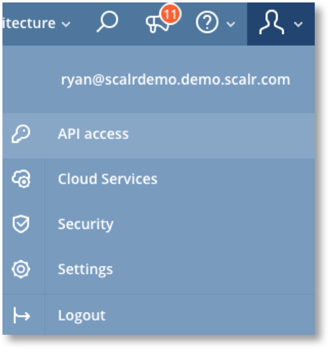

.. include:: ../GLOBAL.rst

.. _generate_keys:

|SCOPE_SCALR| |SCOPE_ACC| |SCOPE_ENV|

To generate API keys in Scalr, go to the top right and click on the silhouette of your user and down to API Access:

Once you are on the API Keys page, click on Generate New API Key and your key will be created. Within this page, you can also manage existing keys by activating, deactivating, or deleting them:

.. image:: images/api_keys_page.png
   :scale: 70%

Keys can be created at the |Scalr|, |Account|, or |Environment| scope. Each scope will give you different levels of access to the API depending on the use case. For example, if you want to make API calls to do more Scalr management work then you'll need API keys at the |Scalr| or |Account| scopes. If you are looking to manage deployments of infrastructure, then you will need keys at the |Environment| scope.
