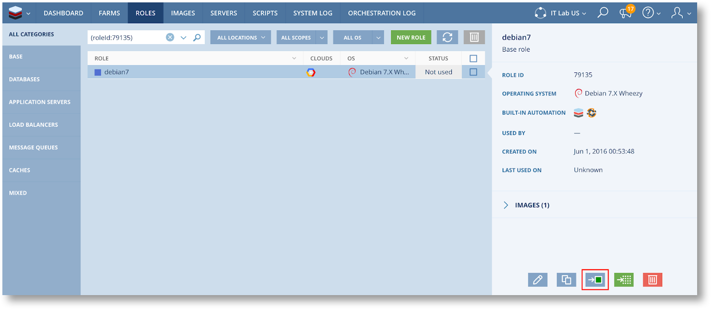

Managing Images in Scalr
==========================

This article describes how to manage Images within Scalr. More specifically, we’ll discuss the following actions:

* Updating Images
* Deleting Images

As we go through these tutorials we’ll lay out the best practices for handling Images in Scalr. This article can be useful for Scalr administrators or anyone who’s interested to learn about Image management in the Scalr Enterprise Grade CMP.

About Images and Scopes
^^^^^^^^^^^^^^^^^^^^^^^
Each Image object in Scalr is tied to a specific machine image on an underlying cloud platform. The Scalr Image contains a reference to the machine image itself and some additional information about it, such as the installed OS, whether the scalarizr agent is installed, and so on. An image exists at a given scope, either the Corporate, Account, or Environment scope. An image can be used in all the lower scopes contained within the greatest scope it is defined at:

* An Account scope Image is available to all the Environments in the Account, but not for other Accounts or either Environments.
* A Corporate scope Image is available to all the Accounts and Environments in the Scalr installation.

Image Lifecycle Best-Practices
^^^^^^^^^^^^^^^^^^^^^^^^^^^^^^^
It is generally a good idea to test your images before making them available. To do so, start by adding new Images to a test Environment and launching a few servers with them to run the tests. Once the tests have passed, publish it.

To avoid having to re-register the machine image at the Account scope when it has already been added in an Environment, we have added the capability to move an Image from the Environment scope to the Account scope. This is called Image Promotion. To promote an Image from an Environment to the containing Account, just click on this button at the bottom right of the Image description:

.. image:: images/image_promote.png
   :scale: 40 %

Image are only the first step of provisioning a server, you will also need a role. Note that as you can promote an Image, you can also promote a Role.  Promoting a Role will automatically promote all the Images associated with the Role. This can be convenient when there are several Images associated to a Role, and you want to promote all of them at once. To promote a Role, use the same button as for promoting Images:

Last but not least, you should be careful when naming your Images and Roles. A good name should allow users to find an Image quickly when they need it, but shouldn’t include information that is already stored in the Image or Role, such as the installed OS. A good naming convention is to put the name and the version of the most important software that’s installed on the image, for instance nginx-1-9, or ubuntu-16-04-1. Additional details or configuration information should go in the description field.

Updating a Widely Used Image
^^^^^^^^^^^^^^^^^^^^^^^^^^^^
Now that you’ve made an Image public, users in your organization can start using it in their Farms, or may build custom Roles with it. On occasion newer versions of the software installed on the image will become available, or security vulnerabilities will be found, and you will have to update the Image.

First things first, you should be extremely careful when updating an image, especially in production environments.  Some of the software running on the Image may be dependent on a specific version of a given software, the new image may introduce unforeseen bugs, etc. This is why we will present two approaches to publishing Image updates:

* The first one describes how to offer an updated version of the image, while keeping the old image for previously created Farms. This approach is perfectly safe to use, but all pre-existing Farms will keep using the old Image. This may be an issue if there are security vulnerabilities in the old Image.

* The second approach shows how to replace entirely the old image by the new one in your infrastructure, so that no new servers can be started with the old image through Scalr. This approach is more risky and may break some of your Farms, so it should be used with caution.

Approach 1: Offering a new version of an image
^^^^^^^^^^^^^^^^^^^^^^^^^^^^^^^^^^^^^^^^^^^^^^^
This is a safe approach to publishing image updates that can be used, for instance, when providing Images with updated software or a newer OS version.

To do so, simply add the new Image to Scalr, just like we described in the first part of this document. The name of the new Image should make it clear that it is more recent, so that users will naturally use the new one.

If you want additional incentive against using the old Role, you can mark it as deprecated (see Editing Roles). This will prevent users from using this Role in new Farms. Note however that as long as the image is available, nothing prevents users from creating new Roles using the old image.

To prevent users from using the old image in new Roles, you can deprecate the old Image (see Editing Images). If you choose to do so, the only way a Server can start with the old image is in an existing Farm that was already configured to use the old Role.

Approach 2: Replacing an existing image with a new version
^^^^^^^^^^^^^^^^^^^^^^^^^^^^^^^^^^^^^^^^^^^^^^^^^^^^^^^^^^^
In this approach, we will replace the old image with the new one in the existing Roles that are using the old Image. This way, in all existing and future Farms that use these Role, newly launched servers will use the new Image.

To do this, in the Images section, click on this button in the bottom right:

.. image:: images/replace_image.png
   :scale: 40 %

You will be asked to select a new Image, and the old Image will be replaced by the new one in all the Roles that use it. You can also choose to mark the old Image as deprecated.

Once this is done, you have the certainty that no new Servers can start with the old Image, but there may still be some existing Servers that are running on the old Image. If this is an issue, you will have to track down the Farms in which these Servers exist.

Once you have identified these Farms, you should contact the Farm owners to request that they replace the Servers running the old Image with new ones. Usually, the process to get rid of these Servers is to manually terminate them through Scalr, and wait for the autoscaling algorithm to launch a new one in replacement. The new Server will automatically use the new Image.

Once no Roles or Servers use the Image anymore, you will then be able to delete it from Scalr.

If anything goes wrong, it is easy to roll back the changes you made.  Just replace the problematic new Image with the previous one by following exactly the same steps.

Automating Image Management
^^^^^^^^^^^^^^^^^^^^^^^^^^^^
Managing images by hand can be time consuming, even more so if you want to provide images available in multiple locations, for instance, you will quickly have to handle 10+ identical images per Role. To simplify the Image management processes, all the actions described in this document can be automated with the help of the API or CLI.

It’s up to you to build the process that will fit with your use case and testing methodology, but the following pointers should help you automate this process, either with scalr-ctl or directly with the APIv2:

Using the Scalr CLI:

* Corporate scope

  * Create Image: scalr-ctl global images register

  * Create Role: scalr-ctl global roles create

  * Associate Image to Role: scalr-ctl global role-images create

  * Replace Image in Role: scalr-ctl global role-images replace

  * Deprecate Role: scalr-ctl global roles update (set the “deprecated” property)

  * Deprecate Image: scalr-ctl global images update (set the “deprecated” property)

* Account scope

  * Create Image: scalr-ctl account images register

  * Create Role: scalr-ctl account roles create

  * Associate Image to Role: scalr-ctl account role-images create

  * Replace Image in Role: scalr-ctl account role-images replace

  * Deprecate Role: scalr-ctl account roles update (set the “deprecated” property)

  * Deprecate Image: scalr-ctl account images update (set the “deprecated” property)

* Environment scope

  * Create Image: scalr-ctl images register

  * Create Role: scalr-ctl roles create

  * Associate Image to Role: scalr-ctl role-images create

  * Replace Image in Role: scalr-ctl role-images replace

  * Deprecate Role: scalr-ctl roles update (set the “deprecated” property)

  * Deprecate Image: scalr-ctl images update (set the “deprecated” property)

Using the API:

* Corporate scope

  * Create Image: https://api-explorer.scalr.com/global/images/post.html

  * Create Role: https://api-explorer.scalr.com/global/roles/post.html

  * Associate Image to Role: https://api-explorer.scalr.com/global/roles/images/post.html

  * Replace Image in Role: https://api-explorer.scalr.com/global/roles/images/actions/post_replace.html

  * Deprecate Role: https://api-explorer.scalr.com/global/roles/patch_roleId.html (set the “deprecated” property)

  * Deprecate Image: https://api-explorer.scalr.com/global/images/patch_imageId.html (set the “deprecated” property)

* Account scope

  * Create Image: https://api-explorer.scalr.com/account/images/post.html

  * Create Role: https://api-explorer.scalr.com/account/roles/post.html

  * Associate Image to Role: https://api-explorer.scalr.com/account/roles/images/post.html

  * Replace Image in Role: https://api-explorer.scalr.com/account/roles/images/actions/post_replace.html

  * Deprecate Role: https://api-explorer.scalr.com/account/roles/patch_roleId.html (set the “deprecated” property)

  * Deprecate Image: https://api-explorer.scalr.com/account/images/patch_imageId.html (set the “deprecated” property)

* Environment scope

  * Create Image: https://api-explorer.scalr.com/user/images/post.html

  * Create Role: https://api-explorer.scalr.com/user/roles/post.html

  * Associate Image to Role: https://api-explorer.scalr.com/user/roles/images/post.html

  * Replace Image in Role: https://api-explorer.scalr.com/user/roles/images/actions/post_replace.html

  * Deprecate Role: https://api-explorer.scalr.com/user/roles/patch_roleId.html (set the “deprecated” property)

  * Deprecate Image: https://api-explorer.scalr.com/user/images/patch_imageId.html (set the “deprecated” property)

Example Image publishing pipeline
^^^^^^^^^^^^^^^^^^^^^^^^^^^^^^^^^
Let’s assume that you are building an application, and that your application is deployed using a Chef cookbook. When the application code or the cookbook is updated, you would like to automatically provide an updated Image of your application in Scalr so that other people can use it.

You will find `here <https://github.com/scalr-tutorials/image_publishing>`_ an example of a script that does exactly that, using `test-kitchen <https://kitchen.ci/>`_ and the kitchen-scalr driver.

It implements the following process:

* Start a new server in Scalr

* Run a Chef recipe on it

* Run some tests to check whether the recipe had the intended result

* If the tests fail, abort

* Take a snapshot of the server

* Publish it as an Image at the account scope

* Register the new Image in a Role, replacing and deprecating any pre-existing Image in the same location in this Role.

Test-kitchen is used here as a convenient way to start a server in Scalr, install some software and run some tests on it, but the workflow that is implemented in this script should be easy to adapt to the tools you are using and your specific Image management and publishing needs.

Now if you register this script to run every time some commits are pushed to your production or staging branches, you will never have to worry about publishing Images again!
