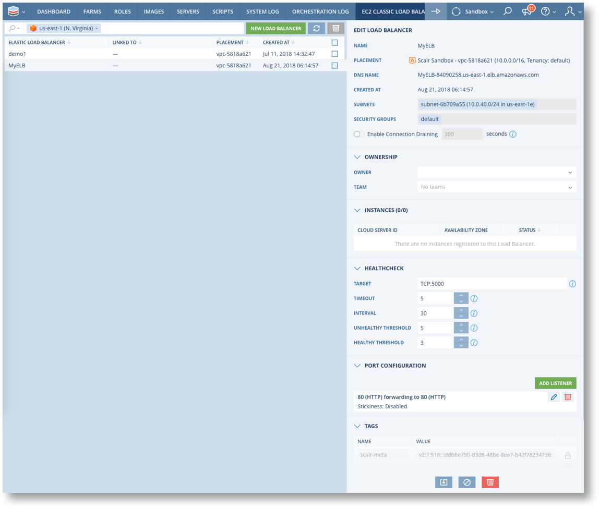
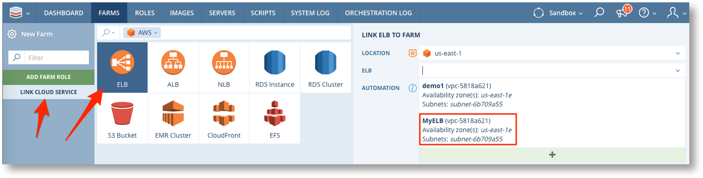

.. include:: ../GLOBAL.rst

.. _config_cloud_services:

Cloud Services and Features in Scalr
====================================

|SCOPE_ENV|

Scalr provides support for configuring and utilising a wide variety of Cloud specific services. Each cloud provider offers extended features and services to enhance their basic compute, storage and network capabilities, such as AWS Elastic Load Balancer, Google Compute Platform Cloud SQL and many more. Within Scalr these cloud features and services can be configured/deployed and linked or utilised in Farms. When a service is linked to a Farm Scalr will automatically perform the required additional configuration to integrate the cloud service with the deployed instances, e.g. configuring an AWS ELB.

This page provides a quick overview of how to configure these cloud services in Scalr.

Please see :ref:`cloud_services` for details on linking cloud services to Farms.

For details on each of the cloud features and services currently supported in Scalr, including relevant links to the Cloud providers own documentation, please see :ref:`cloud_services_ref`. Note that the number of supported features and services increases with almost every release of Scalr.

Cloud Specific Configuring
--------------------------

The |MENU_ENV| menu provides direct access to screens for configuring cloud services and features.

.. image:: images/clouds_menu.png
   :scale: 50%

Each of the screens allows you to view, manage and delete existing features and services and also create new ones. These screens interact directly with the cloud provider and will amend or create the feature/service as soon the SAVE button is clicked.

.. warning:: Some cloud services are separately chargeable by the cloud provider. Costs may be incurred as soon as the configuration is saved in Scalr. Please refer to the Cloud providers own documentation for details of any charges that may arise as a result of configuring cloud services.

Once a service or feature has been configured it will be available for use in Farms. Services can be linked to Farms and other features will appear as additional values in configuration drop down fields.

**Example:: AWS Classic Load Balancer**

Configured via the main menu.

.. image:: images/aws_clb_menu.png
   :scale: 50%

"MyELB" now appears as an option when linking the Cloud Service in a Farms.

.. |PLUS| image:: images/plus.png
          :scale: 30%

.. note:: New Cloud Services configuration can also be done directly from the Farm Configuration. After selecting which service to link the list of available services also includes the |PLUS| button which will present the screen for configuring a new instance of the selected service.
