.. include:: ../GLOBAL.rst

Connecting Scalr to Microsoft Azure
===================================

Scalr needs access to your Cloud Platform(s) in order to provision and manage infrastructure on your behalf. You will therefore need to configure Scalr with your Azure credentials. There are 4 steps to this task.

1. Configure Azure Virtual Network's
2. Configure Instance Connection Policy
3. Configure access to Azure Resource Manager API
4. Add Azure credentials to Scalr and link to |ENVIRONMENTS|.

.. note::
   | **Your credentials are safe with us**
   | Credentials are stored securely and encrypted. Scalr will not use your Credentials for any purpose you have not agreed to. Our terms of service can be found on the Scalr Website Policies Page.
   | **Why Does Scalr Need Credentials?**
   | Cloud Credentials are needed by Scalr to provision and manage cloud infrastructure on your behalf.

Configure Azure for Scalr
-------------------------

Before creating access keys and connecting Scalr to Azure there are some configuration considerations that may need to implemented to ensure Scalr can connect to your instances in Azure.

Configure Virtual Networks
^^^^^^^^^^^^^^^^^^^^^^^^^^

.. |vpc_link| raw:: html

   <a href="https://docs.microsoft.com/en-us/azure/virtual-network/" target="_blank">Virtual Network Documentation</a>

.. |peer_link| raw:: html

   <a href="https://docs.microsoft.com/en-us/azure/virtual-network/virtual-network-peering-overview" target="_blank">Virtual network peering</a>

You will need to create or configure an Azure Virtual Network to work with Scalr. If you need to create a Virtual Network for Scalr and the Scalr managed instances please refer to |vpc_link| |NEWWIN|.

Configure Instance Connection Policy
------------------------------------

You will also need to perform some additional configuration work to ensure that Scalr can connect to your Azure instances. There are three options for this.

#. **Public** - Scalr will ONLY connect to the Public IP of instances. Only use this option if ALL instances managed by Scalr will have a Public IP.
#. **Local** - Scalr will ONLY connect to the local/private IP of instances. This option is only possible if one of the following scenarios applies.

   #. All your managed instances are in the same VPC as the Scalr server.
   #. You have routing or peering connections to all the other VPC's where Scalr managed instances reside. See |peer_link| |NEWWIN| for more details.
   #. You have VPN connection(s) to all the other VPC's where Scalr managed instances reside.

#. **Auto** - (default) Scalr will connect to the Public IP of an instance if it has one, otherwise it will fall back to the local/private IP.

If you choose to use the "public" or "local" option then you need to login to your Scalr server and update the configuration in ``/etc/scalr-server/scalr-server.rb`` by adding the following entry. (NOTE: this entry must be merged with any exiting entries in the ```app[:configuration] = ``` structure)

.. code-block:: shell

   app[:configuration] = {
    "scalr" => {
      "azure" => {
        "instances_connection_policy" => "local" or "public"
       }
     }
   }

After adding this entry you must re-configure scalr by running ``sudo scalr-server-ctl reconfigure``.


Adding Azure Credentials to Scalr
---------------------------------

First you need enable access to Azure and obtain the required access keys.

1. Login to https://portal.azure.com/ (Portal URL can be different for Azure Gov Cloud and Azure Germany Cloud) using Microsoft Live account.
2. Click on **Azure Active Directory** in the left menu.
3. Make sure you are in your Default directory (or add a new one).

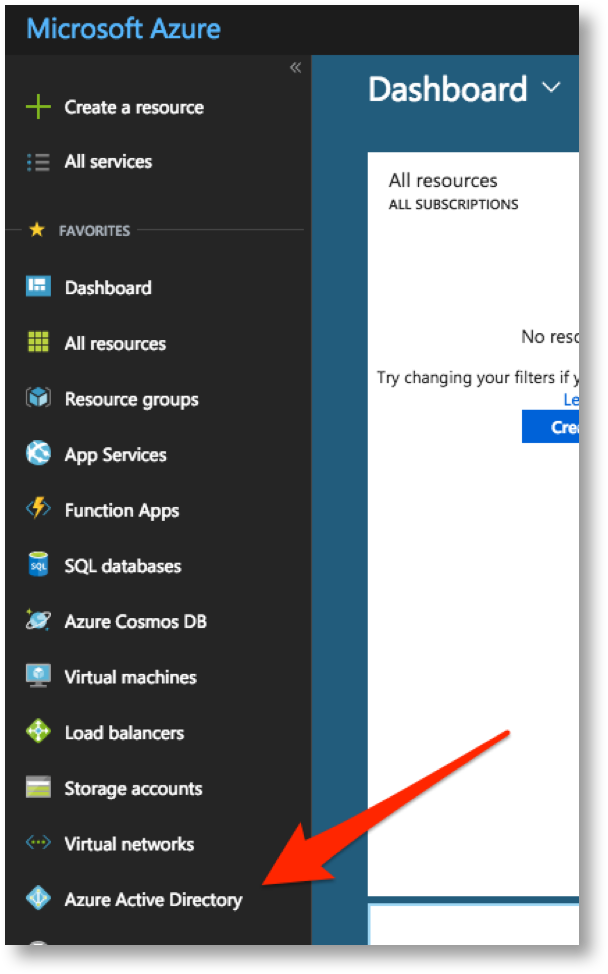

4. Click on **App registrations** in the left menu.

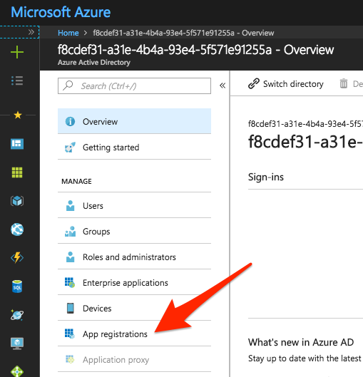

5. Click on **New application registration**.

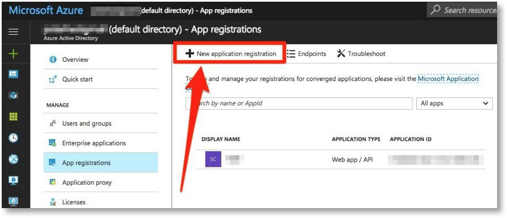

6. Enter the name "Scalr".
7. Enter the following details:

  a. Name: "Scalr"

  b. SIGN-ON URL: http://your-scalr-domain.com/public/xAzureToken (Make sure to replace your-scalr-domain.com with the value of ``routing[:endpoint_host]`` that you have in your scalr-server.rb config file. It should be the IP or Domain that you use to access the Scalr Web UI.)

8. Click "Create"

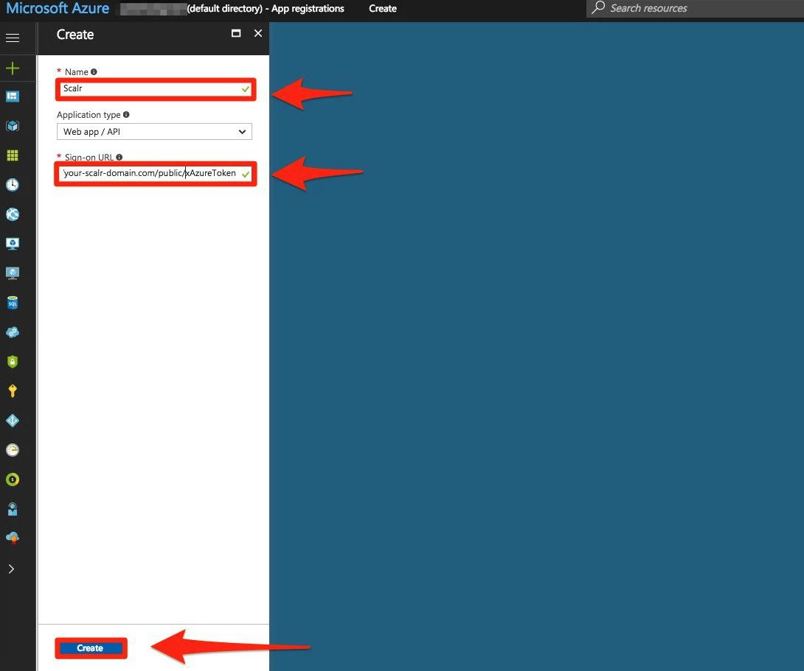

9. Click on the new application

.. image:: images/Azure-sa-5.png
   :scale: 40%

10. Ensure the APP ID URI is configured correctly.

  a. APP ID URI: http://domain.onmicrosoft.com/scalr (make sure that you replace domain.onmicrosoft.com with your actual Active Directory domain which can be found under "Domains" in the relevant directory - the same one from step 3).

.. image:: images/Azure-sa-6.png
   :scale: 40%

11. Under keys, create a new key and select how many years you want this key to last. Be sure to save your Secret Key.

.. Warning:: Warning! This key MUST NOT contain "+" or "/" characters as these will cause API errors.  If your key has these special characters present you MUST re-generate a new key without these symbols for use with Scalr.

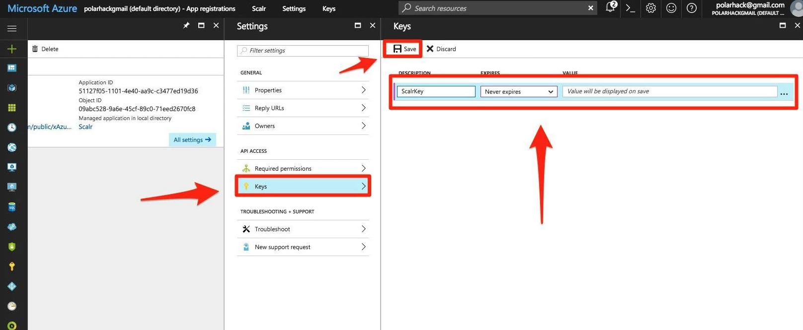

.. image:: images/Azure-sa-8.png
   :scale: 40%

12. Under the Required Permissions section, locate Windows Azure Active Directory.
13. Under Delegated Permissions select Sign in and read user profile as well as Access the Directory as the signed in user permission.  Under Application Permissions select Read Directory Data and Read and Write Directory Data.

.. warning:: Make sure that all of the correct permissions as outlined above have been applied.  Missing permissions will lead to unexpected behavior.

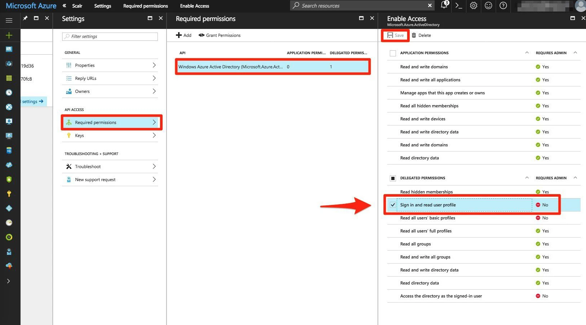

14. Click on Add permission.
15. Click on Windows Azure Service Management API and Select.

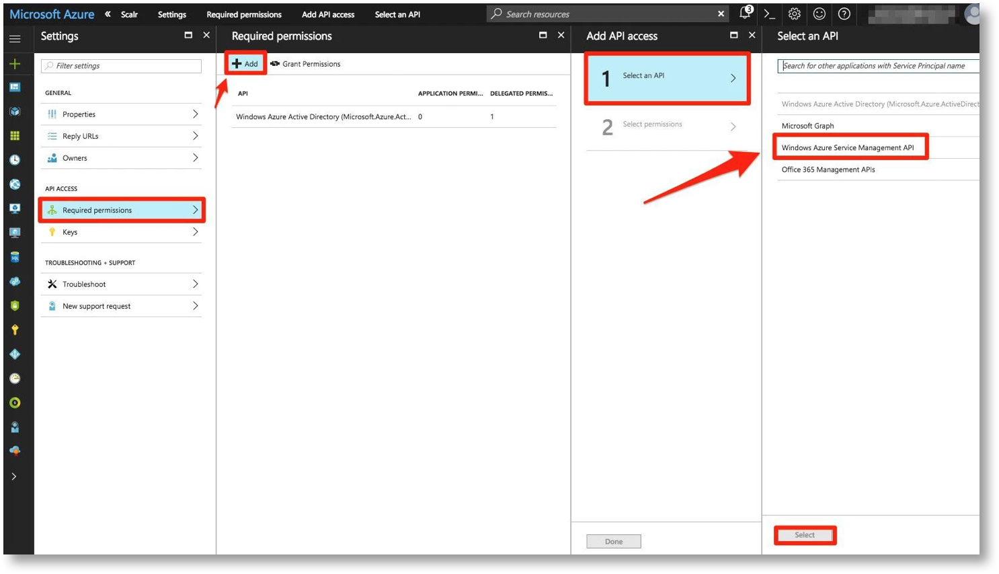

16. Make sure that Access Azure Service Management permission is set on Delegated Permissions for Windows Azure Service Management API.

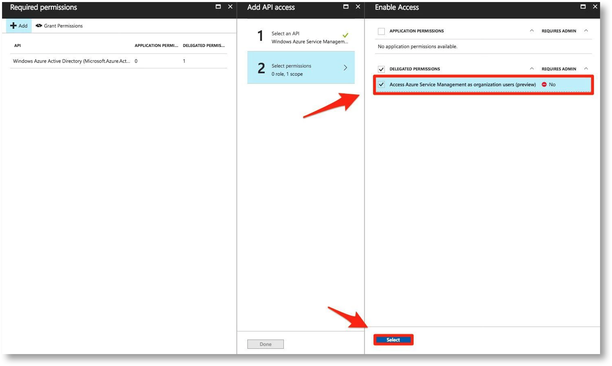

.. warning :: Please note!  You MUST select "Grant Permissions" to make your permission changes active.  It may take up to 15 minutes for this to take effect and for Subscriptions to be selectable when creating Cloud Credentials in Scalr. This dialogue will look like the following screenshots

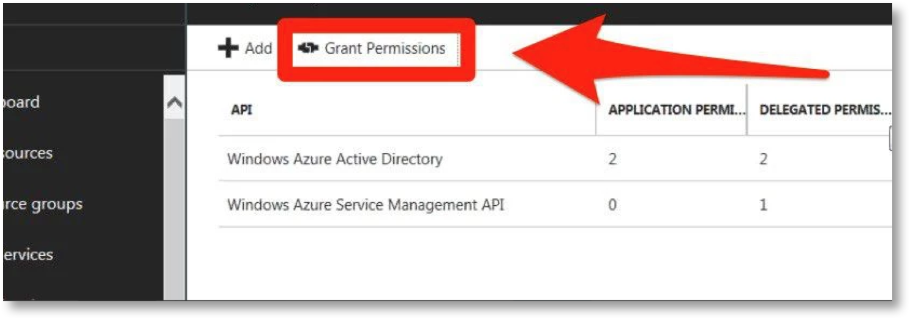

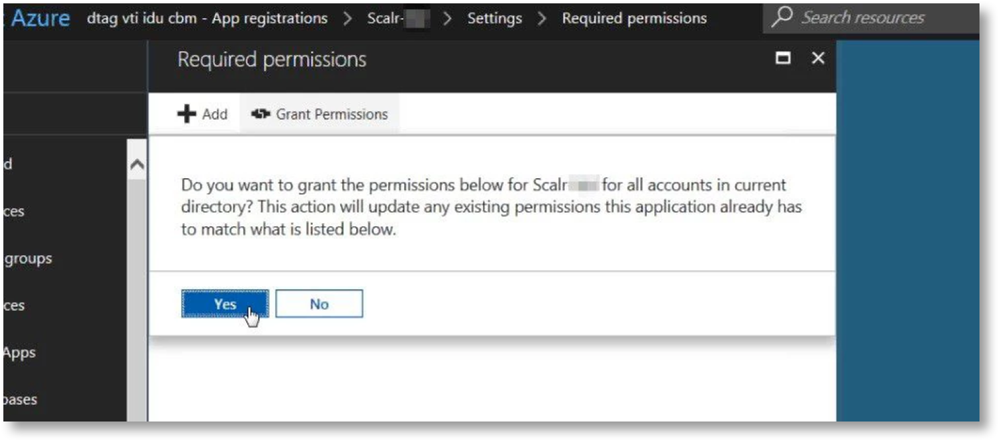

17. After clicking on Save, you will be able to locate the CLIENT-ID (Application ID) under the registered app, and will have your SECRET-KEY from step 11.

.. image:: images/Azure-sa-14.png
   :scale: 50%

18. As a final step, we must ensure that our application has Contributor permissions on your desired subscription IAM configuration.  Navigate to the Subscription> IAM tab and ensure this is present. If not, manually add your app as a CONTRIBUTOR role.

.. image:: images/Azure-sa-15.png
   :scale: 50%

.. include:: credentials-generic.rst

19. After selecting Add Credentials, you will be prompted to add your Cloud Credentials and properties:

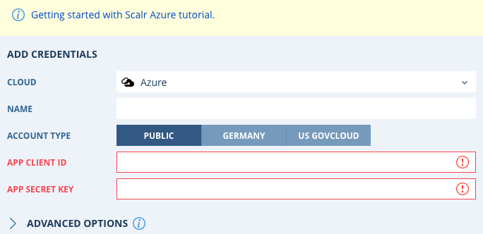

Add the tenant name to your credentials if you have it available, and then click **continue** at the bottom of the dialogue box.  You will be redirected to authenticate in the Azure Portal.  Complete authentication by following the on-screen instructions.

20. After authentication you will be once again redirected back to Scalr.  Then choose your Subscription, and hit Save.  An example fully configured Cloud Credential object for Azure will look similar to the following:

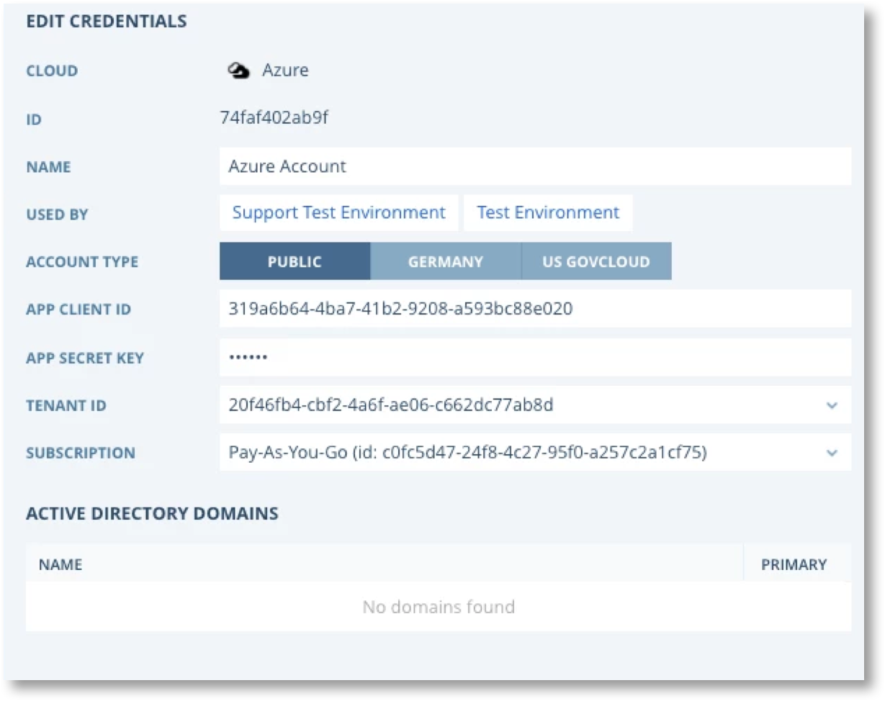

You can now proceed to adding these credentials to your |ENVIRONMENTS|.
