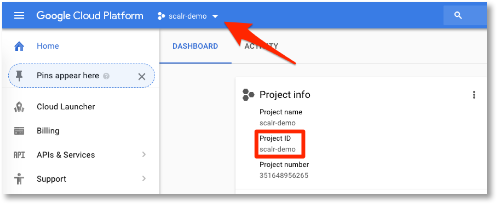
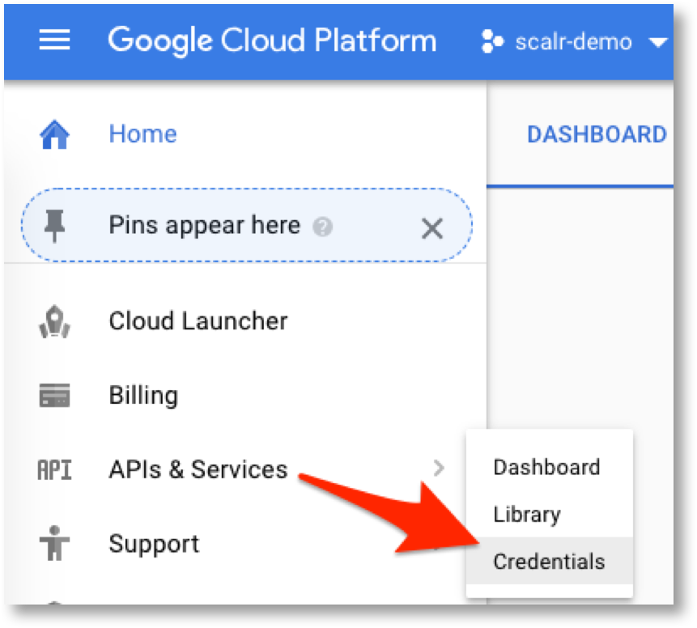
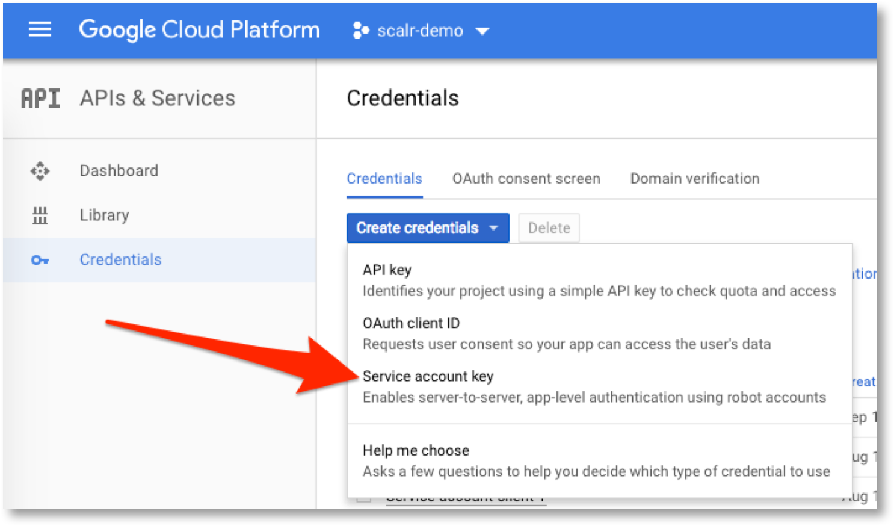
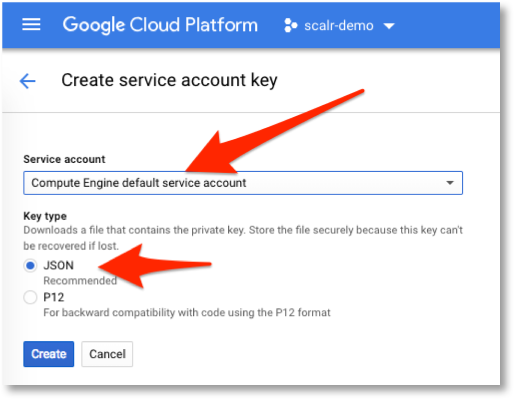
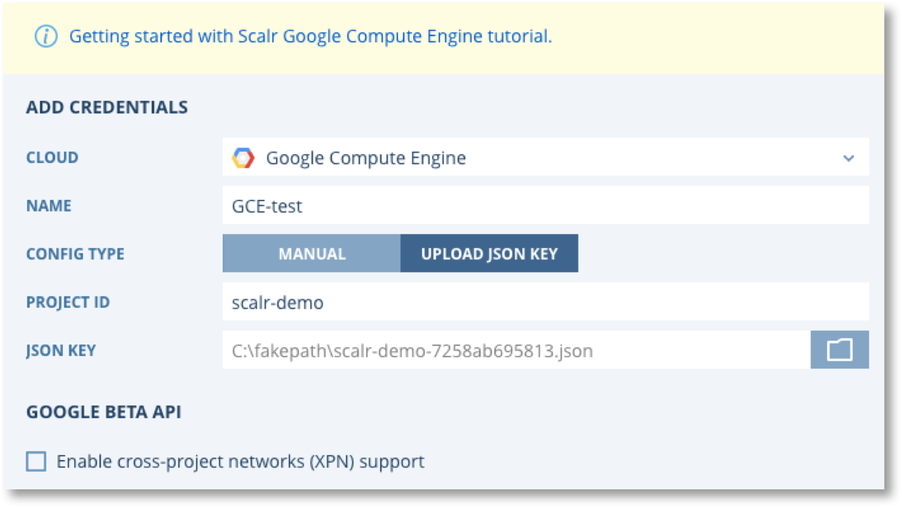
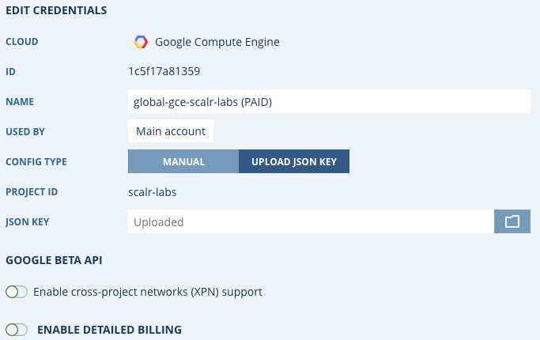
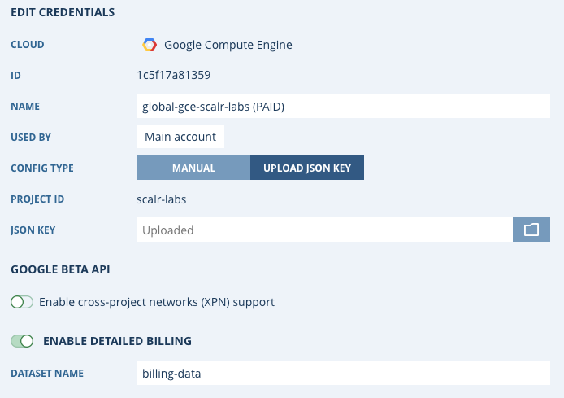

.. include:: ../GLOBAL.rst

Connecting Scalr to Google Cloud Platform (GCP)
===============================================

Scalr needs access to your Cloud Platform(s) in order to provision and manage infrastructure on your behalf. You will therefore need to configure Scalr with your GCP credentials. There are 4 steps to this task.

1. Configure GCP VPC's
2. Configure Instance Connection Policy
3. Create/Configure a user and access keys in GCP
4. Add GCP credentials to Scalr and link to |ENVIRONMENTS|.

.. note::
   | **Your credentials are safe with us**
   | Credentials are stored securely and encrypted. Scalr will not use your Credentials for any purpose you have not agreed to. Our terms of service can be found on the Scalr Website Policies Page.
   | **Why Does Scalr Need Credentials?**
   | Cloud Credentials are needed by Scalr to provision and manage cloud infrastructure on your behalf.

Configure GCP for Scalr
-----------------------

Before creating access keys and connecting Scalr to GCP there are some configuration considerations that may need to implemented to ensure Scalr can connect to your instances in GCP.

Configure Virtual Private Cloud (VPC)
^^^^^^^^^^^^^^^^^^^^^^^^^^^^^^^^^^^^^

.. |vpc_link| raw:: html

   <a href="https://cloud.google.com/vpc/docs/using-vpc" target="_blank">Using VPC Networks</a>

.. |peer_link| raw:: html

   <a href="https://cloud.google.com/vpc/docs/vpc-peering" target="_blank">VPC Network Peering</a>

You will need to create or configure a GCP VPC to work with Scalr. Every GCP user has access to a default network but this is typically NOT an acceptable network for most use cases. If you need to create a VPC for Scalr and the Scalr managed instances please refer to |vpc_link| |NEWWIN|.

Configure Instance Connection Policy
------------------------------------

You will also need to perform some additional configuration work to ensure that Scalr can connect to your GCP instances. There are three options for this.

#. **Public** - Scalr will ONLY connect to the Public IP of instances. Only use this option if ALL instances managed by Scalr will have a Public IP.
#. **Local** - Scalr will ONLY connect to the local/private IP of instances. This option is only possible if one of the following scenarios applies.

   #. All your managed instances are in the same VPC as the Scalr server.
   #. You have routing or peering connections to all the other VPC's where Scalr managed instances reside. See |peer_link| |NEWWIN| for more details.
   #. You have VPN connection(s) to all the other VPC's where Scalr managed instances reside.

#. **Auto** - (default) Scalr will connect to the Public IP of an instance if it has one, otherwise it will fall back to the local/private IP.

If you choose to use the "public" or "local" option then you need to login to your Scalr server and update the configuration in ``/etc/scalr-server/scalr-server.rb`` by adding the following entry. (NOTE: this entry must be merged with any exiting entries in the ```app[:configuration] = ``` structure)

.. code-block:: python

   app[:configuration] = {
    "scalr" => {
      "gce" => {
        "instances_connection_policy" => "local" or "public"
       }
     }
   }

After adding this entry you must re-configure scalr by running ``sudo scalr-server-ctl reconfigure``.


Adding GCP Credentials to Scalr
-------------------------------

First you need to create and obtain the required access keys from GCP.

1. Login to the Google Cloud Console and select the project you want to use with Scalr, then note down the Project ID.



2. Select "API's and Services --> Credentials" from the menu bar.



3. On the Create Credentials drop down select "Service account key".



.. |Create| image:: images/GCE-sa-4a.png
            :scale: 40%

4. Set the drop down to "Compute Engine default service account", and select "JSON", then click |Create|.



5. Save the JSON file to your computer and then go back to the Scalr UI.

.. include:: credentials-generic.rst

6. After selecting Add Credentials, you will be prompted to configure your Cloud Credentials and properties:

.. image:: images/GCE-creds.png
   :scale: 40%

7. Click on "UPLOAD JSON KEY", enter the Project ID from step 1 and select the JSON file you downloaded in step 5.



8. Click Save and the credentials will be validated and saved.



You can now proceed to adding these credentials to your |ENVIRONMENTS|.


Enable Billing
----------------

.. |gcp_billing| raw:: html

   <a href="https://cloud.google.com/billing/docs/how-to/export-data-bigquery" target="_blank">exported billing data</a>

.. |gcp_billing_2| raw:: html

    <a href="https://cloud.google.com/bigquery/docs/access-control#bigquery.dataViewer"" target="_blank">bigquery.dataViewer</a>

The Scalr billing integration relies on |gcp_billing||NEW_WIN|. The cloud credentials added in Scalr must have access to |gcp_billing_2||NEW_WIN| in the GCP Project where the billing dataset is located.

To enable billing, which allows for Scalr :ref:`cost_management` to report on GCP costs, please click Enable Detailed Billing and add the Dataset Name. Once that is added it may take a few hours for the cost to show up within Scalr.


