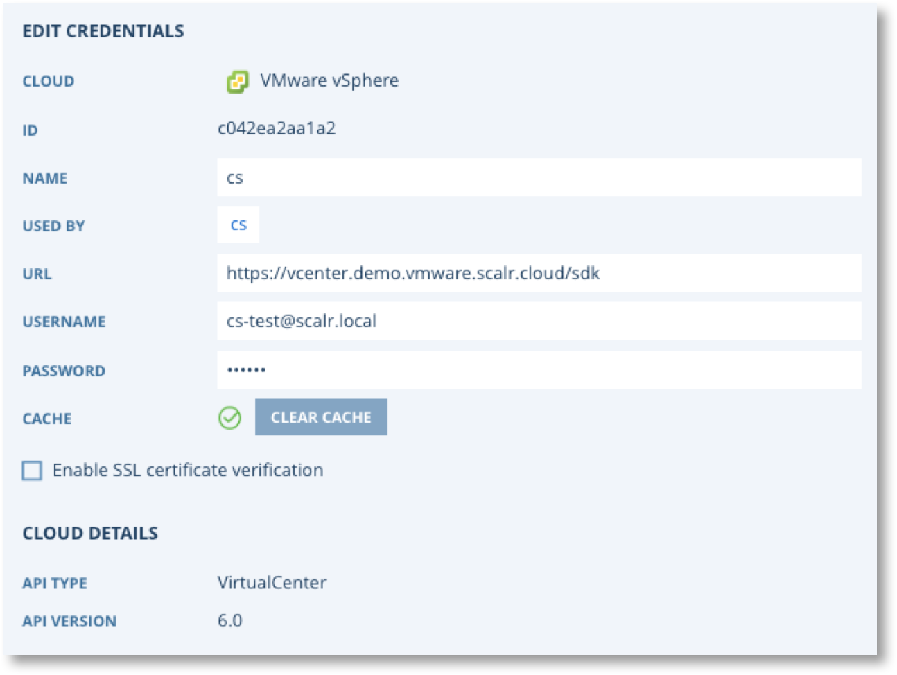

.. include:: ../GLOBAL.rst

Connecting Scalr to VMWare vSphere
==================================

Scalr needs access to your Cloud Platform(s) in order to provision and manage infrastructure on your behalf. To achieve this there is configuration work to do in both VMWare and Scalr as follows.

1. Configure a User for Scalr to use to access VMWare
2. Configure Instance Connection Policy
3. Add VMWare credentials to Scalr and link to |ENVIRONMENTS|.

.. |user_link| raw:: html

   <a href="https://docs.vmware.com/en/VMware-vSphere/5.5/com.vmware.vsphere.hostclient.doc/GUID-670B9B8C-3810-4790-AC83-57142A9FE16F.html" target="_blank">Add a Local ESXi User</a>

If you need assistance creating a VMWare user please refer to |user_link| |NEWWIN|.

.. note::
   | **Your credentials are safe with us**
   | Credentials are stored securely and encrypted. Scalr will not use your Credentials for any purpose you have not agreed to. Our terms of service can be found on the Scalr Website Policies Page.
   | **Why Does Scalr Need Credentials?**
   | Cloud Credentials are needed by Scalr to provision and manage cloud infrastructure on your behalf.

Configure VMWare for Scalr
--------------------------

**Permissions Needed:**

The following is a list of permissions that must be granted in order for this VMware service user to function correctly with Scalr.

.. csv-table::
   :header-rows: 1
   :widths: 30,70
   :file: csv/vmware_perms.csv

Configure Instance Connection Policy
------------------------------------

You will also need to perform some additional configuration work to ensure that Scalr can connect to your VMWare instances. There are three options for this.

#. **Public** - Scalr will ONLY connect to the Public IP of instances. Only use this option if ALL instances managed by Scalr will have a Public IP.
#. **Local** - Scalr will ONLY connect to the local/private IP of instances. This option is only possible if one of the following scenarios applies.

   #. All your managed instances are in the same network as Scalr.
   #. You have routing or peering connections to all the other networks where Scalr managed instances reside.
   #. You have VPN connection(s) to all the other networks where Scalr managed instances reside.

#. **Auto** - (default) Scalr will connect to the Public IP of an instance if it has one, otherwise it will fall back to the local/private IP.

If you choose to use the "public" or "local" option then you need to login to your Scalr server and update the configuration in ``/etc/scalr-server/scalr-server.rb`` by adding the following entry. (NOTE: this entry must be merged with any exiting entries in the ```app[:configuration] = ``` structure)

.. code-block:: python

   app[:configuration] = {
       "scalr" => {
         "vmware" => {
           "instances_connection_policy" => "local" or "public"
          }
       }
   }

After adding this entry you must re-configure scalr by running ``sudo scalr-server-ctl reconfigure``.

Adding VMWare Credentials to Scalr
----------------------------------

You will need the following information in order to set up VMWare credentials in Scalr

1. URL of vCenter
2. URL's of any linked vCenter's (optional)
3. Username
4. Password

.. include:: credentials-generic.rst

After selecting Add Credentials, you will be prompted to configure your Cloud Credentials and properties:

.. image:: images/VMWare-creds.png
   :scale: 40%

Click Save and your screen should look similar like this after Scalr has validate the Credentials.




Validating the Connection to VMWare
-----------------------------------

You can now proceed to adding these credentials to your |ENVIRONMENTS|.

VMware Activities that Impact Scalr
------------------------------------

If the following events take place directly in VMware, Scalr could be negatively impacted:

* UnregisterVM_Task of Virtual Machines and Templates that are used by Scalr. Registering them back into Scalr will not resolve the issue as the VMware UUID will change.
* Scalr will give the following error if DRS/SRDS is disabled for Compute Resources/Storage Pods on running Farms: "Unable to launch instance: Object Datastore with managed object reference: was not found." Reenabling that functionality or editing the Farm fixes the issue. A warmup of VMware cache will be required to get everything fully functional.
* Relocating a server to a linked vCenter that is not configured in Scalr will cause the server to go into a "Missing" state. Scalr will not terminate or shutdown the server, it just won't be able to manage the server.
* Deleting a scalr-meta Custom Attribute from a single server ends up removing all of the scalr-meta attributes from ALL servers in that vCenter. This is a function of vCenter, Scalr never deletes Custom Attributes.
