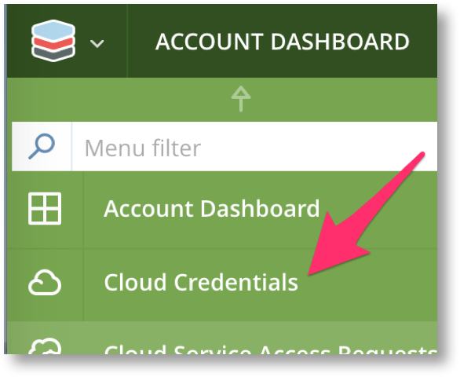
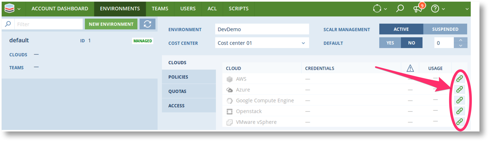

You can now add Cloud Credentials at either the |SCALR| or |ACCOUNT| Scope.
You can add new credentials directly from the Main Menu or via the |ENVIRONMENT| configuration screen at the |ACCOUNT| Scope.

.. note:: Credentials added at the |SCALR| Scope will be available to all |ACCOUNTS|. Only use |SCALR| Scope credentials if all |ACCOUNTS| are trusted to use the connected cloud account.

.. |SCE| image:: images/Admin_cloud_creds.png
   :scale: 40%

============== ==============
 |SCALR| Scope   |ACCOUNT| Scope
============== ==============
 |SCE|          |ACE|
============== ==============

.. |ECC2| image:: images/Environments_cloud_creds_2.png
   :scale: 40%

================================= ======================
                             |ENVIRONMENT| screen
--------------------------------------------------------
 Click on the link for the cloud  Click Add Credentials
================================= ======================
 |ECC1|                                |ECC2|
================================= ======================
