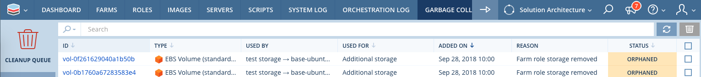

.. include:: ../GLOBAL.rst

.. _garbage_collector:

Garbage Collector
=================

|SCOPE_ENV|

In most cases, EBS volumes will persist when their owning Farm Roles or Farms are scaled down or terminated so they may be reused in the future to minimize downtime.  However, EBS volumes will become “orphaned” when their owning Farm or Farm Roles are deleted, which can cause unnecessary cost for these unused resources. EBS volumes may also become orphaned when terminating servers or Farms if the “Re-use” storage setting is not enabled for a Role.  The Garbage Collector feature serves as an aggregator for orphaned storage resources and allows for simple resource reclamation management via the Cleanup Queue.

Using the Garbage Collector
---------------------------

The Garbage Collector can be accessed by going to the |Environment| scope, clicking on the main Scalr menu |MENU_ENV| and down to Garbage Collector.

The Garbage Collection page will show the Cleanup Queue with queue entry details.  Once they have become Orphaned, relevant entries will be listed and deleted in the Cleanup Queue.

