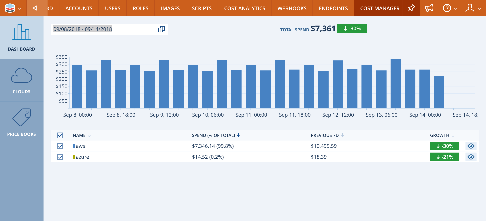
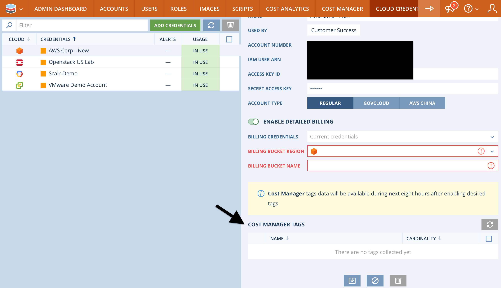
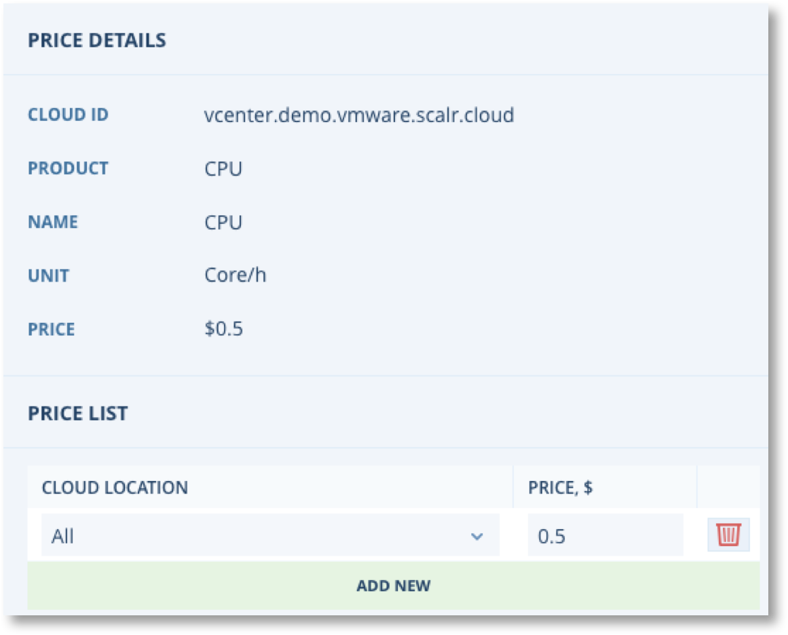
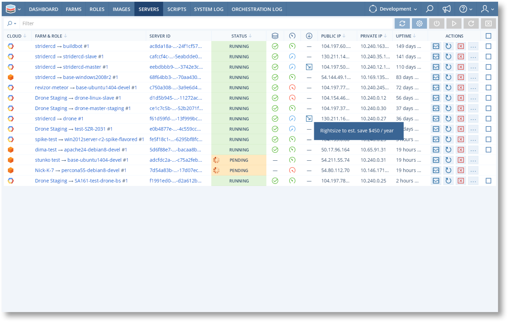
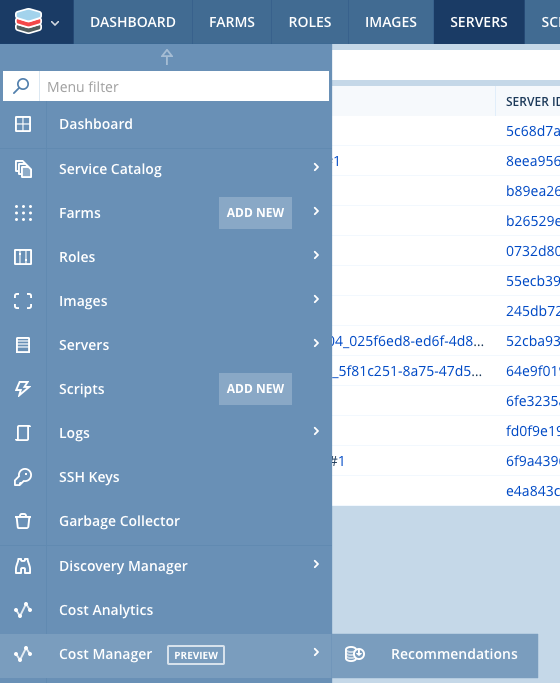
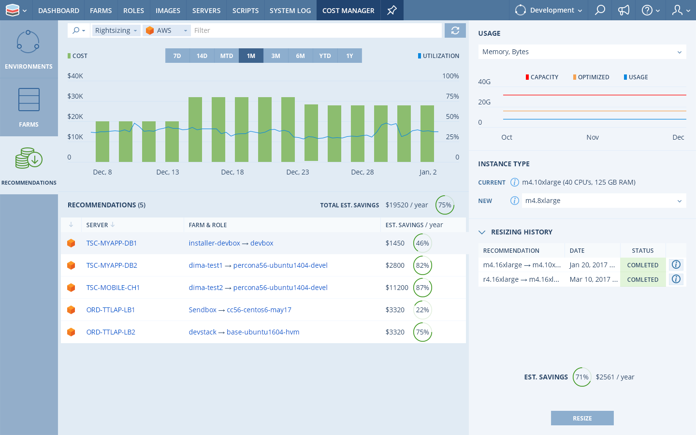
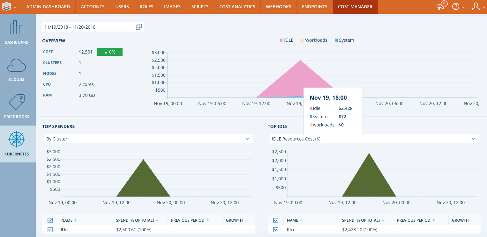
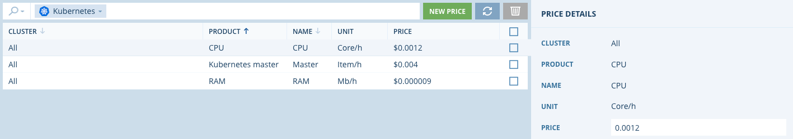

.. include:: ../GLOBAL.rst

.. _cost_management:

Cost Management
===============
|SCOPE_SCALR|

Overview
--------
Scalr Cost Manager is Scalr’s next general cost management product module. Scalr Cost Manager is being built to provide enhanced capabilities to help customers with cost tracking, budgeting, show-back/charge-back and cost optimization.

Scalr Cost Manager reflects all costs associated within a cloud account, including services provisioned by Scalr, as well as services provisioned outside of Scalr.

Feature Preview
---------------
Scalr Cost Manager is currently in Feature Preview and requires a new license file to enable.  Please feel free to contact Scalr Support for additional questions regarding the license file.

Upon receipt of the new license file, replace the existing file (/etc/scalr-server/license.json) on the Scalr Server (either singularly on a single node install, or on every node in the Scalr deployment in a multi-node installation)  and then run `scalr-server-ctl reconfigure` on each node.

No additional configuration should be required.

Currently Supported Cloud Service Providers
--------------------------------------------
Cost Manager currently supports the following Cloud Service Providers:

	* Amazon Web Services - standard and Detailed Billing
	* Microsoft Azure - Azure standard billing and Azure Enterprise Agreements Billing
	* Google Cloud Platform - Google Cloud Billing
	* VMWare - Custom Price Lists
	* Kubernetes - Custom Price Lists

Please see the :ref:`cloud_creds` page to learn how to enable billing for Public Clouds.

Cost Manager Dashboard
----------------------
The new Cost Manager Dashboard is currently accessible through the |SCALR| scope only.

The data populated within the dashboard is summarized from all cloud account numbers entered as Cloud Credentials in either |ACCOUNT| Scope or |SCALR| Scope. This data includes ALL servers in the cloud accounts added, not just servers managed through Scalr.

Enabling Tags
-------------
In order to view cost data by desired Tags, the Tags need to be enabled. You can enable Tags for each cloud account, in Cloud Credentials.

Price Books
-----------
Scalr Cost Manager Price Books are a new component of Scalr Cost Manager that provide an intuitive way to set prices for cloud resources. Price Books allow administrators to create Products, which can be based on one or more attributes such as cpu, memory, disk, and Kubernetes master. Pricing and price metrics can be established for Products with optional pricing conditions like location and/or operating system.

.. note:: Cost Manager Price Books are currently separate from Price Lists established within Scalr Cost Analytics. Cost Data reflected within Cost Analytics, as well as at the Farm level are based on Cost Analytics Price Lists, not Cost Manager Price Books. Price Lists will be merged with Price Books in later release.

Scalr uses the Price Book entries to calculate the cost of all servers that are accessible via the Cloud Credentials, not just those that are managed by Scalr. After launching a Farm and/or creating Price Book entries it can take up to 1 hour for the costs to show up in Cost Manager.

Cost Manager Price Books currently supports VMWare and Kubernetes (see Kubernetes section below).

.. image:: images/price_books.png
   :scale: 60%

Price book entries consist of a "Product" and set of Price List Entries. The Product is either "Instance" or a resource (CPU, RAM, Storage). Price List entries are configured as follows.

* Instance: Price List entries can be defined by Cloud Location and Operating System
* Resources: Price List entries can be defined by Cloud Location only

.. image:: images/instance_pl.png
   :scale: 50 %

**Calculation of Costs**

It is important to be aware of how Scalr uses Price Books and their Price Lists to calculate costs.

* **Price Lists**: Only one Price List in a Price Book is applied to a Server. See below.
* **Price Books**: Price Books are applied cumulatively, so every Price Book that has a Price List that matches a server will contribute to the Cost of the server. Thus you can have a total price made up of an Instance Price Book and one or more Resource Price Books

In the case of Instance price list it is possible to have multiple entries that could apply to a server, e.g. a price for all Locations and Operating Systems, and a price for a specific operating system. When 2 or more price list entries match a server the cost is calculated based on the most specific Price List entry. For example if Price Lists as configured as follows....

.. image:: images/pl_example_1.png
   :scale: 50 %

If there is one Windows VM and one Ubuntu VM, then the cost for the Windows VM will be $1 per hour and the cost for the Ubuntu VM will be $0.75 per hour. This approach allows you to easily define base prices for all VM's and override the base price with specific prices for special cases, e.g. to cover the cost of Windows licensing for example.

.. _rightsizing:

Rightsizing
-----------
|SCOPE_ENV|

Scalr has the ability to rightsize servers based on the metrics it collects from them using the Scalarizr agent. Scalr will not automatically rightsize the servers for you, but will provide recommendations and projected savings based on changing the server size. A server needs to be up for a minimum of 48 hours with the Scalarizr agent running before a recommendation can be made.

To utilize Rightsizing, you first need to logged into the |Environment| scope. Once you are in the |Environment| scope, there are a few ways to get to the Recommendations page:

1. Go to the main Servers page and you will see those instances that have a recommendation (only 2 servers have a recommendation in this screenshot):

2. The other option is to go to the main Scalr menu dropdown on the top left |MENU_ENV| and select Cost Manager and then Recommendations:

Once you are in the Recommendations page, you will see the usage over the period of time selected as well as the Current/New instance type that is recommended as well as projected savings. To complete the rightsizing, verify the new instance type and select Resize on the bottom right:

Kubernetes Cost Dashboard
-------------------------

Scalr also supports Cost Management for the following Kubernetes platforms:

* Self Managed Kubernetes Clusters
* Google GKE
* Amazon EKS - Future Release

The data populated within the dashboard is summarized from all Kubernetes Clusters managed at the |ACCOUNT| scope.

Kubernetes Price Books
^^^^^^^^^^^^^^^^^^^^^^

.. note:: Kubernetes Price Books apply to ALL Kubernetes offerings, not just Self Managed.

This section covers Price Books specific to Kubernetes, see the Price Books section above for a general overview. The Kubernetes Price Book entries consist of a "Product" and set of Price List Entries per Cluster or All Clusters. The Product can be Kubernetes Master, CPU, or RAM.

