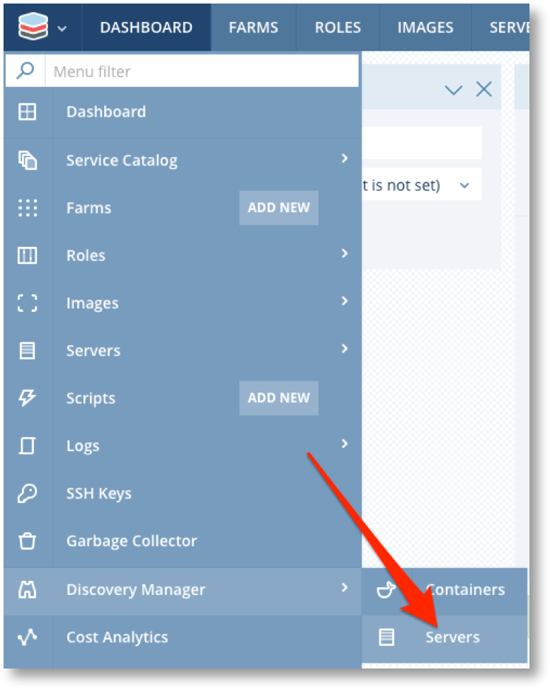
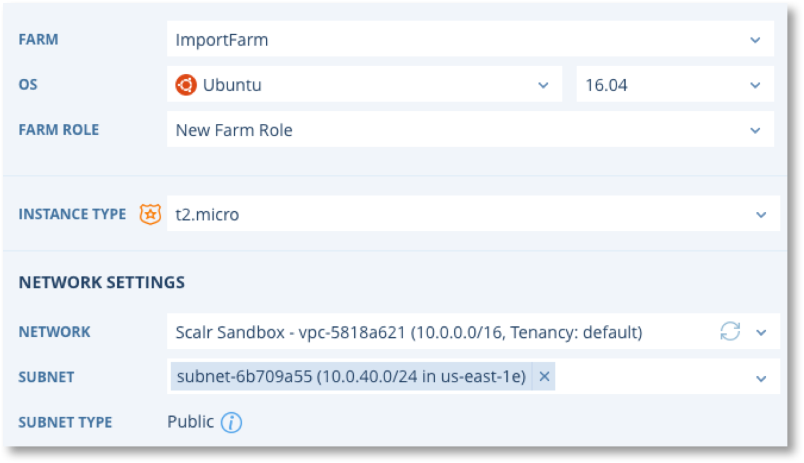
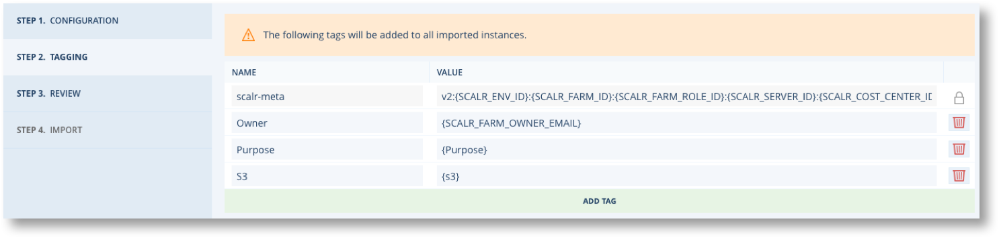
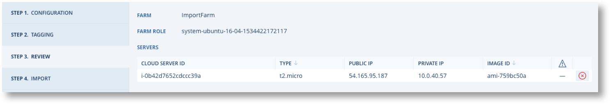
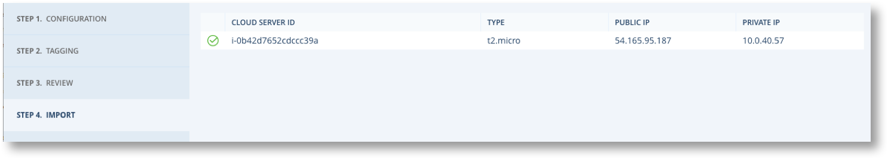
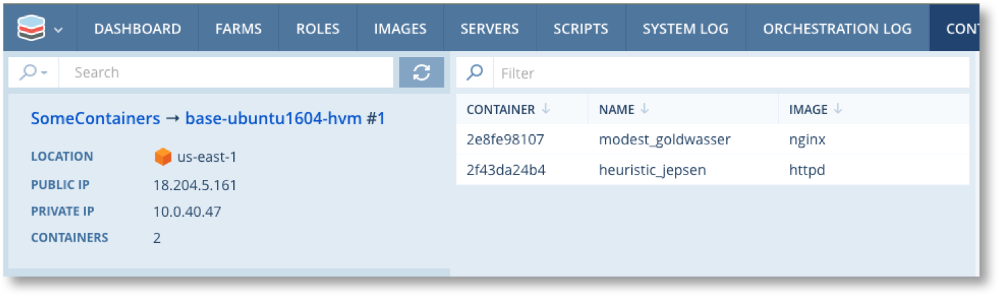
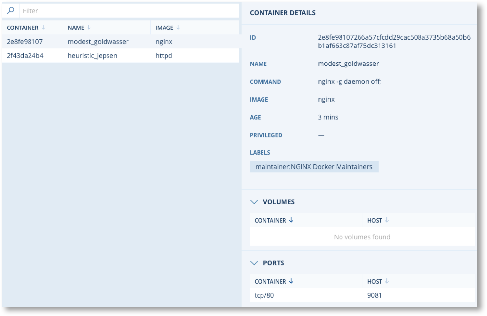

.. include:: ../GLOBAL.rst

.. _discovery_manager:

Discovery Manager
=================
|SCOPE_ENV|

Scalr is often implemented after customers already have some cloud servers deployed that they want to manage or utilise in Scalr. The Discovery Manager provides the capability to bring Servers and Containers under the management control of Scalr in a non-disruptive way. Servers are not stopped or rebooted and continue to operate normally during the discovery process.

.. note:: There are no restrictions on which servers can be imported other than they must be running. Scalr Policies are not enforced and Images & Security Groups used by the server do not need to be known to Scalr before importing.

Importing Overview
------------------

Server Import will register a server in Scalr and create or link it to a Farm Role. Import DOES NOT install the Scalarizr agent. The imported server will then be visible in the Server list.

.. warning:: **Be careful!** Changes made within Scalr after import will impact the server. For example, terminating the farm  or deleting the Farm Role will terminate the server. |BR| Be sure that you no longer use the cloud console and instead only use Scalr to manage imported instances.

The import process requires a running Farm into which it will import the servers. The process itself can guide you through the creation of a new Farm or it can use an existing running Farm.

Import can make use of existing agentless Farm Roles, or it can create a new Farm Role for each run of the import process. Farm Roles created by the import process are known as "System" Farm Roles and are associated with System Roles and System Images. System Images are not real images, in the sense that they do not map to actual images in the cloud. As such they cannot be used to launch new servers.

Generally the objective of importing servers is to be able to temporarily manage existing servers under Scalr whilst they are used create scalarized (agent) images for future re-deployment as fully Scalr managed and Scalr capable servers.

The typical workflow is as follows.

Import Servers -> Deploy Scalarizr -> Create Image and Role -> Create new Farms and Farm Roles -> Redeploy Servers.

Lets looks at each step in more detail.

* Import servers

  * Ideally servers are imported in groups into Farms that map to the application infrastructure they belong to. This isn't essential as Servers can be moved from Farm Role to Farm Role within the same |ENVIRONMENT|.
  * Servers can be imported into system Farms and Farm Roles and terminated once all the other steps of the workflow are completed. In other words once they have been replaced by a fully Scalr managed Server.
* Deploy Agent

  * This deploys the agent in order to enable agent functionality in the server and so that any image created from the server can be associated with an agent based Role.
* Create Image and Role

  * This is done by creating a server snapshot which will briefly suspend the imported Server
  * The Role created should be marked as having the Agent installed.
* Create new Farms and Farm Roles

  * Either entirely new Farms and Farm Roles or just add Farm Roles to the Farm where the Server was imported.
  * Farm Roles will include all the required :ref:`Orchestration <farm_role_orchestration>`, Network, Security and other configuration options.
* Redeploy Servers

  * :ref:`auto_scaling` can be enabled which will launch new Servers as soon as the Farm is saved.
  * Once new servers are running the Farm Role for the Imported Server can be deleted and the Imported Servers will automatically be terminated.

All of these steps can be performed either through the Scalr UI or the API.

Import Servers with the UI
--------------------------

Importing via the UI is easy but only really suitable for a small number of servers. If you have a large number to import use `Import Servers with the API`_ method.

Server Import is available for all cloud providers. Select the cloud and you will see a list of all server that are not currently known to Scalr. All running servers will have checkbox available so you can select them for import.

.. image:: images/import-01.png
   :scale: 50%

.. note:: If you click on any server in the list it's details will appear in the right hand panel along with "CREATE IMAGE" and "CREATE ROLE" buttons. These buttons will take you to the :ref:`images_from_servers` option and WILL NOT import the server.

.. |IMP| image:: images/imp-button.png
         :scale: 50%

Select the check box for the Server(s) to be imported. You can select multiple servers to import providing they have the same Operating System and version. Click on |IMP|. You will now be guided through a 4 step process to import the server.

**Step 1 : Configuration**

.. image:: images/import-02.png
   :scale: 50%

* Select and existing Farm or create a new one.
* Set the OS and version. This MUST match the OS of the Server.
* Set the Farm Role. For a new Farm this must also be a new Farm ROLE

You will now see the additional options for Instance type and network settings which must also be set as required.

.. |TAG| image:: images/tag-button.png
         :scale: 50%

Click |TAG|.

**Step 2 : Tagging**

.. |REV| image:: images/review-button.png
         :scale: 50%

Amend, remove or add tags as required and click |REV|.

**Step 3 : Review**

Review the details. You have the option to remove servers from the import list.

**Step 4 : Import**

.. |WARN| image:: images/warning.png
          :scale: 50%

This is the point of no return and you will be warned |WARN|. You will be presented with a list of servers and you can navigate to the main servers list for the Farm.

.. warning:: **Be careful!** Changes made within Scalr after import will impact the server. For example, terminating the farm will terminate the server. |BR| Be sure that you no longer use the AWS console and instead only use Scalr to manage imported instances.

Import Servers with the API
---------------------------

To be able to import via the API you must first install the CLI tool ``scalr-ctl``. Please see :ref:`api` for more details.

The command to use for importing is ``scalr-ctl farm-roles import-server --farmRoleId $farmRoleId --stdin < instance.json``

This will import a single server int the specified Farm Role using the parameters provided in the JSON file. The format of the file is as follows.

.. code-block:: json

   {
      "alias": "test-1",
      "cloudServerId": "i-xxx",
      "cloudPlatform": "ec2",
      "cloudLocation": "us-west-1",
      "instanceType":{"id":"m1.small"},
      "placement": {
          "region": "us-west-1"
          },
      "platform": "ec2",
      "role": {
          "id": 1
          },
      "scaling": {
          "enabled": false
          }
   }

For a complete example of a process for importing multiple servers please see https://github.com/scalr-tutorials/scalr-cli-import.

Deploy Scalarizr
----------------

From either the Server list or a Server detail screen you can select "Deploy Scalr agent" from the |MENU| button.

You will be presented with a screen similar to this.

.. image:: images/agent-01.png
   :scale: 50%

Proceed as follows:

1. Click on the command window under "INSTALL SCALARIZER" and copy the contents to your paste buffer.
2. Login to the command shell for the server. Note for Windows ensure the Power Shell is running as Administrator.
3. Paste the commands in and run. When complete go back to the Scalr UI.
4. Click on the command window under "LAUNCH SCALARIZER" and copy the contents to your paste buffer.
5. Switch to the command shell for the server. Note for Windows ensure the Power Shell is running as Administrator.
6. Paste the commands in and run.
7. When the Launch command finishes go back to the UI and click on "CONFIRM SCALARIZR LAUNCH".

You will see "AGENT HAS BEEN SUCCESSFULLY DEPLOYED" and the install is complete.

Agent Deployment can also be scripted to use the API and ssh (Key Auth). See https://github.com/scalr-tutorials/scalr-cli-import/blob/master/import-get-agent-install.sh for an example of how this is done.

Discovering Containers
----------------------

Container Discovery automatically detects Docker containers deployed on virtual machines, and provides a view into those deployed Containers, including key information such as container image, launch date, labels, volumes, network information, etc. Container Discovery also includes an intelligent search and filtering capability to locate containers based on various metadata.  Discovery Manager will only display Containers from Farms within the current Environment.

The scalarizr agent must be installed on the server for Container Discovery to work.

.. image:: images/con-01.png
   :scale: 50%

Discovery Manager will now report on all Containers found by Farm, Farm Role and Server sequence number.

Select a container to see it's details.

Migrate Servers from Farm Role to Farm Role
-------------------------------------------

After importing or building servers directly in Scalr, you may have a need to move the server to a new farm role. This can be done via command line tools if you have access to the Scalr server.

There are a few prereqreuisites before migrating servers:

* Servers must be agentless to migrate.
* The Environment Id, Cloud Platform, CloudLocation, and OS should be the same for the farm role source and destination.
* You can only migrate to a running farm.

To execute the migration, run the following in the Scalr server:

.. code-block:: sh

   sudo /opt/scalr-server/embedded/bin/php /opt/scalr-server/embedded/scalr/app/bin/move-server.php --server-ids=ID1,ID2,ID3 --farm-role-id=YYYY

The ``--server-ids`` flag should equal the Scalr IDs for the server(s).

The ``--farm-role-id`` should equal the destination farm role ID.
