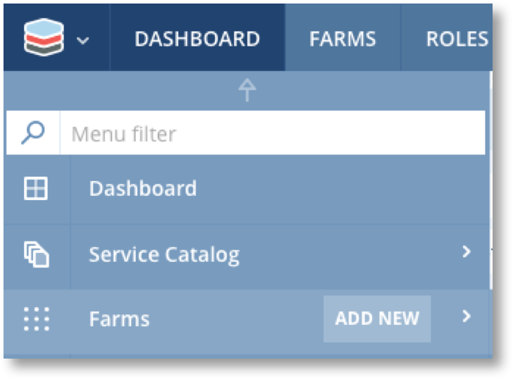
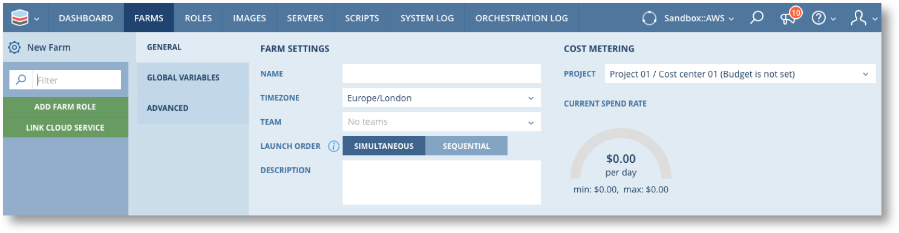
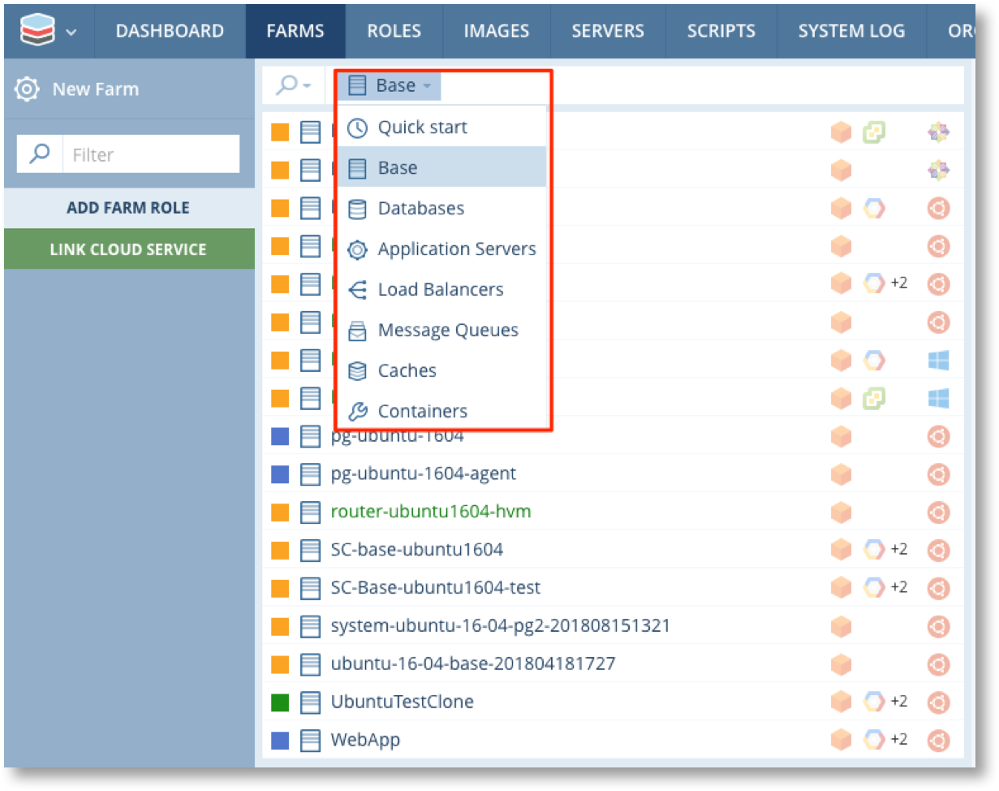
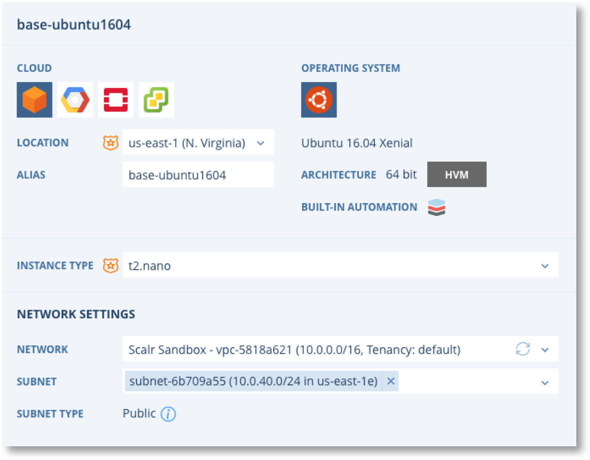
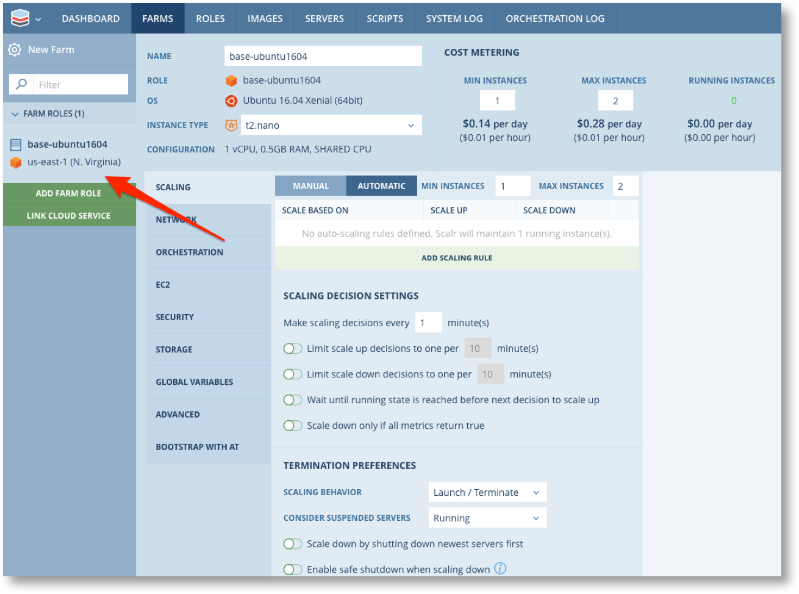
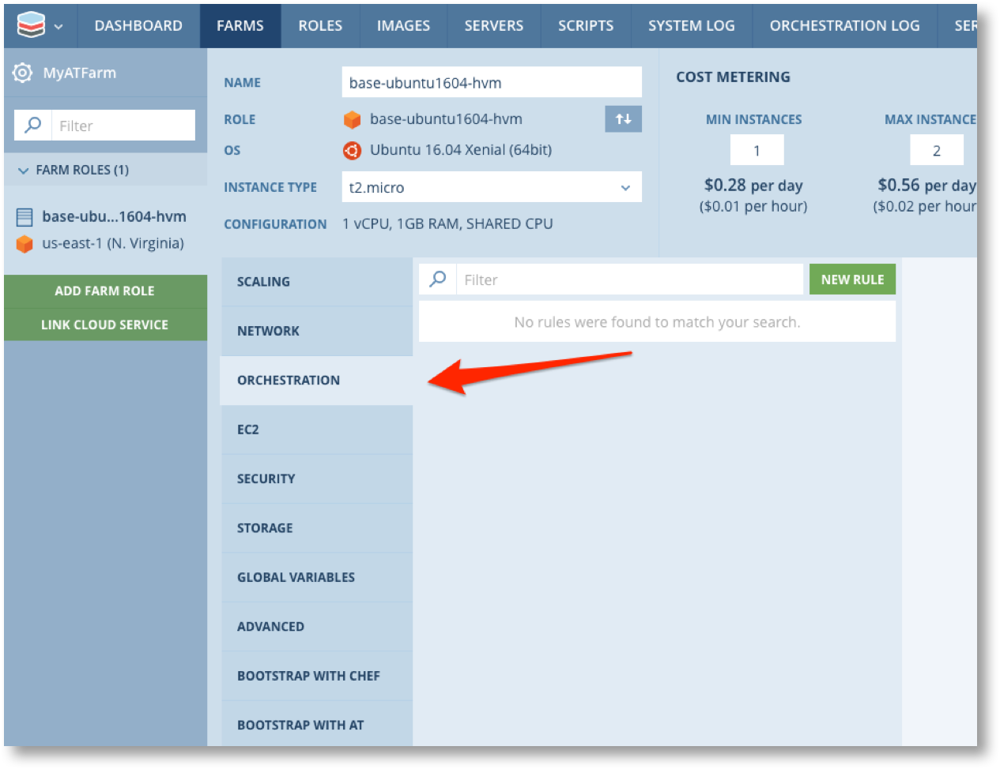
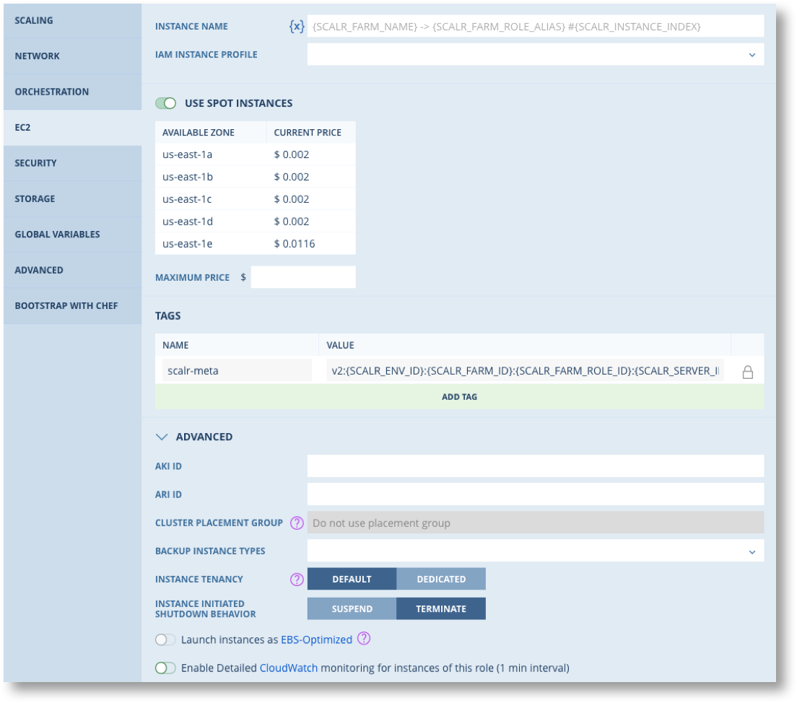
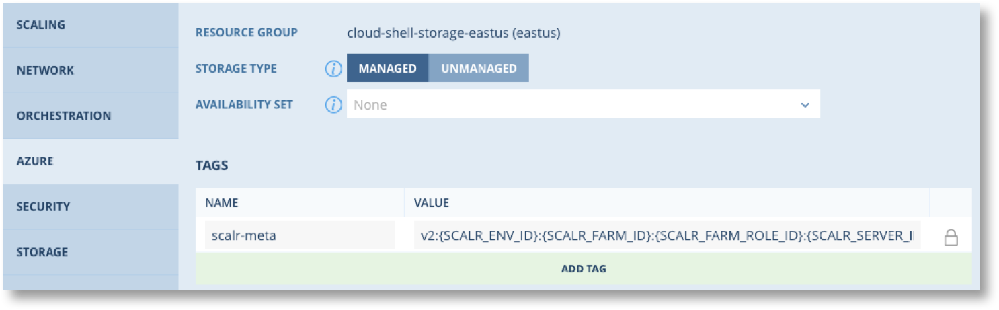
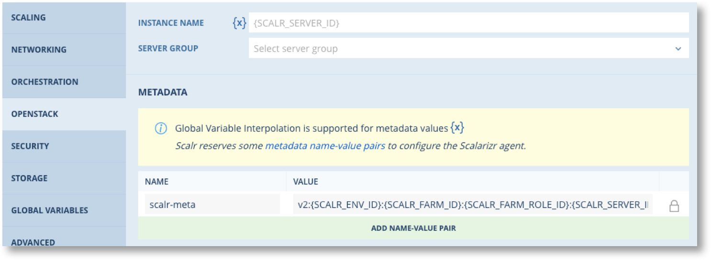
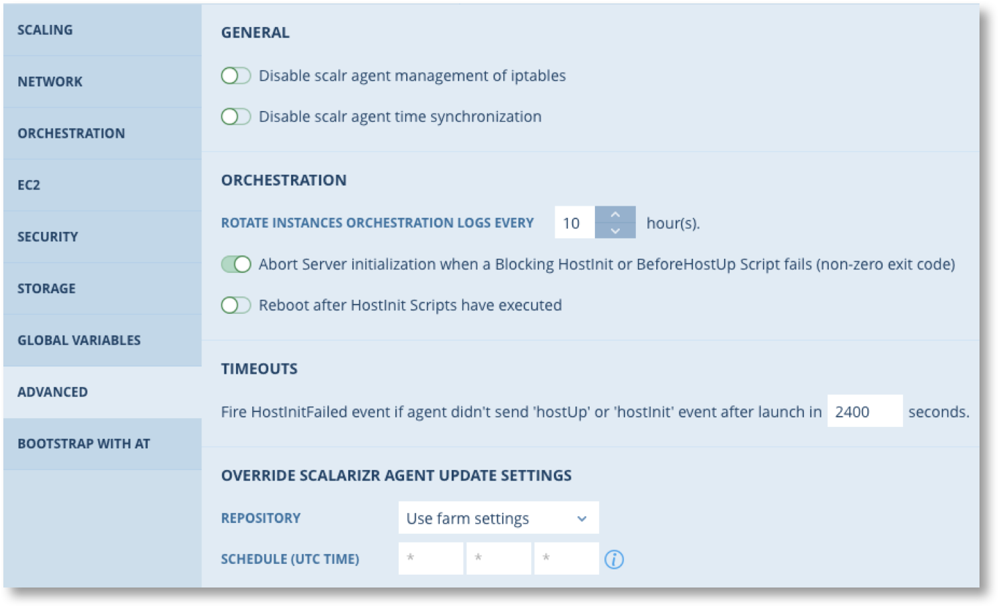

.. include:: ../GLOBAL.rst

.. _farms:

Farm Configuration
==================
|SCOPE_ENV|

A Farm is the collection of Roles, Orchestration rules, network configuration, cloud services and much more that defines the desired deployment state of a cloud based system. When a Role is added to a Farm this is known as a "Farm Role". It inherits all the attributes of the Role itself but extends the configuration to include selection of clouds, locations, network, security groups, additional orchestration rules etc.

Overall the Farm defines the "Desired State" of the Cloud deployment. When a Farm is launched Scalr's Desired State Engine (DSE) begins a continuous cycle of monitoring the cloud infrastructure to determine if the Farm is in the desired state or not, and makes adjustments by starting and terminating servers in order to achieve the desired state.

.. warning:: Reconfiguring a running farm can result in servers being stopped and started. Take great care when reconfiguring farms that are for business critical services.

Creating a Farm
---------------

A new Farm can be created from the main menu |MENU_ENV| or from the NEW FARM button in the Farm List.

.. image:: images/farm_menu_2.png
   :scale: 50%

Farms can also be cloned from the individual Farm menu |MENU| or created from an existing Service Catalog offering. In these two cases the Farms will be pre-populated with Farm Roles and other elements of the Farm configuration. From here on this page deals with creating new Farms only.

Farm Parameters
^^^^^^^^^^^^^^^

.. csv-table::
   :header-rows: 1
   :widths: 15,10,75
   :file: csv/farm_param.csv

**Global Variables** :ref:`gvs` can be defined at the Farm level to be inherited by Farm Roles. As with all Global Variables you can define at what scope the value can or cannot be set.

In the **Advanced** section you can set parameters for updating the Scalarizr agent on all servers in the Farm. See :ref:`updating_scalarizr` for more details.

.. |SZR| image:: images/scalarizr_sched.png
         :scale: 25%

.. note:: By default Scalarizr checks for updates every hour |SZR|.

.. _farm_roles:

Farm Roles
----------

The next step in creating Farms is to add one or more Farm Roles to define the servers and their configuration. A Farm Role is analogous to a 'tier' in an application stack, such as the Webapp, Load Balancer or database tier.

Click of the ADD FARM ROLE tab. You can select from a variety of pre-configured roles from the Quick Start list (if configured), or select a role from the various categories available from the filter drop down menu.

.. |FR01| image:: images/farm_role_01.png
          :scale: 30%

|FR01| |FR02|

Now select the cloud (:ref:`multicloud_roles` only) and enter the Cloud specific parameters for the Farm Role.

Click |ATF| and then click on the Farm Role name on the left hand panel to continue configuration of the Farm Role.

There are several tabs available to continue the configuration. Some tabs are dependent on other aspects of the configuration.

* DATABASE: Only available for Roles from the Database category
* BOOTSTRAP WITH ...: Only available if Chef/Ansible Tower is configured for the |ENVIRONMENT|
* Cloud: A Tab for the specified cloud

.. |INFO| image:: images/info.png
          :scale: 50%

The following sections provide explanations of each tab in the Farm Role configuration. These tabs are customised to match the Cloud chosen and the type of role, so not all tabs and options are always visible. Where a tab implements features of a cloud service there are information points |INFO| you can hover over which will provide an explanation.

Database
^^^^^^^^

(For database roles only)

.. image:: images/database_t.png
   :scale: 40%

Configure Storage, Snapshot and backup settings for the database. This tab may include database specific settings, e.g. for Redis.

**Storage**

Includes:

* Configure the type of Storage
* Set re-use options
* Choose the Snapshot to create the database volume from

**Snapshots**

You have the option of selecting the interval between two Snapshots. You can also specify a time window during which these Snapshots should be performed. Database Snapshots contain a hot copy of database data directory, a file that holds binary log position and debian.cnf. When your Farm starts the following steps are performed:

1. The database master downloads and extracts a snapshot from storage depending on cloud platform (EBS volume for Amazon);
2. When data is loaded and the master starts, slaves download and extract a Snapshot as well;
3. Slaves will sync with the master for some time.

Scaling
^^^^^^^

.. image:: images/scaling_t.png
   :scale: 40%

Auto Scaling in Farm Roles is a built in feature of Scalr that provides a consistent scaling capability across all Cloud platforms even for those clouds that don't have built-in scaling. If you are using the Cloud Platform's auto scaling features then you should set Scaling to Manual in the Farm Role.

.. note:: It is recommended that you disable any scaling features in the Cloud Platforms you use and only use Scalr built-in scaling. This will avoid any conflicts or duplication of effort that could cause service disruption and impact your costs. It will also ensure that your auto scaling parameters are applied consistently, regardless of where your application is deployed.

Auto Scaling is a sophisticated feature of Scalr and is described in detail in :ref:`auto_scaling`.

If you set scaling to Manual there are some options in Scalr for manually scaling applications up and down. See :ref:`manual_scaling` for more details.

Network
^^^^^^^

.. image:: images/network_t.png
   :scale: 40%

In the Network tab you may specify how Scalr should compute the hostname for the Servers in this Farm Role, view the Load Balancer settings, configure subnet and IP address assignment.

**Hostname Source**

There are two possible hostname sources: a hostname template or an external source via a Webhook.

.. warning:: These settings may be affected by a :ref:`Hostname Configuration Policy <config_policies>`, and will not be usable if a Policy has been defined.

.. csv-table::
   :widths: 15,85

   Template,"Enter the hostname in the text field, and Scalr will assign that hostname to your Servers. You may use :ref:`gvi` in the Hostname template. If the template is left blank, Scalr will use the cloud platform's default hostname, or the Scalr server ID if the cloud platform does not provide a default."
   External,"The :ref:`Webhook and Integration Endpoint <webhooks>` must be created first. Before launching a Server, Scalr will make a call to the selected webhook to retrieve a hostname. This webhook call is made before all the other events related to the Server (BeforeInstanceLaunch, HostInit, etc.) are triggered."

**Load Balancer**. You must link a Load Balancer Service to the Farm and associate the LB with the Farm Role via that interface. The Network tab will show the linked LB once this is done. See :ref:`cloud_services` for more details.

**Subnet and IP**. You can amend the subnet settings made when the Farm Role was added and choose how to assign IP's.

.. _farm_role_orchestration:

Farm Role Orchestration
^^^^^^^^^^^^^^^^^^^^^^^

Orchestration rules define actions to be performed at specific events during the lifecycle of servers. Orchestration rules associated with a Farm Role can be inherited from the Role and from the |SCALR|, |ACCOUNT| and |ENVIRONMENT| scopes.

To configure Orchestration Rules click on the Orchestration tab on the left side of the Farm Role details screen.

.. include:: /farms/orchestration_include.rst

Cloud Provider Tabs
^^^^^^^^^^^^^^^^^^^

Scalr supports a variety of configuration options for each cloud provider. The appropriate tab will be available for setting these options.

.. _ec2_spot:

EC2
***

.. csv-table::
   :widths: 30,70
   :header-rows: 1
   :file: csv/ec2_tab.csv

Azure
*****

.. csv-table::
   :widths: 30,70
   :header-rows: 1
   :file: csv/azure_tab.csv

GCE Settings
************

.. image:: images/gce_tab.png
   :scale: 50%

.. csv-table::
   :widths: 30,100
   :header-rows: 1
   :file: csv/gce_tab.csv

OpenStack
*********

.. csv-table::
   :widths: 20,80
   :header-rows: 1
   :file: csv/openstack_tab.csv

VMware
******

.. image:: images/vmware_tab.png
   :scale: 50%

.. csv-table::
   :widths: 20,200
   :header-rows: 1
   :file: csv/vmware_tab.csv

Security
^^^^^^^^

.. image:: images/security_t.png
   :scale: 40%

For all clouds except VMware and Google you can edit the Security Group settings directly through Scalr.

.. warning:: Some changes that are saved through this tab are applied to the Cloud Platform immediately and will impact running servers. |BR| * New Rules/groups are applied to all running servers. |BR| * Deleted rules/groups are applied only if the Rule was created since the server was launched. |BR| * Rules applied when the server was launched WILL NOT be affected by changes made in Scalr

.. _fr_storage:

Storage
^^^^^^^

.. image:: images/storage_t.png
   :scale: 40%

Where the Cloud Platform and Operating System permits you can configure root and additional storage for the servers, subject to any Policy limitations. See :ref:`storage` for detail of the Storage configuration options for each Cloud provider.

Global Variables
^^^^^^^^^^^^^^^^

.. image:: images/gv_t.png
   :scale: 40%

:ref:`gvs` can be defined at the Farm Role and, if permitted, values can be set for Global Variables defined at higher scopes.

.. _fr_advanced:

Advanced Options
^^^^^^^^^^^^^^^^

The following advanced configuration options are available for all Farm Roles.

.. csv-table::
   :header-rows: 1
   :widths: 30,70
   :file: csv/advanced.csv

You can also override the Scalarizer Update settings from the Farm if a different cadence or version is required for this Farm Role.

Ansible and Chef in Farm Roles
^^^^^^^^^^^^^^^^^^^^^^^^^^^^^^

The "Bootstrap by .." tabs allow you to enable bootstrap by Chef and Ansible for the Farm Role and set the bootstrap parameters. The settings are identical to those used in a Role. See :ref:`Bootstrap <bootstrap_ansible>` in the Roles section for more details.

.. note:: Bootstrapping can only be fully configured in a Farm Role if it has NOT been enabled at the Role level. If the Role has bootstrap enabled then it will be enabled at the Farm Role level and cannot be changed. Some limited options do remain configurable at the Farm Role level, such as choosing the Chef environment.
