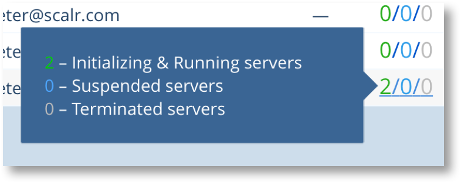
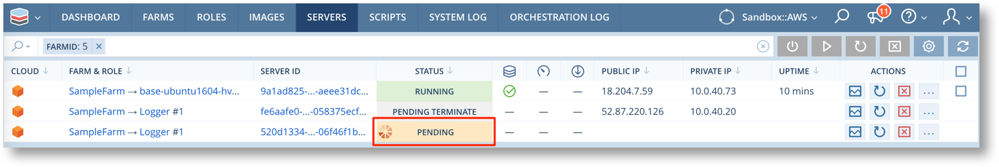
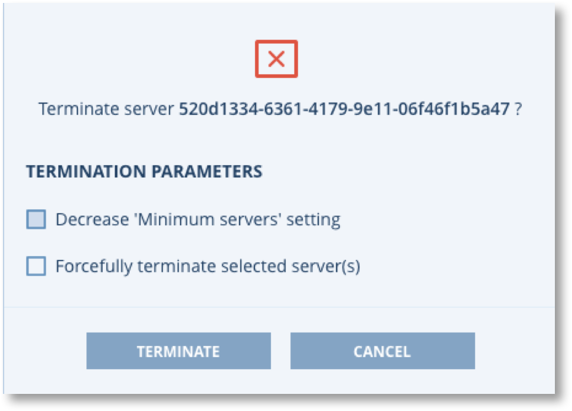
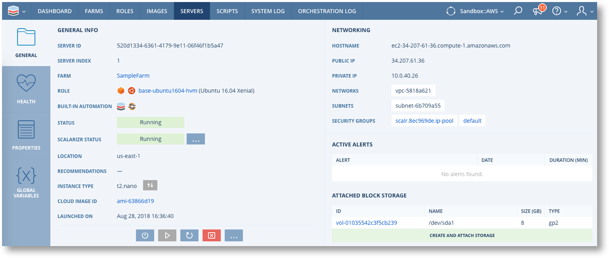
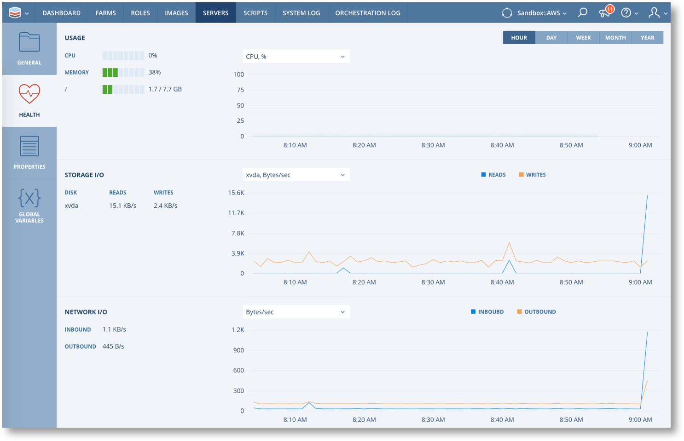
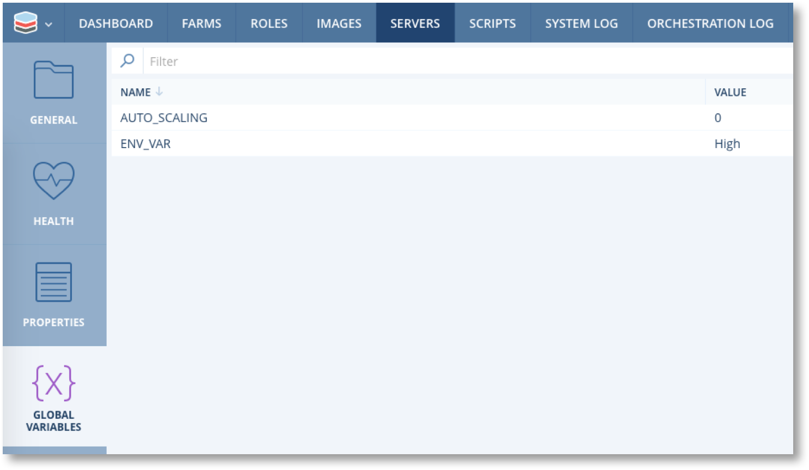
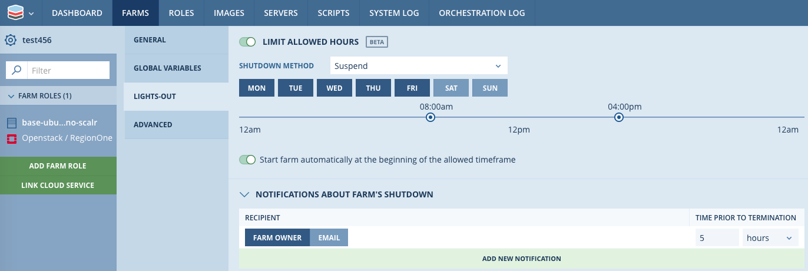

.. include:: ../GLOBAL.rst

Farm Launching and Managing Servers
===================================

Once a Farm is configured as desired it must be Launched in order for Scalr to start managing the state of the Farm in the clouds. Launching a Farm causes Scalr to start the continuous processing of analysing and maintaining the desired the state of the Farm in the cloud. At initial Launch this means it will immediately start launching servers, configuring storage and enabling cloud services as specified in the Farm configuration. After the initial launch Scalr will continue to monitor the cloud status and make adjustments to the deployment as required. Adjustments to the cloud deployment are made for three broad reasons.

* The state of cloud deployment has been changed due to events outside of Scalr. Scalr will redeploy servers etc to bring the cloud deployment back in line with the desired state specified in the Farm.
* The Scaling rules in the Farm have detected the need to scale the deployment up or down.
* The Farm configuration is changed. Scalr will immediately adjust the deployment to match the new desired state.

Launching a Farm
----------------

.. |SAVEL| image:: images/save_launch.png
           :scale: 40%

A Farm is launched either from the Farm Configuration page by clicking |SAVEL| or by clicking the Launch button on the Farm list.

.. image:: images/farm_launch.png
           :scale: 50%

After launching a Farm the farms list provides quick access links to the Servers, Farm Roles, Cloud Services and Containers in the Farm.

.. image:: images/farm_links.png
           :scale: 50%

The link to the Servers shows 3 numbers that correspond to the state of the servers in the Farm.

Managing Servers
----------------

After clicking on the Servers link from the Farm list you will be take to a filtered list of servers for the current Farm. On the right of each row in the list are action buttons for the Server Dashboard, Reboot and Terminate, plus a context sensitive menu which show additional actions that are applicable to the current state of the server.

.. image:: images/server_list.png
           :scale: 50%

The majority of the Server actions from the context menu are self explanatory. Those that require further explanation are as follows.

.. csv-table::
   :header-rows: 1
   :widths: 40,100
   :file: csv/server_actions.csv

There are also links and icons to show the Agent version and access to Utilization stats and Right Sizing recommendations as and when these are available.

.. image:: images/server_links2.png
           :scale: 50%

When a server is in a working through the process of booting and initialising the status will show as "PENDING" or "INITIALIZING". These status also provide a link to a summary of the initialisation progress, and if the server fails to initialise or even launch it will show |PENDL| or  "FAILED" state the failure reason will be shown.

.. image:: images/init.png
           :scale: 50%

.. image:: images/failed_msg.png
           :scale: 50%

Terminating Servers
-------------------

Terminating a server from the server list will not, by default, change the desired state of the Farm. If the "Decrease 'minimum servers' setting" is not checked Scalr will launch another server to replace the terminated server.

The terminate options act as follows

* Using "Decrease Minimum Servers" will change the :ref:`auto_scaling` configuration for the Farm Role.
* Forcefully terminating a Server will disable processing of the BeforeHostTerminate Event.

Server Dashboard
----------------

.. |DASH| image:: images/dashboard.png
          :scale: 40%

A detailed server dashboard is available for each server via the |DASH| button in the server list. This provides access to detailed information about the server and some additional management actions.

**General**

Provides access links to various related components such as the Farm, Role, Image, Security Groups etc. This screen also has a |MENU| button next to SCALARIZR STATUS to allow update or reboot of Scalarizr on the server.

Within this screen, you can also change the instance size by clicking |change_instance| next to the instance type.

**Health**

Health data is only available for Servers with the agent installed and can show resource usage statistics going back up to one year.

**Properties**

Detailed Cloud and Scalr properties for the server.

.. image:: images/dash_prop.png
           :scale: 50%

**Global Variables**

List of :ref:`gvs` for the server. This is all Global Variables configured at any scope, the Farm, Farm Role or Server. It does NOT include any Global Variables that may be available during Event processing.

.. _farm_allowed_hours:

Allowed Hours
-------------

Allowed Hours enforces automatic suspension or termination of a Farm between the specified periods. This helps ensure that servers are only running during hours that an admin sees fit. For example, you may not want a Dev |Environment| running 24 hours a day 7 days a week. To avoid this, you can create an allowed hours policy that only allows Farms to be in a running state Monday - Friday from 8:00AM - 5:00PM. Allowed hours need the following defined:

1. Shutdown Method: Suspend or Terminate
2. Day(s) of the week that Farms are allowed to be in a Running state.
3. Hours during the day in which the Farms are allowed to be in a Running state. Note: To determine the hours that apply, the policy will follow the timezone set in the Farm settings.
4. If the Farm should automatically start back up during the next allowed period.
5. Notifications to be sent prior to automatic suspension or termination.

There is also an :ref:`allowed_hours` policy, if the Account Admin has created this policy and applied it to your |Environment| then this section cannot be modified.

.. note:: The default Shutdown Method is Suspend. If you choose Terminate, this will destroy the server and potentially cause data loss.
