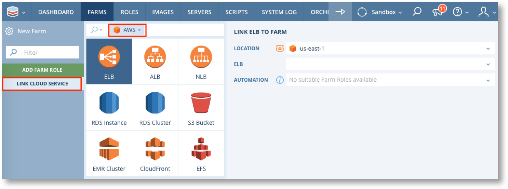

.. include:: ../GLOBAL.rst

.. _cloud_services:

Using Cloud Services in Farms
=============================

Cloud Services are described in :ref:`config_cloud_services` and a full reference list is available in :ref:`cloud_services_ref`.

Cloud services can be configured outside a Farm via the main menu and then linked, or new cloud service instances can be created whilst creating a Farm.

In the Farm Designer click on Link Cloud Service, select the required cloud provider from the search bar and then click on the required service.

.. |PLUS| image:: images/plus.png
          :scale: 30%

The configuration screen will show all available instances of the cloud service, including any that have been configured directly in the cloud and not through Scalr. Select one of the existing service instances or click |PLUS| to add a new service instance.

.. image:: images/link_2.png
   :scale: 50%

.. warning:: Some cloud services are separately chargeable by the cloud provider. Costs may be incurred as soon as the service instance configuration is saved in Scalr. Please refer to the Cloud providers own documentation for details of any charges that may arise as a result of configuring cloud services.

Depending on the Service chosen you may also need to configure the automation to link the service to the required Farm Roles, e.g. for Load Balancers

.. image:: images/link_auto.png
   :scale: 50%

This automation is performed by Scalr to register/deregister the Servers of the Farm Role with the cloud service as they are launched and terminated.

Don't forget to save the farm after linking a cloud service.
