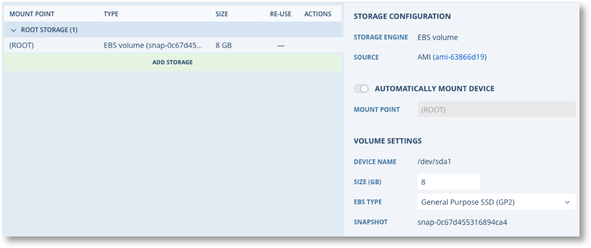
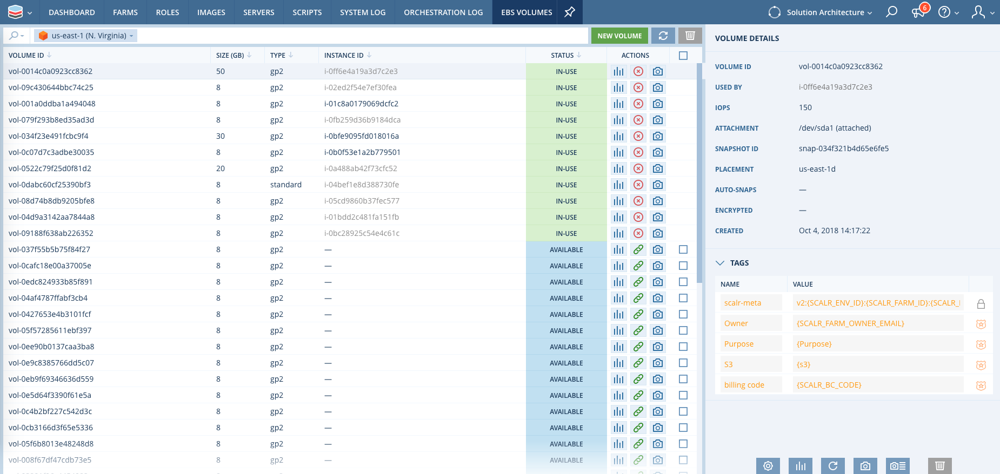
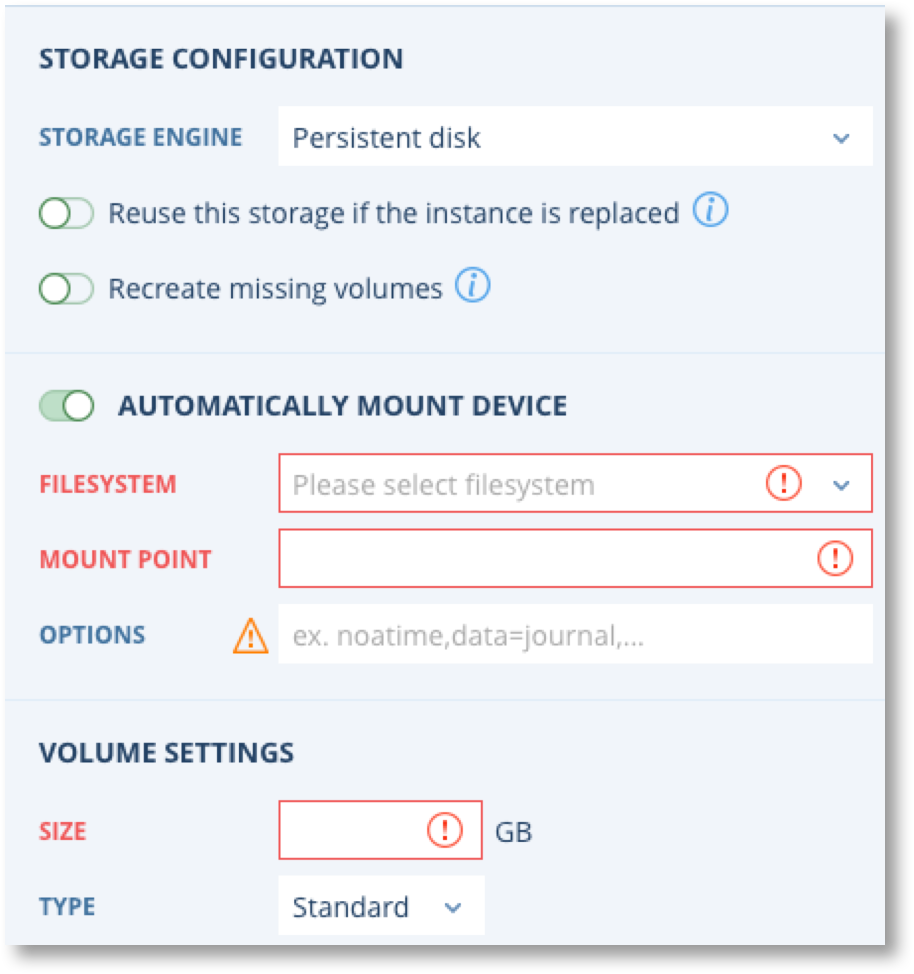
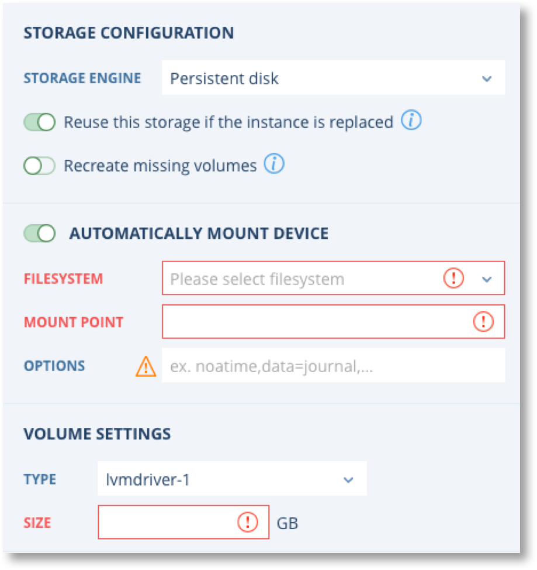
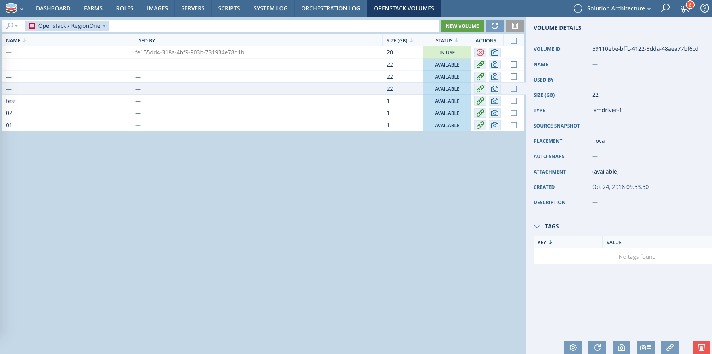
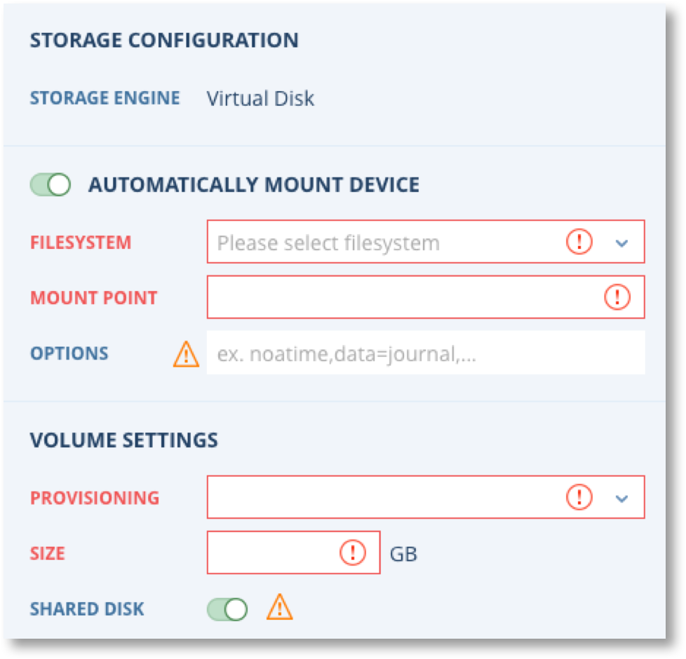

.. include:: ../GLOBAL.rst

.. _storage:

Configuring Storage
===================

|SCOPE_ENV|

Storage is configured at the Farm Role and includes options for configuring the mandatory root storage volume and optional additional storage. The additional storage can be shared on some clouds and marked as reusable. Reusable storage is automatically preserved by a snapshot and added to new servers when they are launched. In AWS this includes copying snapshots to other Availability Zones when a Farm Role is re-launched in a different AZ.

.. note:: Storage configuration changes do not apply to running Servers. They only take effect when new servers are launched.

Below is an example of a Storage configuration for a root volume. The actual options available are specific to the Cloud allocated to the Farm Role but are typically limited to the volume size and type.

For additional storage there are many more options available which are again specific to the Cloud allocated to the Farm Role. This example for AWS shows the full set of options when auto-mount is enabled.

.. image:: images/storage_add.png
           :scale: 50%

The common parameters for additional storage are as follows.

.. csv-table::
   :header-rows: 1
   :widths: 25,100
   :file: csv/storage_add_gen.csv

Volume Mounting
---------------

The way volumes are mounted varies depending on the Operating System.

It is important to be aware that the :ref:`EBSVolumeMounted` can fire when volumes are remounted during a reboot. Thus any Orchestration Rules that are trigged by the :ref:`EBSVolumeMounted` must be coded to be aware of this possibility and not take any inappropriate actions after reboots that could cause data loss.

For ALL Operating Systems additional volumes (not root / C:) are mounted by the scalr agent (scalarizr) on the first boot of a Server and will trigger the :ref:`EBSVolumeMounted`. For subsequent reboots the additional volumes are mounted as follows.

**Linux**

On first boot scalarizr adds the additional volumes to the operating systems fstab file, e.g. /etc/fstab so that the Operating System itself will remount the volumes on subsequent reboots. Thus the :ref:`EBSVolumeMounted` event will NOT fire for additional volumes after a reboot.

However if scalarizr detects that a volume configured in Scalr has not been re-mounted after a reboot, e.g. because the entry was removed from fstab, then it will re-mount the volume and add it back into fstab. In these circumstances the :ref:`EBSVolumeMounted` WILL fire.

**Windows**

Scalarizr performs all required volume mounting on first boot and all subsequent re-boots. Thus the :ref:`EBSVolumeMounted` WILL fire on every re-boot.

.. note:: Scalarizr checks volumes every time it restarts, so if any manual adjustments have been made since the server booted, scalarizr will unmount and remount volumes to ensure the Scalr configuration is re-applied. The :ref:`EBSVolumeMounted` will fire for these adjustments. If you wish to change the configuration of Volumes you must do this through Scalr.

AWS Storage Configuration
-------------------------

Additional AWS EBS Volumes can be configured on a Farm Role to be added to every server. The additional EBS options are as follows.

.. |EBS| raw:: html

   <a href="https://aws.amazon.com/ebs/details/" target="_blank">Amazon EBS Product Details</a>

.. csv-table::
   :header-rows: 1
   :widths: 25,100

   Option,Description
   EBS Type,The full range of EBS types can be selected. See |EBS| |NEWWIN| for more details
   Snapshot,The Snapshot to create the volume from. If blank a new Volume is created
   Enable EBS encryption,Turn on encryption and specify the KMS key

.. image:: images/storage_aws.png
   :scale: 50%

All storage volumes for AWS can be managed in the EBS Volumes page. Go to the main Scalr menu dropdown on the top left |MENU_ENV| and click on AWS, then EC2, and EBS volumes:

From the screen above you can do the following:

* Create and attach storage
* Change existing volume settings: size, type, tags
* Check Cloud Watch statistics
* Snapshot the selected volume
* Setup automatic snapshots for a volume

Google Cloud Platform Storage Configuration
-------------------------------------------

GCP based Farm Roles can have additional storage added using either "Persistent Disk" or "Local SSD (ephemeral)".

**Persistent Disk** : Options are Standard or SSD disk |BR|
**Local SSD** : Only option is the name.

.. |GCP2| image:: images/storage_gcp_2.png
          :scale: 50%

|GCP1| |GCP2|

All storage volumes for GCP can be managed in the GCP Persistent Disk page. Go to the main Scalr menu dropdown on the top left |MENU_ENV|, click on Google Cloud Platform, then Compute Engine, and Persistent Disks:

.. image:: images/storage_gcp_3.png
   :scale: 50%

From the screen above you can do the following:

* Change the size of the exists disks

Azure Storage Configuration
---------------------------

Azure based Farm Roles can have additional managed data disks added. The only option is the size.

.. image:: images/storage_azure.png
   :scale: 50%

All storage volumes for Azure can be managed in the Azure Managed Disk page. Go to the main Scalr menu dropdown on the top left |MENU_ENV|, click on Azure and Managed Disks:

.. image:: images/storage_azure2.png
   :scale: 50%

From the screen above you can do the following:

* Create a new Managed Disk
* Update the size and type of existing disks

OpenStack Storage Configuration
-------------------------------

OpenStack based Farm Roles can have additional persistent disks added. The only option is the size.

All storage volumes for Openstack can be managed in the Openstack Volumes page. Go to the main Scalr menu dropdown on the top left |MENU_ENV|, click on Openstack and then Volumes:

From the screen above you can do the following:

* Create and attach storage
* Change existing volume settings: size, type, tags
* Snapshot the selected volume
* Setup automatic snapshots for a volume

VMWare Storage Configuration
----------------------------

VMware based Farm Roles can have additional virtual disks added. The Volume Settings available are as follows.

.. csv-table::
   :header-rows: 1
   :widths: 25,100

   Option,Description
   Provisioning,Defines how to initialise the volume using zeroing
   Shared Disk,Allows the disk to be shared across all servers in the Farm Role. Only available for "Eager Zeroed" provisioning

All storage volumes for VMware can be managed in the VMware Vitrual Disks page. Go to the main Scalr menu dropdown on the top left |MENU_ENV|, click on VMware and then Virtual Disks:

.. image:: images/storage_vmware2.png
   :scale: 50%

From the screen above you can do the following:

* Create and attach storage 
