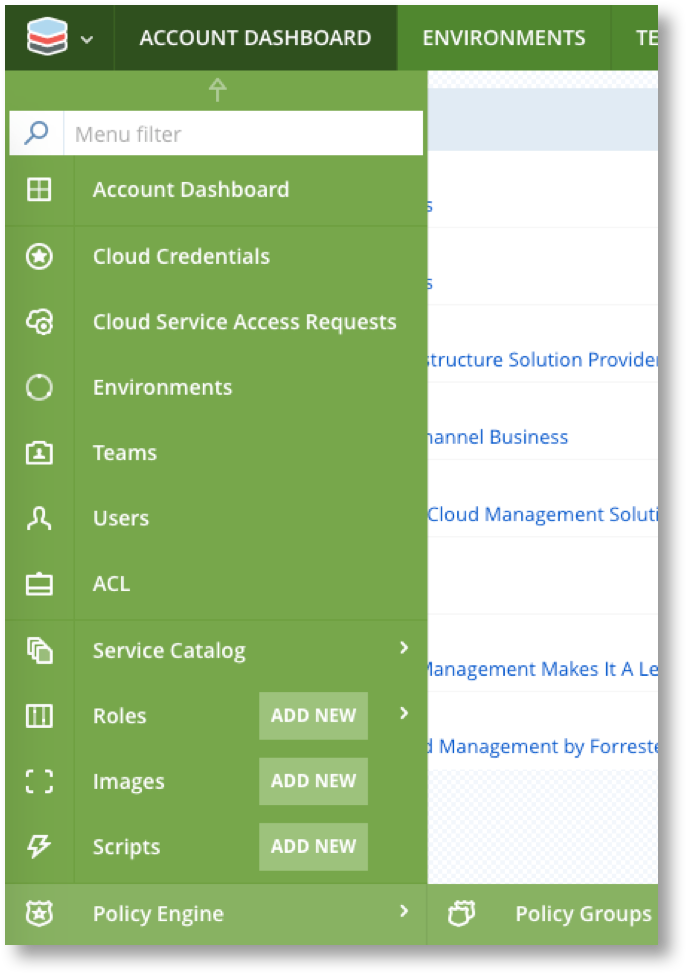
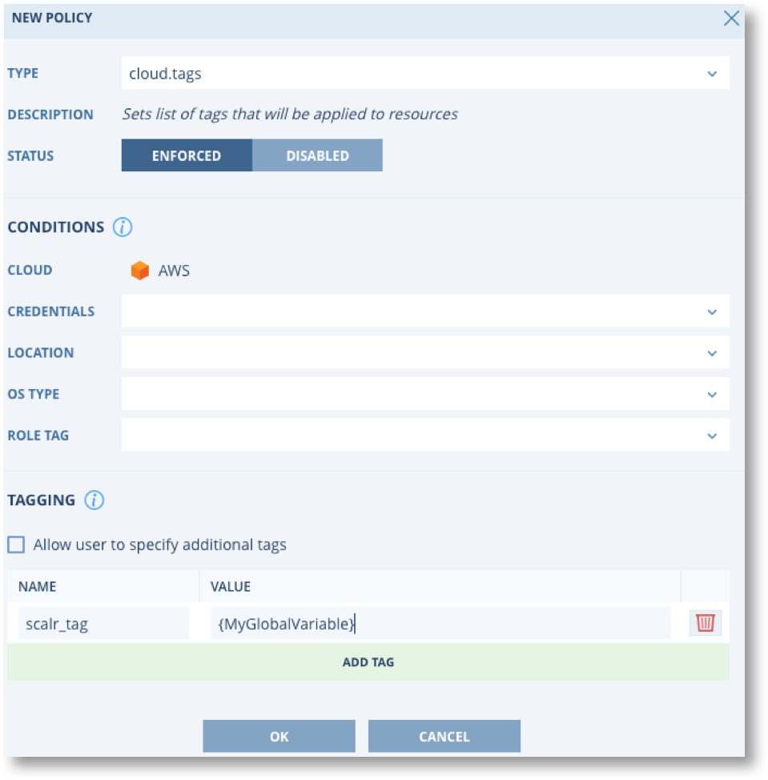

.. include:: ../GLOBAL.rst

.. _gvs:

Global Variables
================

Definition and Scope
--------------------

|SCOPE_SCALR| |SCOPE_ACC| |SCOPE_ENV| |SCOPE_ROLE| |SCOPE_FARM| |SCOPE_F_ROLE|

Global Variables are multi-purpose key value store objects that can be used for input from users or admins for the following:

* Tagging
* Script Input
* Naming Conventions
* Etc

Global Variables are encrypted in the Scalr database and can also be pulled down from the Scalr server by the Scalarizr agent when needed.

When accessing a Global Variable, Scalr follows the following algorithm:

* If the variable exists in the Scope you're trying to access, it will be returned
* If the variable does not exist in the Scope you're trying to access, or has an empty value, its parent scopes will be inspected to attempt returning the value

.. note::
   Note that the Farm Role Scope has two parents: the Farm Scope and the Role Scope. The Farm Scope is prioritized over the Role Scope.

Creating Global Variables
-------------------------

.. |SCALR_ICON| image:: images/scalr_icon_env.png
   :scale: 70%

Global Variables can be created, updated, edited, or deleted at the |Scalr|, |Account|, |Environment|, Farm, or Farm Role scopes. To create a Global Variable at the |Scalr|, |Account|, or |Environment| scopes you can click on the Scalr icon on the top left: |SCALR_ICON|

Then click on Global Variables: |GV|

You have a few options when creating a Global Variable:

.. image:: images/new_gv.png
   :scale: 70%

.. |MAN| image:: images/mandatory.png
   :scale: 25%

.. csv-table::
   :header-rows: 1
   :widths: 20,10,70

   Item,Type,Description
   Name,Metadata,Name of the Global Variable
   Category,Metadata,Category that the Global Variable falls into
   Description,Metadata,Description of the Global Variable
   |HID| Hidden,Flag,The value cannot be seen at a lower scope
   |LOCK| Locked,Flag,The value cannot be changed at a lower scope. However if a required scope is set the value can be changed at that scope.
   |MAN| Mandatory,Flag,The value must be set at a specific scope
   Custom,Format,A regular expression can be created for pattern validation
   JSON,Format,The values must be in a JSON format
   List,Format,The values will be presented in a dropdown

Once the Global Variable is created, click save and you will be able to use it in the various use cases below.

Using Global Variables in Scripts
---------------------------------

Global Variables can be passed to scripts that are executed through Scalr orchestration. The following examples are scripts executed on a server whose scope includes a Global Variable with the name "MyGlobalVariable".

Bash:

.. code-block:: shell

  #!/bin/bash
  echo $MyGlobalVariable

Powershell:

.. code-block:: Powershell

  #!powershell
  $env:MyGlobalVariable

Python:

.. code-block:: Python

  #!/usr/bin/env python
  import os
  print os.environ.get("MyGlobalVariable", "")

Ruby:

.. code-block:: Ruby

  #!/usr/bin/env ruby
  print ENV["MyGlobalVariable"]

.. _gvi:

Global Variable Interpolation
-----------------------------

Certain fields in the Scalr User Interface support Global Variable interpolation. These fields are identified with the |GVI| symbol. Global Variables can be entered into fields using the following placeholder syntax: ``{GLOBAL_VARIABLE_NAME}``. When the value of field is required, e.g. when a server is being provisioned, or when a :ref:`Policy <policy_engine>` is being applied, the Global Variable placeholders will be replaced with their actual value.

Using Global Variables in Policies
----------------------------------

Another powerful use of Global Variables is to use them in policy. A common use case is to use them in conjunction with tagging or naming policies. To do this, go to Policy at the |Account| scope:

In the example below, a tagging policy is created in the cloud provider which will have a tag name of "scalr_tag" and the tag value will be the value of a Global Variable named "MyGlobalVariable". Based on the brackets {} being around the value, Scalr knows to pull that as a Global Variable and insert that value into the cloud provider.

This same concept can be used for other policies that allow for free form input, like hostname and instance name policies.

Examining Global Variables in Servers
-------------------------------------

Global Variables can also be referenced while working within the operating system by using the Scalarizr agent admin command: ``szradm``. To find out more, go to the :ref:`szradm` in the Scalarizr section of the documentation.

Built-in Scalr Variables
------------------------

All of the variables above have been Global Variables that are provided by either an admin or user input. Scalr can also automatically define a certain amount of "built-in" Global Variables and inject them in the server Scope. These Global Variables are always available and they are prefixed with "SCALR" to avoid collisions with your own variables. Here is the list of the variables that can be accessed the same way as Global Variables:

Server Scope Built-In Variables
^^^^^^^^^^^^^^^^^^^^^^^^^^^^^^^

+---------------------------+---------------------------------------------------------------------------------------------------------------+-----------------------------------------+
| Environment Variable      | Description                                                                                                   | Sample Value                            |
+===========================+===============================================================================================================+=========================================+
| SCALR_IMAGE_ID            | Cloud Image Identifier                                                                                        | ami-43935d2a                            |
+---------------------------+---------------------------------------------------------------------------------------------------------------+-----------------------------------------+
| SCALR_EXTERNAL_IP         | External IP Address of the Server (only provided if the IP exists)                                            | 107.108.109.110                         |
+---------------------------+---------------------------------------------------------------------------------------------------------------+-----------------------------------------+
| SCALR_INTERNAL_IP         | Internal IP Address of the Server (only provided if the IP exists)                                            | 10.11.12.13                             |
+---------------------------+---------------------------------------------------------------------------------------------------------------+-----------------------------------------+
| SCALR_ROLE_NAME           | Name of the Scalr Role this Server belongs to. This is not the Farm Role Alias.                               | app-apache-ubuntu-ebs                   |
+---------------------------+---------------------------------------------------------------------------------------------------------------+-----------------------------------------+
| SCALR_ROLE_OS             | Operating System of the Role                                                                                  | Ubuntu, etc                             |
+---------------------------+---------------------------------------------------------------------------------------------------------------+-----------------------------------------+
| SCALR_ISDBMASTER          | Whether this Instance is a Role Master (only provided).                                                       | 1                                       |
+---------------------------+---------------------------------------------------------------------------------------------------------------+-----------------------------------------+
| SCALR_INSTANCE_INDEX      | Index of this Instance within its Farm Role                                                                   | 2                                       |
+---------------------------+---------------------------------------------------------------------------------------------------------------+-----------------------------------------+
| SCALR_INSTANCE_FARM_INDEX | Index of this instance within its Farm                                                                        | 1                                       |
+---------------------------+---------------------------------------------------------------------------------------------------------------+-----------------------------------------+
| SCALR_SERVER_TYPE         | Instance type                                                                                                 | c3.large                                |
+---------------------------+---------------------------------------------------------------------------------------------------------------+-----------------------------------------+
| SCALR_SERVER_HOSTNAME     | The hostname for this Server                                                                                  | app-1.example.com                       |
+---------------------------+---------------------------------------------------------------------------------------------------------------+-----------------------------------------+
| SCALR_LAUNCHED_BY_EMAIL   | The system email of the user who launched the instance                                                        | someone@company.com                     |
+---------------------------+---------------------------------------------------------------------------------------------------------------+-----------------------------------------+
| SCALR_LAUNCHED_BY_ID      | The system ID of the user who launched the instance                                                           | 1                                       |
+---------------------------+---------------------------------------------------------------------------------------------------------------+-----------------------------------------+
| SCALR_SERVER_ID           | The Server ID for this Server. This is an internal Scalr record key.                                          | 0abb9535-9d1a-4dc4-a38c-7b7b26db7bb0    |
+---------------------------+---------------------------------------------------------------------------------------------------------------+-----------------------------------------+
| SCALR_FARM_ID             | The Farm ID of the Farm this Server belongs to. This is an internal Scalr record key.                         | 5334                                    |
+---------------------------+---------------------------------------------------------------------------------------------------------------+-----------------------------------------+
| SCALR_FARM_ROLE_ID        | The Farm Role ID of the Farm Role this Server belongs to. This is an internal Scalr record key.               | 4                                       |
+---------------------------+---------------------------------------------------------------------------------------------------------------+-----------------------------------------+
| SCALR_FARM_ROLE_ALIAS     | The Farm Role Alias of the Farm Role this Server belongs to.                                                  | myrole                                  |
+---------------------------+---------------------------------------------------------------------------------------------------------------+-----------------------------------------+
| SCALR_FARM_NAME           | The Name of the Farm this Server belongs to.                                                                  | My App Production                       |
+---------------------------+---------------------------------------------------------------------------------------------------------------+-----------------------------------------+
| SCALR_FARM_HASH           | The Farm Hash of the Farm this Server belongs to. This is an internal Scalr record key.                       | cc55739bfdf844                          |
+---------------------------+---------------------------------------------------------------------------------------------------------------+-----------------------------------------+
| SCALR_FARM_OWNER_EMAIL    | The email address of the owner of the Farm this Server belongs to.                                            | user@scalr.com                          |
+---------------------------+---------------------------------------------------------------------------------------------------------------+-----------------------------------------+
| SCALR_BEHAVIORS           | A comma-separated list of the Scalr built-in automations that are active for this Server.                     | apache,nginx                            |
+---------------------------+---------------------------------------------------------------------------------------------------------------+-----------------------------------------+
| SCALR_ENV_ID              | The ID of the Environment this Server belongs to. This is an internal Scalr record key.                       | 1                                       |
+---------------------------+---------------------------------------------------------------------------------------------------------------+-----------------------------------------+
| SCALR_ENV_NAME            | The Name of the Environment this Server belongs to.                                                           | Staging                                 |
+---------------------------+---------------------------------------------------------------------------------------------------------------+-----------------------------------------+
| SCALR_CLOUD_LOCATION      | The Location where this Server is. This value is provided by your Cloud Platform.                             | us-east-1                               |
+---------------------------+---------------------------------------------------------------------------------------------------------------+-----------------------------------------+
| SCALR_CLOUD_SERVER_ID     | The Cloud ID for this Server. This value is provided by your Cloud Platform.                                  | i-866f40a8                              |
+---------------------------+---------------------------------------------------------------------------------------------------------------+-----------------------------------------+
| SCALR_CLOUD_LOCATION_ZONE | A more precise location for this Server, if available. This value is provided by your Cloud Platform.         | us-east-1a                              |
+---------------------------+---------------------------------------------------------------------------------------------------------------+-----------------------------------------+
| SCALR_CLOUD_PLATFORM      | A description of the Cloud Platform.  Available in Scalr  >=7.5.2.                                            | openstack, ec2, etc                     |
+---------------------------+---------------------------------------------------------------------------------------------------------------+-----------------------------------------+
| SCALR_ACCOUNT_ID          | The Scalr Account ID.  This is an internal Scalr record key. Available in Scalr  >=7.5.2.                     | 1, 5, etc                               |
+---------------------------+---------------------------------------------------------------------------------------------------------------+-----------------------------------------+
| SCALR_ACCOUNT_NAME        | The Scalr Account Name.  This is an internal Scalr record key. Available in Scalr  >=7.5.2.                   | Account1, Oil and Gas, Healthcare, etc. |
+---------------------------+---------------------------------------------------------------------------------------------------------------+-----------------------------------------+
| SCALR_INSTANCE_ID         | Equivalent to SCALR_CLOUD_SERVER_ID . This Global Variable is a legacy AWS specific variable.                 | i-866f40a8                              |
+---------------------------+---------------------------------------------------------------------------------------------------------------+-----------------------------------------+
| SCALR_AMI_ID              | Equivalent to SCALR_IMAGE_ID . This Global Variable is a legacy AWS specific variable.                        | ami-43935d2a                            |
+---------------------------+---------------------------------------------------------------------------------------------------------------+-----------------------------------------+
| SCALR_REGION              | Equivalent to SCALR_CLOUD_LOCATION . This Global Variable is a legacy AWS specific variable.                  | us-east-1                               |
+---------------------------+---------------------------------------------------------------------------------------------------------------+-----------------------------------------+
| SCALR_AVAIL_ZONE          | Equivalent to SCALR_CLOUD_LOCATION_ZONE . This Global Variable is a legacy AWS specific variable.             | us-east-1a                              |
+---------------------------+---------------------------------------------------------------------------------------------------------------+-----------------------------------------+

Server Scope Built-In Cost Variables
^^^^^^^^^^^^^^^^^^^^^^^^^^^^^^^^^^^^^

+------------------------+---------------------------------------------------------------------------------------------------------------------------+-------------------------------------------------+
| Environment Variable   | Description                                                                                                               | Sample Value                                    |
+========================+===========================================================================================================================+=================================================+
| SCALR_COST_CENTER_ID   | The ID of the Cost Center this Server is associated with (through the Project the Farm it belongs to is associated with). | c3146a74-3135-451e-b09e-d9882965d57f            |
+------------------------+---------------------------------------------------------------------------------------------------------------------------+-------------------------------------------------+
| SCALR_COST_CENTER_BC   | The Billing Code of the Cost Center this Server is associated with.                                                       | BU-1-code                                       |
+------------------------+---------------------------------------------------------------------------------------------------------------------------+-------------------------------------------------+
| SCALR_COST_CENTER_NAME | The Name of the Cost Center this Server is associated with.                                                               | Businesses Unit A                               |
+------------------------+---------------------------------------------------------------------------------------------------------------------------+-------------------------------------------------+
| SCALR_PROJECT_ID       | The ID of the Project this Server is associated with (through the Farm it belongs to ).                                   | 05650aa6-e472-4bae-8532-c57503eb5bb4            |
+------------------------+---------------------------------------------------------------------------------------------------------------------------+-------------------------------------------------+
| SCALR_PROJECT_BC       | The Billing Code of the Project this Server is associated with (through the Farm it belongs to).                          | Application-123                                 |
+------------------------+---------------------------------------------------------------------------------------------------------------------------+-------------------------------------------------+
| SCALR_PROJECT_NAME     | The Name of the Project this Server is associated with (through the Farm it belongs to ).                                 | Europe Cloud Identity Management Infrastructure |
+------------------------+---------------------------------------------------------------------------------------------------------------------------+-------------------------------------------------+

Scalr UI Default Global Variables
---------------------------------

The following special Global Variables can be used to set default behavior of your Farm Roles in the |Account|, |Environment|, or Role scopes. An example of when to use a UI default variable is if you have an environment in which you know that no servers should be auto-scaled, you can set SCALR_UI_DEFAULT_AUTO_SCALING to "0" at the |Environment| level and all farms will inherently have auto-scaling disabled by default.

+----------------------------------------------------------------+----------------------+---------------------------------------------------------------------------------------------------------------------------------------+
| Name                                                           | Accepted value(s)    | Description                                                                                                                           |
+----------------------------------------------------------------+----------------------+---------------------------------------------------------------------------------------------------------------------------------------+
| SCALR_UI_DEFAULT_AWS_EC2_INITIATED_SHUTDOWN_BEHAVIOR           | stop/terminate       | "AWS EC2 instance initiated shutdown behavior is suspend (""stop"") or terminate (""terminate"")."                                    |
+----------------------------------------------------------------+----------------------+---------------------------------------------------------------------------------------------------------------------------------------+
| SCALR_UI_DEFAULT_STORAGE_RE_USE                                | 0/1                  | Reuse block storage device if an instance is replaced.                                                                                |
+----------------------------------------------------------------+----------------------+---------------------------------------------------------------------------------------------------------------------------------------+
| SCALR_UI_DEFAULT_REBOOT_AFTER_HOST_INIT                        | 0/1                  | Reboot after HostInit Scripts have executed.                                                                                          |
+----------------------------------------------------------------+----------------------+---------------------------------------------------------------------------------------------------------------------------------------+
| SCALR_UI_DEFAULT_AUTO_SCALING                                  | 0/1                  | Auto-scaling is disabled (0) or enabled (1).                                                                                          |
+----------------------------------------------------------------+----------------------+---------------------------------------------------------------------------------------------------------------------------------------+
| SCALR_UI_DEFAULT_ABORT_INITIALIZATION_ON_ORCHESTRATION_FAILURE | 0/1                  | Abort Server initialization when a Blocking HostInit or BeforeHostUp Script fails (non-zero exit code).                               |
+----------------------------------------------------------------+----------------------+---------------------------------------------------------------------------------------------------------------------------------------+
| SCALR_UI_DEFAULT_{PLATFORM}_LOCATION                           | "us-east-1           | Location for a cloud platform.  Value must be valid for the cloud platform.                                                           |
+----------------------------------------------------------------+----------------------+---------------------------------------------------------------------------------------------------------------------------------------+
| SCALR_UI_DEFAULT_{PLATFORM}_INSTANCE_TYPE                      | "t2.small            | Location for a cloud platform.  Value must be valid for the cloud platform.                                                           |
+----------------------------------------------------------------+----------------------+---------------------------------------------------------------------------------------------------------------------------------------+
| SCALR_UI_DEFAULT_CHEF_SERVER                                   | chef.example.com     | Chef server for Chef-bootstrapped Roles.                                                                                              |
+----------------------------------------------------------------+----------------------+---------------------------------------------------------------------------------------------------------------------------------------+
| SCALR_UI_DEFAULT_AZURE_RESOURCE_GROUP                          | ExampleResourceGroup | Resource Group for Azure Roles.                                                                                                       |
+----------------------------------------------------------------+----------------------+---------------------------------------------------------------------------------------------------------------------------------------+
| SCALR_UI_DEFAULT_AWS_SUBNETS                                   | subnet-6407ef00      | Subnets for AWS EC2 Roles.                                                                                                            |
+----------------------------------------------------------------+----------------------+---------------------------------------------------------------------------------------------------------------------------------------+
| SCALR_UI_DEFAULT_AWS_EC2_SECURITY_GROUPS                       | sg-0f0c4e68          | Security Groups for AWS EC2 Roles.                                                                                                    |
+----------------------------------------------------------------+----------------------+---------------------------------------------------------------------------------------------------------------------------------------+
| SCALR_UI_DEFAULT_INITIALIZATION_TIMEOUT                        | Integer              | Terminate instance if it will not send 'hostInit' or 'hostUp' event after launch in the defined time frame. Value defined in seconds. |
+----------------------------------------------------------------+----------------------+---------------------------------------------------------------------------------------------------------------------------------------+
| SCALR_UI_DEFAULT_AWS_RDS_MAINTENANCE_WINDOW                    | dd:hh:mm - dd:hh:mm  | Set the preferred maintenance window for AWS RDS. dd defines day of the week (mon-sun)                                                |
+----------------------------------------------------------------+----------------------+---------------------------------------------------------------------------------------------------------------------------------------+
| SCALR_UI_DEFAULT_AWS_RDS_BACKUP_WINDOW                         | hh:mm - hh:mm        | Set the preferred backup window for AWS RDS.                                                                                          |
+----------------------------------------------------------------+----------------------+---------------------------------------------------------------------------------------------------------------------------------------+
| SCALR_UI_DEFAULT_AWS_RDS_BACKUP_RETENTION_PERIOD               | Integer              | Period of days to retain backup.  Value defined in days.                                                                              |
+----------------------------------------------------------------+----------------------+---------------------------------------------------------------------------------------------------------------------------------------+
| SCALR_UI_DEFAULT_AWS_EC2_KMS_KEY                               | example-key          | Default KMS key for EBS Volume                                                                                                        |
+----------------------------------------------------------------+----------------------+---------------------------------------------------------------------------------------------------------------------------------------+
| SCALR_UI_DEFAULT_AWS_RDS_KMS_KEY                               | example-key          | Default KMS key for RDS                                                                                                               |
+----------------------------------------------------------------+----------------------+---------------------------------------------------------------------------------------------------------------------------------------+
| SCALR_UI_DEFAULT_DISABLE_NTP_MANAGEMENT                        | 0/1                  | "Scalarizr agent NTP management is enabled by default. (0) .  To Disable NTP management                                               |
+----------------------------------------------------------------+----------------------+---------------------------------------------------------------------------------------------------------------------------------------+
| SCALR_UI_DEFAULT_AWS_IAM_INSTANCE_PROFILE                      | iam-profile-1        | The default IAM profile to use                                                                                                        |
+----------------------------------------------------------------+----------------------+---------------------------------------------------------------------------------------------------------------------------------------+
| SCALR_UI_DEFAULT_GCE_PUBLIC_IP_USAGE                           | 0/1                  | Sets public IPs on all instances or none.                                                                                             |
+----------------------------------------------------------------+----------------------+---------------------------------------------------------------------------------------------------------------------------------------+
| SCALR_UI_DEFAULT_AWS_EFS_KMS_KEY                               | example-key          | The KMS key alias or the full ARN for an encrypted Elastic File System.                                                               |
+----------------------------------------------------------------+----------------------+---------------------------------------------------------------------------------------------------------------------------------------+
| SCALR_UI_DEFAULT_GCE_SERVICE_ACCOUNT                           | service-account      | The default GCE service account to use.                                                                                               |
+----------------------------------------------------------------+----------------------+---------------------------------------------------------------------------------------------------------------------------------------+

.. note::
   If a default GV violates a Governance Policy, it will be ignored.
