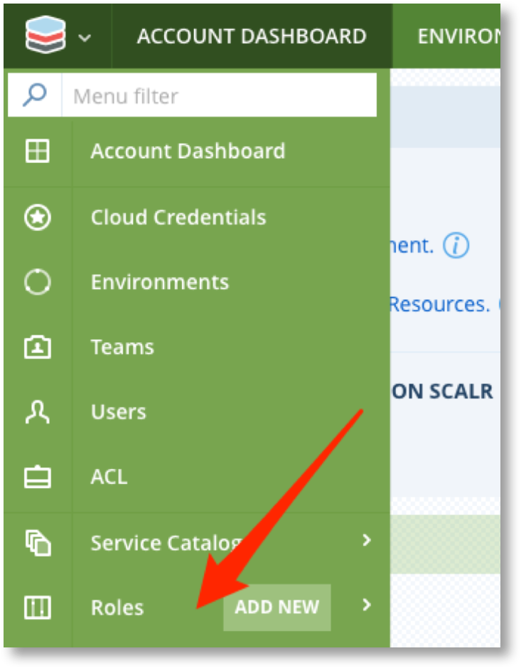
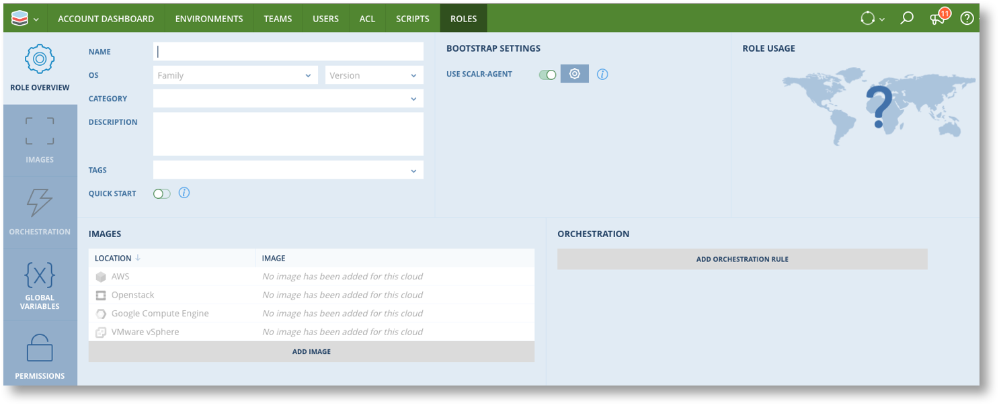
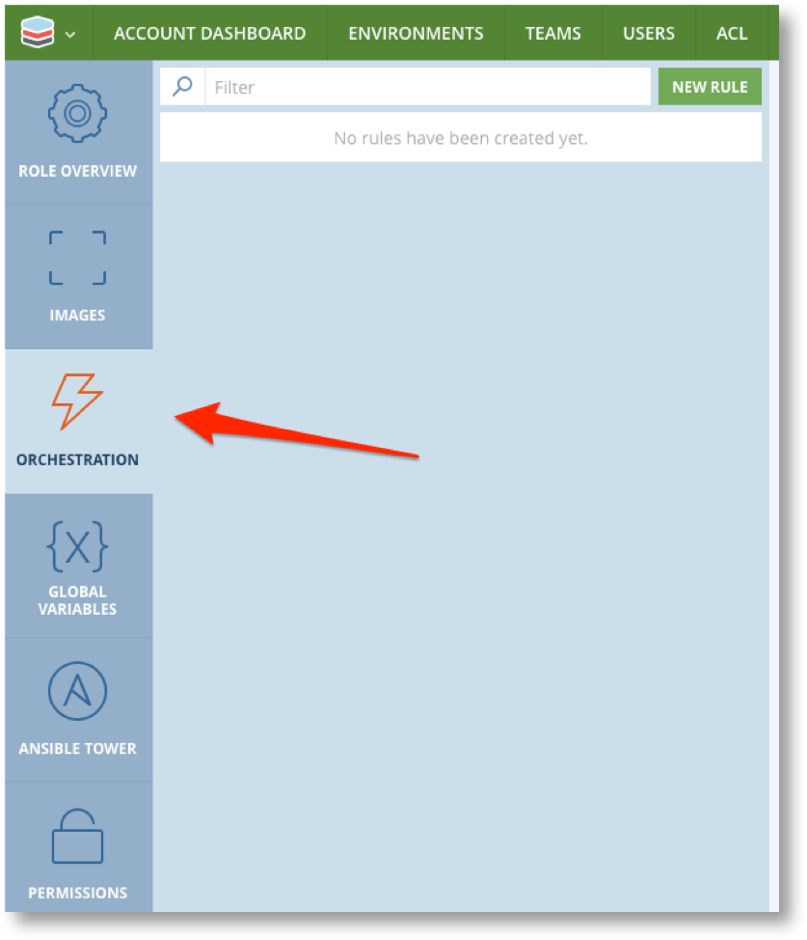
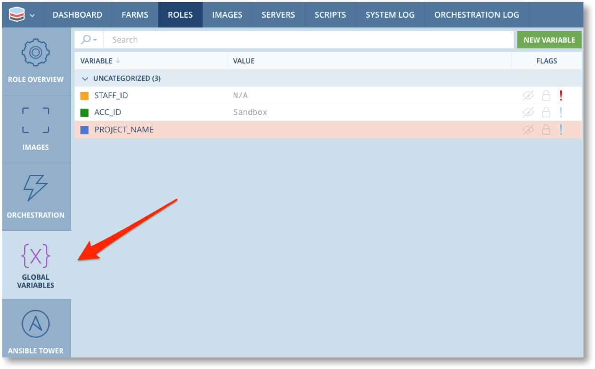
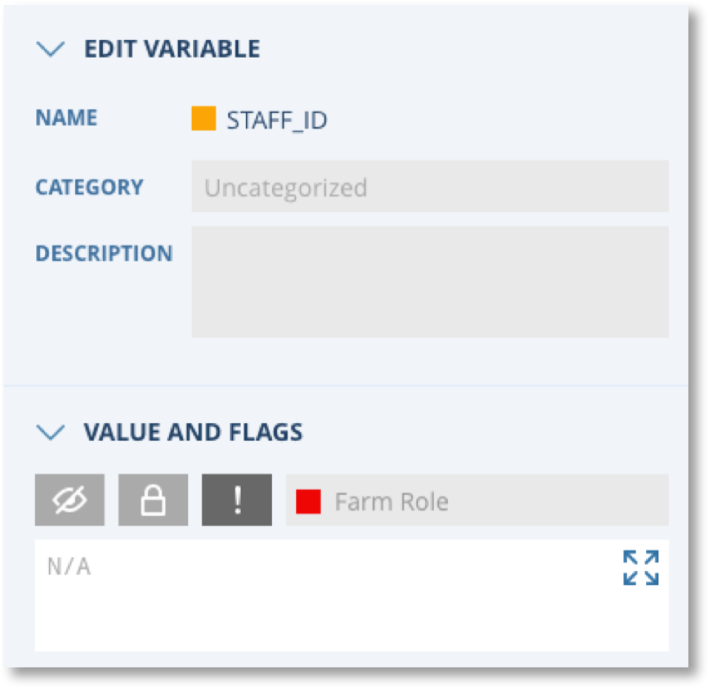
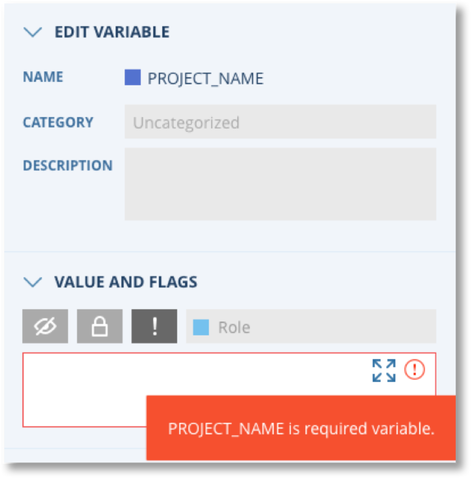

.. include:: ../GLOBAL.rst

.. _roles:

Creating Roles
==============
|SCOPE_SCALR| |SCOPE_ACC| |SCOPE_ENV|

Step two of using Scalr to configure and deploy infrastructure is to create Roles. Roles are the building block that define the characteristics of servers that are deployed by Scalr. In their simplest form Roles provide an abstraction layer over the top of the Images. A Role is linked to one or more similar Images, located in different clouds and/or locations, thus providing the flexibility for infrastructure designers and end users to chose the cloud and location for the resulting servers at the time they launch an application.

"Similar" Images are Images that are configured to provide the same behaviour and deliver the same service. Thus all similar Images will have

* The same base operating system and Version
* The same patch levels
* The same pre-installed and configured software packages

Roles can also include options to further manage the behaviour and configuration of servers.

* Orchestration rules that define actions (executed through Scripts) that take place at various lifecycle events throughout the life of a server.
* Global Variables that can be used to pass dynamic values to alter the configuration of servers and execution of Orchestration rules.
* Integration with Configuration Management tools like Chef and Ansible to perform the bootstrap and configuration of servers.

Roles can be created at any scope in Scalr and made available to lower scopes. |ACCOUNT| scope roles can be given permissions to restrict which |ENVIRONMENTS| they are available to. By default they will be available to all |ENVIRONMENTS| in the |ACCOUNT|.

Role functionality is accessed via Roles in the Main menu or Bookmarks bar at any scope. Note that you can jump straight to New Role from the main menu or click on "Roles" and then "New Role" at the top of the list.

.. |ROLE_LIST| image:: images/role_list.png
              :scale: 50%

|ROLE_MENU| |ROLE_LIST|

You will now be presented with the New Role screen where you configure all the Role options

.. csv-table:: Role Configuration Parameters
   :header-rows: 1
   :widths: 15,10,75

   Parameter,Mandatory?,Details
   Name,Yes,A meaningful name that typically includes the OS and version and main package e.g. "ubuntu-1404-haproxy"
   OS Family and Version,Yes,This must match the OS Family and Version of the Images you wish to link to this role
   Category,Yes,Provides grouping of roles when being selected in the Farm Designer. You can add your own Categories from Roles -> Role Categories menu
   Description,No,Describes the purpose of the Role and any special details that may be relevant
   Tags,No,You can include previously defined :ref:`policy_tags` to associate the Role with governance policies defined in the :ref:`policy_engine`. You can also add your own tags to help with role grouping related Roles and for use in :ref:`cost_management` for cost reporting.
   Quick Start,No,Enable this to include this role in the Quick Start menu of the Farm Designer
   Use Scalr-Agent,No,Enabled by default and required for `Role Orchestration`_ and :ref:`auto_scaling`. If this is disabled the "Configure Built-In Automation wheel" |CONFIGURE| will be disabled but the option to Use Cloud-Init will appear.
   Configure Built-In Automation wheel |CONFIGURE|,No,Click on the wheel and select "Chef" to enable the Chef options for this role. This will make the Chef tab visible on the left side. You can only enable Chef when creating a new Role as it cannot be done after the role has been saved. See Note below.
   Use Cloud-Init,No,This option only appears if "Use Scalr-Agent" is disabled. Enable this option to have Scalr work with Cloud-Init to configure servers. Once enabled the Configure button |CONFIGURE| will appear to enable you to set the Cloud-Int Config

   Images,Yes,You must link the Role to at least one Image (see below). When you click on ADD IMAGES you will only see Images with the same OS Family/Version that have Scalarizr or CloudInit installed.

.. note:: Built in Automations other than Chef will be deprecated in future release of Scalr. They will continue to work for existing roles but should now be replaced by user configured Orchestration Rules.

When adding Images to Roles you need to be aware of the different ways Images are configured in each cloud.

.. csv-table::
   :widths: 15,70
   :header-rows: 1

   Cloud,Image Configuration
   AWS EC2,Images are unique for every AWS location. You must add every similar Image in every location you want the Role to be enabled for.
   Azure,Azure Image is common to all regions so only one Image needs be added to the Role
   GCP,GCP Image is common to all regions so only one Image needs be added to the Role
   Openstack,Images are unique for every Openstack. You must add every similar Image in every region you want the Role to be enable for.
   VMware,Images are unique for every VMware location. You must add every similar Image in every location you want the Role to be enable for.

.. note:: When you save a Role you will be taken back to the role list. To make further edits to a role select the Role to be edited and click the Edit |EDIT| button.

.. _role_orchestration:

Role Orchestration
------------------

Orchestration rules define actions to be performed at specific events during the lifecycle of servers. Orchestration rules associated with a Role are inherited by :ref:`farm_roles` that are created in the Farm designer or Service Catalog.

To configure Orchestration Rules click on the Orchestration tab on the left side of the Role details screen.

.. include:: /farms/orchestration_include.rst

Global Variables in Roles
-------------------------

When defining Roles you can define new :ref:`gvs` for use in scripts etc as described in the :ref:`gvs` section.
You may also need to set the value of Global Variables that have been defined at the same or higher scopes. Global Variables defined at the same or higher scope as the role are automatically associated with the Role and will be visible when clicking on the Global Variables tab of the Role screen.

If the value for a variable is already set then the Role can use that value or overwrite it if the variable is configured to allow it.

.. |GV1| image:: images/gv1.png
         :scale: 30%

.. csv-table::

   "Variable Unlocked. Role can set the value to be inherited by lower scopes, but ALL lower scopes can overwrite the value",|GV1|
   "Value can be set at any scope down to the specified scope. Role can set the value to be be inherited by the lower scopes. Only lower scopes as far as the specified scope will be able to overwrite the value.",|GV2|
   "Value must be set at this scope. A value must be supplied and an error will occur if you attempt to save the Role, save any Farm using the role, or launch a Farm that uses the Role if the value is not set. Lower scopes will NOT be able to overwrite",|GV3|

.. _bootstrap_ansible:

Ansible Tower in Roles
----------------------

Ansible Tower can be configured at |SCALR| or |ACCOUNT| scope to be used as means to bootstrap servers. See :ref:`ansible` for more details.

.. ansible_roles_start

If an Ansible tower server is configured at the or above the scope for the Role, the Ansible Tower tab will be available on the Role configuration screen. This option allows you to enable Ansible Tower Bootstrap for the Role and define bootstrap configuration to be used.

.. image:: /images_roles/images/role_ansible.png
   :scale: 50%

At a minimum, this will ensure the server is added to the correct Organization, Inventory and Group. If you want to run a Job Template during the provisioning of the server, click on the Orchestration tab, then New Rule, select the Event, and then click on AT Job:

.. image:: /images_roles/images/role_ansible_job.png
   :scale: 70%

.. warning :: Please note! You must click "Prompt on Launch" on all fields in the Ansible Tower Template for Scalr to import the Job Template.

.. ansible_roles_end

.. _bootstrap_chef:

Chef in Roles
-------------

Chef Servers can be configured at |SCALR| or |ACCOUNT| scope to be used as means to bootstrap servers. See :ref:`chef` for more details.

.. chef_roles_start

If a Chef server is configured at the or above the scope for the Role, the tab will be available on the Role configuration screen. This option allows you to enable Chef Bootstrap for the Role and define either a Chef Server or Chef Solo Cookbook to be used. Within here you can add Chef Roles, Runlists, Cookbooks, and more. All Farm Roles that use this role will inherit the configuration. To add Chef to a role, you must click on the gear icon under Bootstrap Settings in the Roles page and enable Chef:

.. image:: /images_roles/images/role_chef3.png
           :scale: 50%

Then select Chef when the Configure Scalr Automation pop up appears:

.. image:: /images_roles/images/role_chef4.png
           :scale: 30%

Once that is enabled you will then be able to click on the Chef tab on the bottom left of the page which will bring up the pages below.

.. |CHEF1| image:: /images_roles/images/role_chef1.png
           :scale: 50%

.. |CHEF2| image:: /images_roles/images/role_chef2.png
           :scale: 50%

Chef Server:

|CHEF1|

Chef Solo:

|CHEF2|

.. chef_roles_end

Role Permissions
----------------
|SCOPE_ACC|

|ACCOUNT| scope roles can optionally have permissions set to define which |ENVIRONMENTS| within the |ACCOUNT| can have access to the Role. By default all |ENVIRONMENTS| will have access.

.. image:: images/role_perm.png
   :scale: 50%
