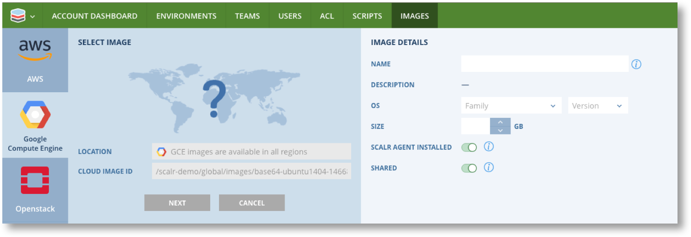
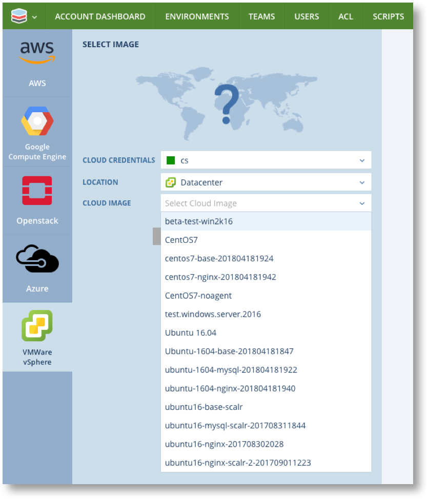

.. include:: ../GLOBAL.rst

.. _register_images:

Registering Images
==================
|SCOPE_SCALR| |SCOPE_ACC| |SCOPE_ENV|

Step one of using Scalr to configure and deploy infrastructure is to register one or more images that you wish to use as the basis for the servers you are going to deploy. As mentioned previously, an Image in Scalr is simply a meta data record of an actual Image or Template in a cloud that you use. It is a 1:1 mapping.

Images in Scalr have slight differences to they way they map to cloud imnages depending on the Cloud the actual image or template is in.

.. csv-table::
   :widths: 15,15,70
   :header-rows: 1

   Cloud,Image Mapping,Notes
   AWS EC2,AMI,Requires a Scalr Image for every AWS location as each is a unique AMI
   Azure,Image,Azure Image is common to all regions so only one Scalr Image per Azure Image
   GCP,Image,GCP Image is common to all regions so only one Scalr Image per GCP Image
   Openstack,Image,One Scalr Image per Openstack Region Image
   VMware,Template,One Scalr Image per VMware Location Image

.. warning:: It is recommended that images registered in Scalr should have Scalarizer installed. If you Intend to use images with Scalr :ref:`role_orchestration` or :ref:`farm_role_orchestration` the Scalarizer agent MUST be installed. If you do not have Scalarizer installed in any images see :ref:`images_from_servers`.  See :ref:`discovery_manager` for more details on agentless options.

Images can be registered at any scope in Scalr and made available to the lower scopes.

Image functionality is accessed via Images in the Main menu or Bookmarks bar at any scope. Note that you can jump straight to New Image from the main menu or click on "Images" and then "New Image" at the top of the list.

.. |IMG_MENU| image:: images/image_menu.png
              :scale: 50%

.. |IMG_LIST| image:: images/image_list.png
              :scale: 50%

|IMG_MENU| |IMG_LIST|

You will now be presented with the New Image screen where you must select the Cloud for the Image you are registering. The details required vary from cloud to cloud.

.. note:: For all images you must manually set details of the installed operating system, and indicate if Scalarizer is installed. Scalr cannot verify this information so make sure it is correct.

* `AWS Images`_
* `Azure Images`_
* `GCE Images`_
* `Openstack Images`_
* `VMware Images`_

AWS Images
----------

**Image ID in AWS** : The Image ID is the AMI ID of the form ``ami-xxxxxxxx``.

* Navigate to EC2 -> Images -> AMI in the AWS Console.
* Copy the AMI from the AMI column for the Image to be registered

In Scalr select the Credentials and Location of the image, enter the AMI ID and click on "NEXT". You will see a screen similar to this.

.. image:: images/new_aws.png
           :scale: 40%

Add the additional details and set the requited options as described below and the click on "REGISTER"

.. csv-table:: AWS Image Options
   :header-rows: 1
   :widths: 20,80

   Item,Details
   OS Family and Version,**Mandatory** Select the appropriate operating system family and Version
   Size,Enter the size in GB if known or leave blank
   Scalr Agent Installed,Unset this if importing a non-scalarizer image
   Shared,Unset this if you DO NOT want to share this image with lower scopes

Azure Images
------------

**Image ID in Azure** : This is the URN of the image in the form ``PublisherName/Offer/SKUs/verisone``. URN's can only be obtained via the Azure API.

* Using the Azure API list available images and copy the URN you require. The API command is ``az vm image list``

In Scalr add the CLOUD LOCATION if this is NOT a Marketplace image, and enter the image URN. Then click on "NEXT". You will see a screen similar to this.

.. image:: images/new_azure.png
           :scale: 40%

Add the additional details and set the requited options as described below and the click on "REGISTER"

.. csv-table:: Azure Image Options
   :header-rows: 1
   :widths: 20,80

   Item,Details
   OS Family and Version,**Mandatory** Select the appropriate operating system family and Version
   Size,Enter the size in GB if known or leave blank
   Scalr Agent Installed,Unset this if importing a non-scalarizer image
   Shared,Unset this if you DO NOT want to share this image with lower scopes

GCE Images
----------

**Image ID in GCE** : This is the URI of the image in the form ``PROJECT-ID/path/to/image``.

* In the GCP Console navigate to Images and click on the image to be registered.
* Click on "REST" |REST|
* Locate "selflink" and copy the part of the URI after ``projects/``. e.g. ``scalr-demo/global/images/base64-ubuntu-14-04-1456237068``

In Scalr paste the URI into the CLOUD IMAGE ID field and click on "NEXT". You will see a screen similar to this.

Add the additional details and set the requited options as described below and the click on "REGISTER".

.. csv-table:: GCE Image Options
   :header-rows: 1
   :widths: 20,80

   Item,Details
   Name,**Mandatory** This name is only used in Scalr and does not change the name used in GCE
   OS Family and Version,**Mandatory** Select the appropriate operating system family and Version
   Size,Enter the size in GB if known or leave blank
   Scalr Agent Installed,Unset this if importing a non-scalarizer image
   Shared,Unset this if you DO NOT want to share this image with lower scopes

Openstack Images
----------------

**Image ID in Openstack** : This is the UUID of the image in the form ``xxxxxxxx-xxxx-xxxx-xxxx-xxxxxxxxxxxx``.

* In the Openstack console chose the Project and optionally the Region from the drop down |OPENSTACK_DROP|.
* Navigate to Images and click on the desired image.
* The UUID you need is the ID field in the "Image" section.

In Scalr enter the Region Name into CLOUD LOCATION and paste the UUID into the CLOUD IMAGE ID field, then click on "NEXT". You will see a screen similar to this.

Note: If you do not have regions set up in your Openstack environment then use "RegionOne".

.. image:: images/new_openstack.png
           :scale: 40%

Add the additional details and set the requited options as described below and the click on "REGISTER".

.. csv-table:: Openstack Image Options
   :header-rows: 1
   :widths: 20,80

   Item,Details
   Name,**Mandatory** This name is only used in Scalr and does not change the name used in GCE
   OS Family and Version,**Mandatory** Select the appropriate operating system family and Version
   Size,Enter the size in GB if known or leave blank
   Scalr Agent Installed,Unset this if importing a non-scalarizer image
   Shared,Unset this if you DO NOT want to share this image with lower scopes

VMware Images
-------------

**Image ID in VMware** : Scalr will look up the available images in VMware and provide a list in a drop down once the Cloud Credentials and Location have been entered.

Click on "NEXT". You will see a screen similar to this.

.. image:: images/new_vmware_2.png
           :scale: 40%

Add the additional details and set the requited options as described below and the click on "REGISTER".

.. csv-table:: VMware Image Options
   :header-rows: 1
   :widths: 20,80

   Item,Details
   Name,**Mandatory** Use the pre-filled name or amend as required. This name is only used in Scalr and does not change the name used in GCE
   OS Family and Version,**Mandatory** Select the appropriate operating system family and Version
   Size,Enter the size in GB if known or leave blank
   Scalr Agent Installed,Unset this if importing a non-scalarizer image
   Shared,Unset this if you DO NOT want to share this image with lower scopes
