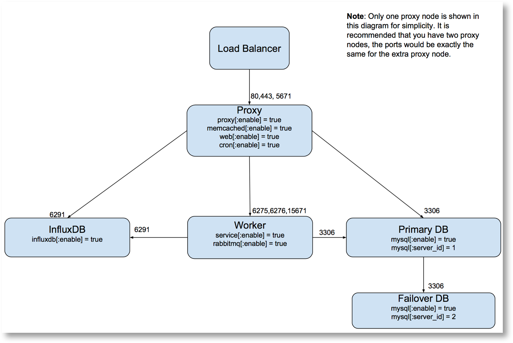

Scalr Server Architecture and Requirements
==========================================

The information below is based on the standard Scalr deployment, if you have any questions or would like to make any changes please contact Scalr support.

Architecture
------------
Scalr’s architecture consist of 8 modules (Proxy, App, Session, RabbitMQ, Worker, InfluxDB, Main DB, and Cost Analytics DB).  The recommended Scalr HA deployment consists of 6 VMs (Instances) and is outlined in the following diagram:

It is completely acceptable to group multiple components onto one virtual machine as the load for these services are minimal. The following are the recommended specs for the initial configuration:

* Load Balancer of choice. The target should be the Scalr servers over 80 or 443 and 5671.
* 1 VM for the Worker:

  * 4CPU, 8GB RAM
  * 100GB storage mounted on /opt/scalr-server on each server
  * NOTE: Worker should only be enabled on one server.

* 1 VM for InfluxDB:

  * 4CPU, 16GB RAM
  * 100GB storage mounted on /opt/scalr-server on each server

* 2 VMs for Proxy, Sessions, and App:

  * 4CPU, 8GB RAM
  * 100GB storage mounted on /opt/scalr-server on each server

* 2 VMs for DB (active/passive):

  * 4CPU, 8GB RAM (A server is not required, this can be a cloud based database service like AWS RDS)
  * 750GB storage mounted on /opt/scalr-server on each server

Supported Operating Systems:
-----------------------------
* RedHat Enterprise Linux 6.x or 7.x
* Centos Linux 6.x or 7.x
* Debian 7.x or 8.x
* Ubuntu 14.04, 16.04, 18.04

.. _network_reqs:

Network Requirements
---------------------
When deploying Scalr you must ensure that all the necessary network configuration is in place to enable Scalr to connect to the instances it is managing. There are two options for this.

#. Scalr can connect to the private/internal/local IP’s of instances that are within the same set of routed networks.

   #. Local VPC/VNet/Network within a region.
   #. Via peering connections to another VPC/VNet/network (inter and intra region).
#. Scalr can connect to the Public IP’s of instances in any cloud.

Scalr can be configured to specify the connection option (Public or Local) or a per cloud basis, e.g. EC2, Azure etc. There is also the "auto" option which will use Public IP's and will fallback to local IP's if no public IP is available. If you wish to use private/local IP's for connectivity then you must ensure the necessary network configurations are in place to enable this. By default Scalr will only have access to the local IP of instances that are in the same VPC/VNet in which it is deployed. For more details see the relevant page for your cloud(s) under :doc:`Clouds - Configuring for Scalr <../clouds/index>`

In both cases the firewall protecting instances must be opened to permit access to the required ports on the Scalr server and the managed instances as follows.

.. include:: /reference/index.rst
   :start-after: net-req-start:
   :end-before: net-req-end
