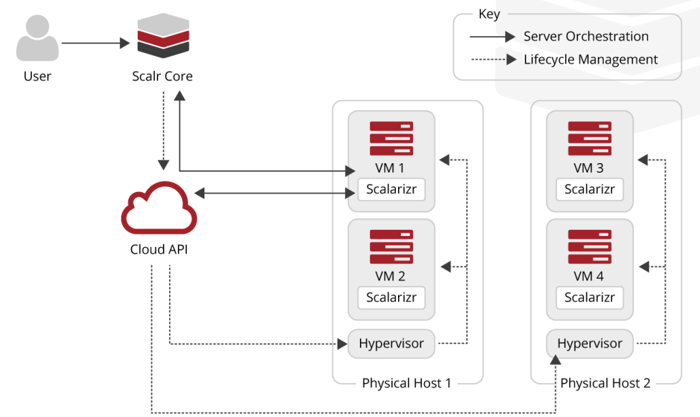
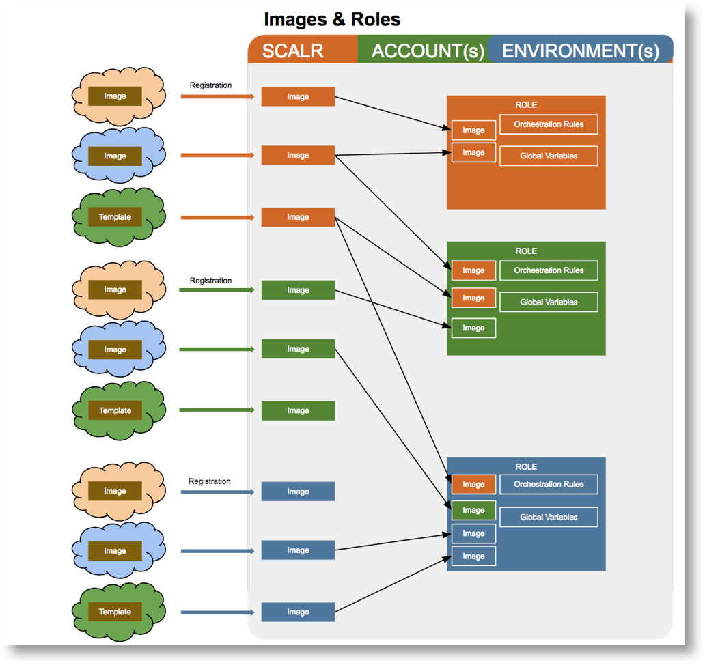

.. include:: ../GLOBAL.rst

Concepts and Terminology
========================

Scalr Architecture
------------------

Scalr is comprised of two main software components.

1. **Scalr Server**. This is installed on one or hosts and provides the user interface, API's, meta data storage and all necessary processes to interface with the API's of clouds and manage the instances/servers running in the cloud. Scalr Server is sometimes referred to as Scalr Core.
2. **Scalarizer Agent**. The agent is installed in all instances/servers running in clouds that are managed by Scalr. It's purpose is to execute actions in the instances upon receipt of those actions from the Scalr Server, and to provide monitoring and status information back to the Scalr Server.

Scalr Server can be installed on a single host but this would typically only be done for non-critical installations, such as staging or pre-prod environment. For production use Scalr should be installed on multiple hosts and configured with HA and redundancy to ensure continuity of service.

Software Architecture
^^^^^^^^^^^^^^^^^^^^^

Deployment Architecture
^^^^^^^^^^^^^^^^^^^^^^^

.. image:: images/arch.png
   :scale: 50%

Scalr Scopes
------------

Login Scopes
^^^^^^^^^^^^

The Scalr application is organised into 3 levels of login access that are known as "Scopes". These scopes provide a hierarchy of access, functionality and object inheritance that enables a customer to match Scalr to their organisational structure, and to manage, control and monitor their deployments of cloud based infrastructure. The 3 scopes are as follows.

.. |ES| image:: images/environment.png
   :scale: 70%

============================= ============================= ======================================================================================
Scope                         Usage                         Description
============================= ============================= ======================================================================================
|SCALR| |SCOPE_SCALR|         Scalr Administration          - There is a single admin level in Scalr where global configuration elements and |ACCOUNTS| are managed.
                                                            - Scalr Administrators can configure cloud access credentials, roles, images and much more for common usage by all |ACCOUNTS| and |ENVIRONMENTS|.
                                                            - Users are also managed at the |SCALR| scope.
                                                            - Cost Analytics and Cost Management are configured and analysed through the definition of Cost Centers, Projects, Budgets and Pricing.

                                                            |SS|
|ACCOUNT| |SCOPE_ACC|         Organisation Units            - Typically |ACCOUNTS| are Business Units that bring together teams working to a common purpose.
                                                            - There will be multiple |ACCOUNTS| which can define common governance policies for all their environments as well as also configuring additional cloud access credentials, roles, images etc over and above those defined at the |SCALR| scope.
                                                            - |Accounts| are also responsible for configuring Teams and Access Control Lists (ACLs) to control who can do what and which resources they can use.
                                                            - Cost Analytics can (with permission) be further configured and analysed through the definition of additional Projects, Budgets and Pricing.

                                                            |AS|
|ENVIRONMENT| |SCOPE_ENV|     Deployment Environments       - |Environments| bring together the resources required to deploy infrastructure to the cloud.
                                                            - It is at the |ENVIRONMENT| scope that deployment infrastructures, known as "Farms" are defined. Farms bring together roles, cloud services and orchestration rules to enable simple deployment of an entire application infrastructure with a single click. Orchestration rules are used to install packages, deploy custom software and much more.
                                                            - There will typically be multiple |ENVIRONMENTS| per |ACCOUNT| that can also configure additional roles, images etc over and above those defined at the higher scopes.
                                                            - Farms can also be published as Service Catalog offerings to allow non-technical end users to select and deploy applications in real time without the need to raise requests to the central IT department.

                                                            |ES|
============================= ============================= ======================================================================================

The following diagram shows the high level hierarchical relationships between the 3 scopes.

.. image:: images/Scalr-Scopes.png
   :scale: 50%

Configuration Scopes
^^^^^^^^^^^^^^^^^^^^

Within the application you will also see references to 3 lower scopes where aspects of Scalr can be configured. These are perhaps better thought of as the context within which something is defined and therefore visible. These 3 additional scopes apply to 3 items, Scripts, Orchestration Rules and Global Variables as each of these can be defined at each of these additional scopes and are inherited by, or become visible at relevant lower scopes.

* Role Scope |SCOPE_ROLE| - Items created within the context of a Role at any of the 3 main scopes. These are inherited by Farm Roles based on the Role.
* Farm Scope |SCOPE_FARM| - Items can be created at Farm level and are inherited by all Farm Roles in the Farm.
* Farm Role Scope |SCOPE_F_ROLE| - The lowest level of item definition, visible only in the Farm Role where they are defined.

Cloud Credentials
-----------------

|SCOPE_SCALR| |SCOPE_ACC|

To be able to manage your cloud infrastructure Scalr needs to be able to connect to the APIs of the clouds that you use. Each cloud is different in the way it authenticates API access. Some require the generation of Access Keys and configuration of permissions and policies inside the cloud, whilst others simply authenticate with username and password. Whatever the method these authentication details must be stored in Scalr as Cloud Credentials.

Cloud credentials can be configured at both the |SCALR| and |ACCOUNT| scopes and are then available to all lower scopes. Once they are configured Cloud Credentials are then linked to |Environments| so that end users can configure and manage cloud infrastructure.

See :ref:`cloud_creds` for details on configuring cloud access and Cloud Credentials.

|Accounts|
----------

|AS|

|Accounts| are the core of implementing a federated IT organisational structure in Scalr. An |ACCOUNT| brings together the configuration resources, access permissions (ACLs) and governance policies that are applicable to to an organisational unit within an enterprise, thus ensuring consistent and suitably managed use of cloud environments. |Accounts| typically map to Business Units within an enterprise and are further sub-divided into |ENVIRONMENTS| for the different teams and/or functional areas within the BU, such as Dev, QA, Sales etc.

There can be multiple |Accounts| within Scalr and these will be created by the Scalr administrator.

An |ACCOUNT| administrator will be responsible for managing and configuring the following aspects of Scalr.

* Cloud credentials
* |Environments|
* Governance Policies and Resource Quotas
* Users, Teams and Access Control Lists
* Account level Orchestration rules
* Cost Management

For details on configuring |ACCOUNTS| see :ref:`account_configuration`.

|Environments|
--------------

|ES|

|Environments| are the scope at which cloud infrastructure is configured and run. An |ACCOUNT| can have multiple |Environments| that correspond to functional areas, different cloud providers or whatever structure makes sense for your business. Typically |Environments| are set up in line with application life cycles for specific applications and also possibly by geographical region. Each environment is linked to one or more sets of cloud credentials and one or more end user teams will be granted access at various levels to the |ENVIRONMENT|.

Application developers, architects etc work within |Environments| to configure, develop and test applications. These applications are configured in "Farms" which combine Roles, cloud services and orchestration rules together to create easily transportable application infrastructure that can be shared with other |Environments|, can be deployed across different clouds and set up to scale automatically based on the varying demands of each different deployment. Once a Farm has completed development and testing it can be published as a Service Catalog application for self service consumption by other |Accounts| and |Environments|.

Multiple teams can login to each |ENVIRONMENT| and the users functional capability can range from IT sophisticated DevOps users that build applications, through to minimal access Service Catalog users who simply login to launch applications (with one click) that they wish to use.

Menu for a full access |ENVIRONMENT| user:

Menu for a Service Catalog |ENVIRONMENT| user:

For details on configuring |ENVIRONMENTS| see :ref:`environment_configuration`.

Images and Roles
----------------
|SCOPE_SCALR| |SCOPE_ACC| |SCOPE_ENV|

.. note::
   | **Server vs Instance vs VM**
   | Scalr uses the term "Server" to refer to virtual machines running in the cloud. The term used for this varies from cloud to cloud. AWS and GCP use "Instance", Azure uses "Virtual Machine" for example. Throughout the Scalr documentation we will use the term "server".

**Images** (aka, AMI, template etc) are the main building blocks for building cloud infrastructure in all clouds. Images are used to create servers in a cloud. Scalr also indirectly makes use of Images stored in the clouds, but in order to do this it requires a record within it's own internal meta data of every image that can be used. Thus an image in Scalr is simply a unique registration of an image that exists in a cloud. Images are used indirectly through Roles and Farm Roles within Scalr. There are three broad types of image.

* Images provided by Scalr that include Scalr's agent called Scalarizer. These Scalr images are ready made to provide the full functionality of Scalr as the agent enables control and monitoring functions. Scalr images are currently available in AWS, GCP and Azure.
* Base images provided by the cloud provider, such as AWS's AMI's
* Images users have created from customized servers with additional pre-installed software and configurations.

Base and user created images can easily be imported into Scalr and converted to scalarized images through the Scalr UI.

**Roles** provide an abstraction layer over the top of the images. Within Scalr a Role is the reusable building block for provisioning servers through Scalr. A Role can be associated with multiple similar images from multiple clouds. All similar images linked to a role will have the same base operating system and version, and the same pre-installed software and configuration. This may or may not include Scalarizer, but all images in a role must be the same in this respect. The effect of this abstraction is that any user can potentially chose which cloud to use when launching a farm/application and they will get exactly the same features and behaviour. A role can also include a set of orchestration rules and global variables which ensures consistent configuration of an server regardless of which Farm it is used in and which cloud it is deployed in.

Images and Roles can be configured at all three scopes within Scalr and are inherited by the lower scopes. Roles can link to Images from the same or higher scopes. Images and Roles can only be edited at the scope where they were created, but they can be cloned at lower scopes and the can be promoted from lower scopes to higher scopes.

For details on working with Images and Roles see :ref:`images_roles`.

Farms and Farm Roles
--------------------
|SCOPE_ENV|

A Farm is the collection of Roles, Orchestration rules, network configuration, cloud services and much more that defines the desired deployment state of a cloud based system. A Farm can include any number of Roles that work together to provide a service, such as a basic 3-tier app that includes a load balancer, a web app layer and a database layer. The Farm can include all the required automation to bootstrap servers with the required software and auto discover the related services being provided by other roles, e.g. registering web app servers with the load balancer.

When a Role is added to a Farm this is known as a "Farm Role". It inherits all the attributes of the Role itself but extends the configuration to include selection of clouds, locations, network, security groups, additional orchestration   rules etc. In other words it turns a role into something that can actually be deployed as a functioning server in the cloud. The Farm Role can also be parameterised through the use of Global Variables to enable end users to make choices about certain aspects of the deployment at the time it is launched

Desired State Engine
^^^^^^^^^^^^^^^^^^^^
The underlying principle behind a Farm configuration is that it defines the desired state of a deployment. When a Farm is launched Scalr's Desired State Engine (DSE) begins a continuous cycle of monitoring the cloud infrastructure to determine if the Farm is in the desired state or not. If any variance from the desired state is identified Scalr will take action to address this. At initial launch this will cause all the required servers to be started. During later cycles the DSE may detect the need to both stop and start servers. If a Farm is reconfigured to reduce the maximum number of servers for a role then any extra servers will be terminated. This can also happen with Auto Scaling as demand changes.

.. warning:: Reconfiguring a running farm can result in servers being stopped and started. Take great care when reconfiguring farms that are for business critical services.

For details on configuring Farms and Farm Roles see :ref:`farms`.

Service Catalog and Applications
--------------------------------
|SCOPE_SCALR| |SCOPE_ACC| |SCOPE_ENV|

Scalr provides a cloud self service capability through the Service Catalog. Non IT users can be given Service Catalog access to Scalr to enable them to request and launch pre-configured applications and services at the click of a button. A Service Catalog entry is simply a service offering that has been created from a fully developed and tested Farm. Developers can publish their Farm at any time to enable other teams and users to request Applications from these Service Catalog entries, and thereby rapidly deploy cloud services without the complexity of making requests through Central IT. The Service Catalog based applications are controlled by the governance and security policies in the :ref:`policy_engine_intro` in the same way as the original Farms.

Service Catalog offerings can also be parameterised to allow end users some limited choices when requesting an applications, such as which cloud and locations to use, choice of instance sizes and networks etc.

Service Catalog offerings are publish at the |ENVIRONMENT| scope but can be prompted to |ACCOUNT| and |SCALR| scope.

For details on publishing Service Catalog offerings see :ref:`service_catalog`.

Cost Analytics/Manager
----------------------
|SCOPE_SCALR| |SCOPE_ACC| |SCOPE_ENV|

Scalr includes two separate features for analysing and managing the cost of using cloud services.

**Cost Analytics** provides comprehensive management and reporting capabilities across all three scopes as follows.

* |SCALR| scope

 * Definition of Cost Centers and Projects for aligning expenditure to organisational budgets.
 * Custom Price Lists for internal clouds and to override default price lists from public clouds.
 * Conditional price Markups to allow the addition of cost overheads to per instance.
 * Definition of Budgets and associated notifications to enable close control of expenditure.
 * Comprehensive reporting across all |ACCOUNTS| and |ENVIRONMENTS|.

* |ACCOUNT| Scope includes a subset of the features available at |SCALR| scope and provides cost visibility only for the individual |ACCOUNT| and it's |ENVIRONMENTS|.

 * Projects can be defined
 * Markups
 * Budgets for |ACCOUNT| level projects
 * |ACCOUNT| and |ENVIRONMENT| level reporting

* |ENVIRONMENT| Scope only has reporting capability limited to the individual |ENVIRONMENT| and it's Farms.

**Cost Manager** is a new feature that is currently under development and released in preview mode only. Cost Manager's role will be to take cost management to the next level by providing guidance on right sizing and ultimately provide the ability to automate right sizing and cost saving actions.

For more details on the cost control features of Scalr see :ref:`cost_control`.

.. _policy_engine_intro:

Policy Engine
-------------
|SCOPE_ACC|

The Policy Engine is the Core of Scalr's ability to ensure consistent and repeatable implementation of governance, compliance and security policies across all |ACCOUNTS| and |ENVIRONMENTS|. The Scalr Policy Engine sits between users and the clouds, validating their actions but at the same time allowing users to continue to take advantage of the speed and flexibility enabled by Cloud services, without increasing risk for your organization.  Scalr lets you enforce policies for an entire |ENVIRONMENT|, such as restricting instance types, restricting networks or mandating security requirements.  Each policy is defined by its type, which describes the goal of the policy, optional conditions that limit the scope this policy will apply to, and for some policy types that need it, additional configuration settings.

When you provision a new Policy Group in an |ENVIRONMENT|, all user interaction with Scalr will be validated by the Policy Engine.  We also validate all actions from Scalr to clouds with the policy engine as well.  New Policies do not automatically apply to running farms. They will only be fully taken into account for Farms launched after the enforcement of the policy.  For previously running Farms, Scalr will not terminate existing instances that violate newly enforced Policies, but will not allow for violation of the policy in the future.

.. note:: Example: If a policy disables t1.micro instance type in an environment but a Farm has a Farm Role configured to use this type, existing servers will not be terminated but no new instances will be launched until configuration is updated to an allowed instance type.  If there is autoscaling configured, Scalr will throw an error stating that the instance type is not allowed.

For details on configuring the Policy Engine see :ref:`policy_engine`.

Users, Teams and Access Control
-------------------------------
|SCOPE_SCALR| |SCOPE_ACC|

Users, Teams and Access Control Lists (ACLs) are the authorization and functional control components of Scalr.

**Access Control Lists** define the functional aspects of Scalr that are available to individual Teams. ACLs can range from granting full access to everything, through total Read Only access and on to very limited functionality, such as for a Service Catalog user.

[pictures]

**Teams** group users together to provide them with access to environments and to apply a common ACL to all team members. Users can belong to multiple teams.

**Users** are individuals who login to Scalr. Users can be designated as Administrators which will give them access to the |SCALR| scope. Users can either be authenticated within Scalr or Scalr can be configured to authenticate against an external system via LDAP or SAML. A user is a unique entity in Scalr and can be given access to multiple |ACCOUNTS| and multiple |ENVIRONMENTS| via team membership.

For details on configuring Users, Teams and ACL's see :ref:`users_teams`.

Global Variables
----------------
|SCOPE_SCALR| |SCOPE_ACC| |SCOPE_ENV| |SCOPE_ROLE| |SCOPE_FARM| |SCOPE_F_ROLE|

.. |GVI| image:: images/gvi.png

Global Variables are a key value store built in to Scalr and are stored encrypted in the main Scalr database. They are used to pass configuration data from the Scalr User Interface down to your Servers. Global Variables can be defined at all scopes of Scalr. They can be defined as simple single values, validation lists or JSON objects.

Within the Scalr UI certain fields support Global Variable Interpolation. These fields can be set with the name of a Global Variable rather than an actual value. The actual value used is then determined from Global Variable at the time of execution, e.g. when launching a farm. Fields that support Global Variable Interpolation are marked with |GVI| .

For details on configuring Global Variables see :ref:`gvs`.

Orchestration
-------------
|SCOPE_SCALR| |SCOPE_ACC| |SCOPE_ENV| |SCOPE_ROLE| |SCOPE_FARM| |SCOPE_F_ROLE|

Orchestration is the process of provisioning, configuring and managing servers in the cloud. In it's simplest form orchestration is just the act of provisioning and starting a server from a given Image and later terminating that server. However Scalr provides a sophisticated Orchestration engine that defines rules for event based script execution, or scheduled execution of scripts on running servers. Through this engine the entire life cycle of a server can be customised by performing actions such as installing software on startup, performing service auto discovery and adjusting configs, scaling, external integrations and much more. There are more than 10 built in events that can trigger orchestration rules and all scopes can also define custom events that can be triggered via scripts, API calls and through the UI.

Orchestration rules can be defined in Roles so that they apply to all related Farm Roles in any Farm. Additional Orchestration rules can also be defined on Farms and Farm Roles where they they have the added capability to execute scripts in servers for other Farm Roles within the Farm.

For details on configuring orchestration in Roles see :ref:`role_orchestration`.
For details on configuring orchestration in Farms and Farm Roles see :ref:`farms`.

Scripts
-------
|SCOPE_SCALR| |SCOPE_ACC| |SCOPE_ENV| |SCOPE_ROLE| |SCOPE_FARM| |SCOPE_F_ROLE|

Scripts in Scalr are used in conjunction with Orchestration and can also be executed on a on-off basis if required. Scripts can perform ANY action that is valid within the context that they are run and can be written in any scripting language including shell, python, perl and Power Shell (for Windows). They are written exactly as you would normally write scripts, and they have access to all the Global Variables that exist within the context of the Farm Role that the target server is running in. Scripts can be defined at all scopes within Scalr.

For details on working with Scripts see :ref:`scripts`.

Webhooks, Endpoints and External Integrations
---------------------------------------------
|SCOPE_SCALR| |SCOPE_ACC| |SCOPE_ENV|

Scalr supports integration with external systems through the definition of Webhooks and Endpoints. Endpoints indentify external systems that support inbound Webhook payloads. Typically these are systems such as IPAM systems to allocate and mange IP addresses, Config Management systems to register infrastructure and allocate hostnames, or Service Management systems to provide approval mechanisms.

Endpoints and associated with Webhooks in Scalr. The Webhook defines the the Farms and Events for which the Webhook will be triggered and the user data that is passed to the external system. Webhooks defined at the |SCALR| or |ACCOUNT| scopes will apply to all Farms in the lower scopes.
