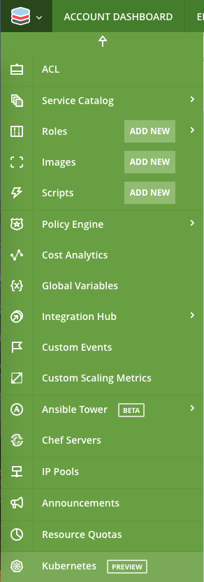
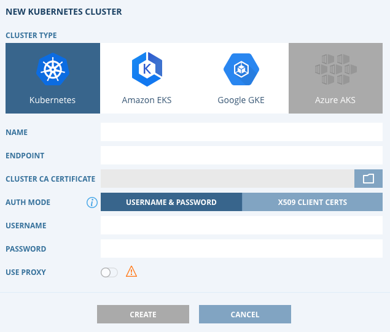
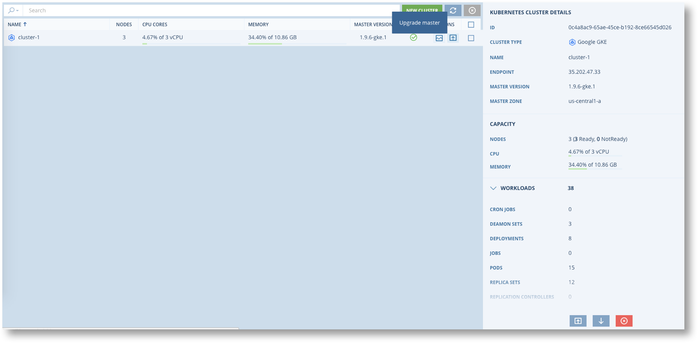

.. include:: ../GLOBAL.rst

.. _kubernetes:

Kubernetes Clusters
====================

Definition and Scope
--------------------

|SCOPE_ACC|

Scalr provides a built-in integration with Kubernetes to manage existing clusters and give a view into the overall health, capacity and workloads on the cluster. Currently, Scalr supports:

* GKE Kubernetes
* Amazon EKS
* Native Kubernetes

The following Kubernetes offerings will be supported soon:

* Azure AKS

Google GKE
----------

.. |gke_link| raw:: html

   <a href="https://console.cloud.google.com/kubernetes/list" target="_blank">GKE Permissions</a>

.. |gke_perm| raw:: html

    <a href="https://cloud.google.com/kubernetes-engine/docs/reference/rest/v1/projects.zones/getServerconfig" target="_blank">Google GKE</a>

The integration of |gke_link| |NEWWIN| clusters requires a few permissions to be granted for the service account that is used to add Kubernetes clusters in Scalr:

* **roles/container.viewer** role permission (could also be visible as Kubernetes Engine Clusters Viewer)
* **roles/compute.viewer** role permissions to view list of instances where the Kubernetes cluster is running
* **container.clusters.getCredentials** (to obtain cluster credentials)

Here is more info on permissions to call |gke_perm| |NEWWIN|

These are the permissions needed for upgrading the master node:

* **container.clusters.update** on the requested cluster
* **container.operations.get** on the requested operations (included by roles/container.viewer)
* **container.operations.list** on the requested Cloud project (included by roles/container.viewer)

GKE Kube-Config
^^^^^^^^^^^^^^^

.. |gke_gcloud| raw:: html

    <a href="https://cloud.google.com/sdk/install" target="_blank">gcloud</a>

In order to use the kube-config file downloaded from Kubernetes page you need |gke_gcloud| |NEWWIN| to be installed in your system.
Configure ``gcloud`` to use your service account. If you have access to the service-account file you can use ``gcloud auth activate-service-account --key-file=<path_to_file>``.
Then to connect to the cluster you can either export the config path as environment variable(``export KUBECONFIG=<path_to_config>``) or specify it directly in kubectl command: ``kubectl --kubeconfig=<path_to_config>>``.

Resources:
^^^^^^^^^^

.. |gke_iam| raw:: html

    <a href="https://cloud.google.com/kubernetes-engine/docs/how-to/iam" target="_blank">GKE How-To for IAM</a>

.. |gke_api| raw:: html

    <a href="https://cloud.google.com/kubernetes-engine/docs/reference/api-permissions" target="_blank">API Permissions Reference</a>

Here is some more information that can be referenced on GKE:

* |gke_iam| |NEWWIN|
* |gke_api| |NEWWIN|

Amazon EKS
----------

There are few things need to be done before you can add a EKS Cluster to your Scalr account:

.. |aws_eks| raw:: html

    <a href="https://docs.aws.amazon.com/eks/latest/userguide/add-user-role.html" target="_blank">(EKS IAM Userguide)</a>

* Your AWS cloud credential has to have EKS view permissions.
* The IAM entity of your AWS cloud credentials has to be added to cluster RBAC |aws_eks| |NEWWIN|.

When an Amazon EKS cluster is created, the IAM entity (user or role) that creates the cluster is added to the Kubernetes RBAC authorization table as the administrator. Initially, only that IAM user can make calls to the Kubernetes API server using ``kubectl``.

.. note::
  In order to collect nodes CPU/MEM metrics ``heapster`` or ``merics-server`` need to be deployed on the cluster.

AWS Kube-Config
^^^^^^^^^^^^^^^

.. |aws_auth| raw:: html

    <a href="https://github.com/kubernetes-sigs/aws-iam-authenticator" target="_blank">aws-iam-authenticator</a>

In order to use the kube-config file downloaded from the Kubernetes page you need |aws_auth| |NEWWIN| to be installed and added to ``$PATH`` on your system. Make sure you are using correct credentials while calling ``aws-iam-credentials``.

Resources:
^^^^^^^^^^

.. |aws_starting| raw:: html

    <a href="https://docs.aws.amazon.com/eks/latest/userguide/getting-started.html" target="_blank">(Amazon EKS Getting Started)</a>

Here is some more information that can be referenced on AWS EKS:

* |aws_starting| |NEWWIN|

Self - Managed Kubernetes Clusters
----------------------------------

Scalr supports the following authorization for native Kubernetes clusters:

* Basic: ``username`` + ``password`` + ``cluster_ca_cert`` - basic authorization should be enabled in order for this method to work.

* x509 client certs: ``client_key`` + ``client_cert`` + ``cluster_cert`` - ``Enable obsolete authorization``.

Depending on the type of authorization kube-config will contain either username + pass or client x509 certs.

Resources:
^^^^^^^^^^

.. |kub_rbac| raw:: html

    <a href="https://kubernetes.io/docs/reference/access-authn-authz/rbac/" target="_blank">(Using RBAC Authorization)</a>

Here is some more information that can be referenced on native Kubernetes:

* |kub_rbac| |NEWWIN|

Adding a Cluster to Scalr
-------------------------

To add a cluster into Scalr, go to the |Account| scope and click on the Scalr menu on the top left of the screen |MENU_ACC| and then down to Kubernetes (Preview):

To discover a new cluster, click on New Cluster, select your cluster type and enter the details:

Once it is successfully added the cluster operation dashboard will appear:

