.. include:: ../GLOBAL.rst

.. _navigating:

Navigating the User Interface
=============================

This section provides a guide to the Scalr User Interface. It will show you how the various functional features of the UI, but it will NOT show you every feature of Scalr.

The details of the UI, including the menu buttons and functionality, will vary according to the Scope you are logged in to, and the permissions you have been granted via :ref:`access_control`. This section of the documentation will show screen shots and examples based on a user having full access to Scalr at the |ENVIRONMENT| Scope. If you do not see all the options shown in these examples when you login to Scalr please contact your administrator.

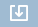

.. warning:: DO NOT FORGET TO SAVE. When you are creating or editing anything in Scalr you must always click on the appropriate "Save" button. The button will either be located at the bottom of the screen, or the bottom of a pop-up dialogue. The Save button can appear in different formats, including have an associated options drop down. |SAV1| |SAV2| |SAV3|

.. note:: The Scalr UI is highly optimised to provide fast response times and rapid loading of data, especially lists of items such as Images, Roles, Farms etc. Every list has a refresh button |REFRESH|. For an optimal experience always use the list refresh button to refresh the list rather than your browsers page refresh option.

Scope Differences
-----------------

Aside from functionality the only difference between the UI for each scope is the colour as shown in these examples of the Bookmark Bar.

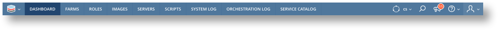

============= ==============================================================================
Scope         Colour
============= ==============================================================================
|SCALR|       |SB|
|ACCOUNT|     |AB|
|ENVIRONMENT| |EB|
============= ==============================================================================

UI Overview
-----------

This screen shot shows an overview of the entire UI.

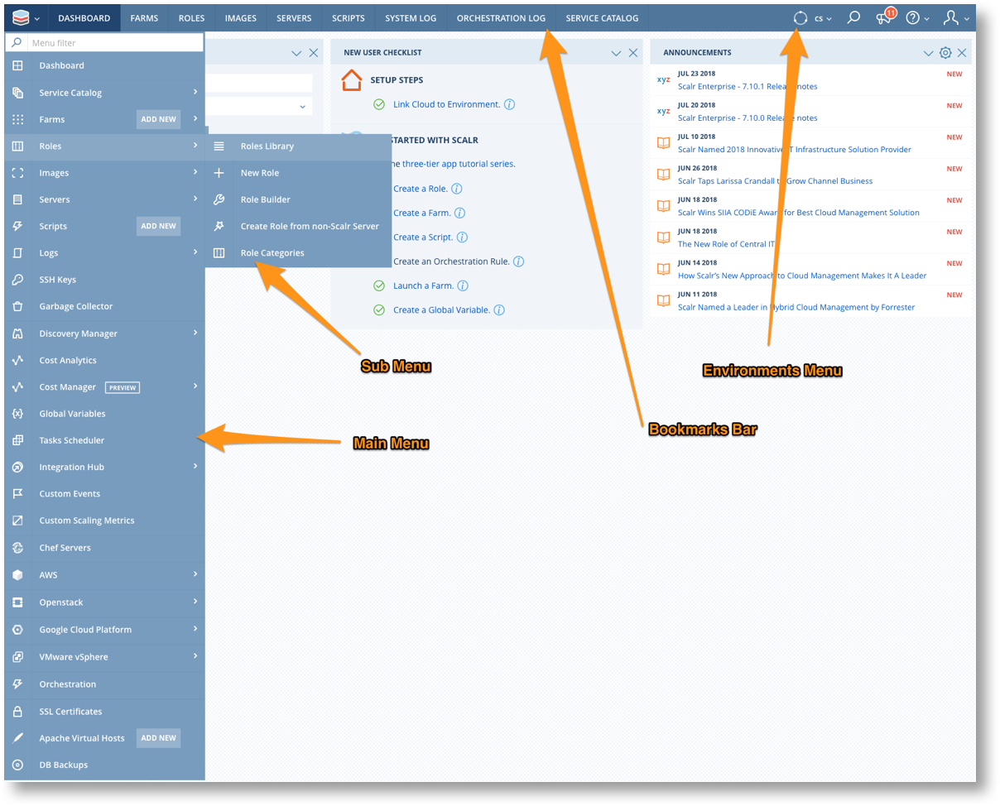

Dashboards
----------
|SCOPE_SCALR| |SCOPE_ACC| |SCOPE_ENV|

Each scope has a Dashboard which is the default landing page and provides quick access to some functionality and various status information via a series of Widgets. The Widgets can be customised so that the user can choose which ones to display, their position on the Dashboard, and, in some cases, their content. There is one dashboard at |SCALR| scope and then one dashboard for each |ACCOUNT| and each |ENVIRONMENT|.

.. image:: images/dashboard.png
         :scale: 40%

Dashboard Configuration
^^^^^^^^^^^^^^^^^^^^^^^

The following Dashboard configuration can be performed at all scopes.

**Number of Columns**

The number of columns displayed can be altered to suit.

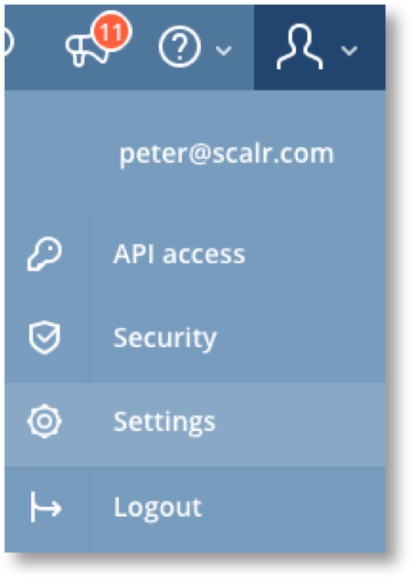

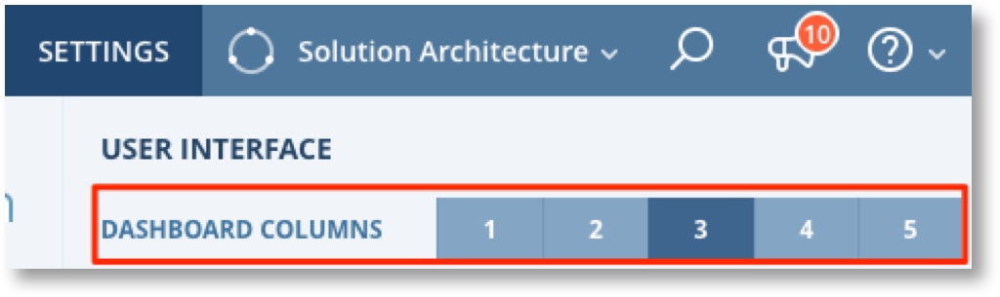

|SET| --> |COL|

**Adding and Moving Widgets**

The Add Widget button appears when the mouse is hovered below any column on the Dashboard. A check list of available widgets is displayed and widgets are then added to that column. Widgets can be re-positioned by dragging and dropping using the widget header.

.. |ADD_1| image:: images/add_widget_1.png
         :scale: 30%

.. |ADD_2| image:: images/add_widget_2.png
         :scale: 30%

|ADD_1| |ADD_2|

**Widget Settings and Removal**

The widget header bars provide buttons to collapse, remove, and in some cases configure the settings of the widget. e.g. for "Resource Quotas" the clouds to be displayed can be configured.

.. image:: images/widget_head.png
         :scale: 40%

Available Widgets
^^^^^^^^^^^^^^^^^
=============  =======================================================
|SCOPE_SCALR|  | Scalr Health
               | Services
               | First Steps
               | License
|SCOPE_ACC|    | New User Checklist
               | Get Your Organization On Scalr
               | Announcements
               | |ENVIRONMENTS| in this |ACCOUNT|
|SCOPE_ENV|    | Create New Farm
               | New User Checklist
               | Announcements
               | Active Policies
               | Resource Quotas
               | AWS Health Status
               | Last Errors
               | Server Alerts
               | Cost analytics
=============  =======================================================

Main Menu
---------
|SCOPE_SCALR| |SCOPE_ACC| |SCOPE_ENV|

The Main Menu gives you access to all the functionality that is available to you. The Main Menu is opened by clicking on |MENU_ENV| in the top left corner.

The menu can be filtered by typing text into the filter box at the top. This will reduce the menu down to to items that include that text at any level in the menu. As you can see from this example, typing "server" in the filter reveals top level items that have sub-menu's containing the word "server".

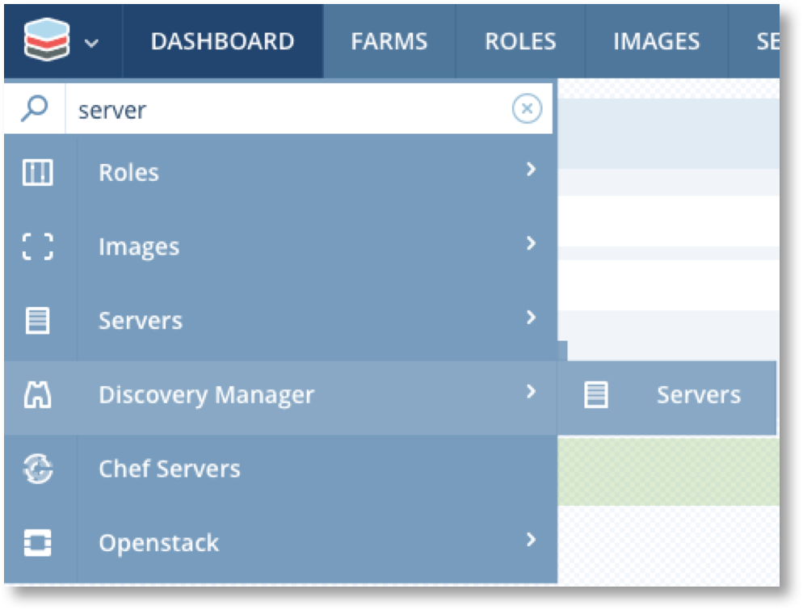

Bookmarks Bar
-------------
|SCOPE_SCALR| |SCOPE_ACC| |SCOPE_ENV|

The Bookmarks Bar provides quick access to commonly used menu items. It defaults to the items shown in the table above but can easily be edited to include the items most relevant to you.

You can edit the contents of the bookmarks bar in two ways.

**Pin a Menu Item**

When you select an item from the Main Menu that is not already in the Bookmarks Bar, it will be temporarily added to the Bookmarks Bar until you select a different menu item.
Temporary bookmark items have an associated pin button |PIN|. Click the pin to add the item to the Bookmarks Bar permanently.

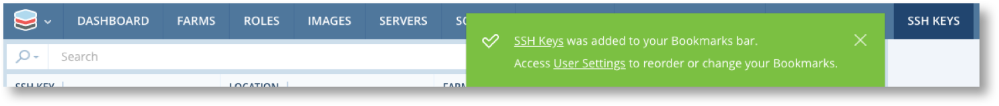

**Edit and Re-Order Via Settings**

To remove or re-order Bookmarks Bar items you must navigate to settings. Click on the profile menu icon top right and select settings.

* Remove bookmarks by clicking the "x" next to the name.
* Re-order the bookmarks by dragging and dropping
* Suppress the confirmation if desired.

.. image:: images/settings_2.png
           :scale: 50%

Click "Save" at the bottom of the screen when done.

Profile Menu
------------
|SCOPE_SCALR| |SCOPE_ACC| |SCOPE_ENV|

The Profile menu also gives access to some security and UI related features.

================= ======
**API access**    The API Access option can be used to enable API Access and to obtain an API Key ID and Access Key ID for configuring the Scalr API.
                  API Key's only provide access at the Scope they are created at and scopes below that. See :ref:`api` for more details.
**Security**      The Security option can be used to make password changes and for creating an IP Access Whitelist.
**Settings**      The Settings option can be used to make profile changes, attach an avatar, configure RSS Feed for Logs, change timezones,
                  configure the Dashboard, and for making Grid layout changes.
**Logout**        The Logout option will log you out of your session at the current scope. If you logged into to an |ACCOUNT| from |SCALR| scope
                  you will be taken back to you |SCALR| scope session.
================= ======

Two-Factor Authentication
^^^^^^^^^^^^^^^^^^^^^^^^^

.. |google_auth| raw:: html

   <a href="https://support.google.com/accounts/answer/1066447?co=GENIE.Platform%3DiOS&hl=en" target="_blank">Google Authenticator</a>

To enable two-factor authentication for your user, you can do so by navigating to the Profile Menu and clicking on Security. Once in the Security page, click "Enabled" for the two-factor authentication and following the instructions. Learn more about Google two-factor authentication here: |google_auth| |NEWWIN|.

|ENVIRONMENTS| Menu
-------------------

The |ENVIRONMENTS| Menu is used to select and manage working |ENVIRONMENTS| within an |ACCOUNT|. Click on an |ENVIRONMENT| within this menu to switch between your available |ENVIRONMENTS|.

The current working |ENVIRONMENT| will contain a dot as a visual indicator of the current selection, as shown below.
Click on the green |ACCOUNT| name to be taken to the |ACCOUNT| Dashboard.
If you have access to multiple |ACCOUNTS| you can use the "Switch |ACCOUNTS| " button to change to another |ACCOUNT|.

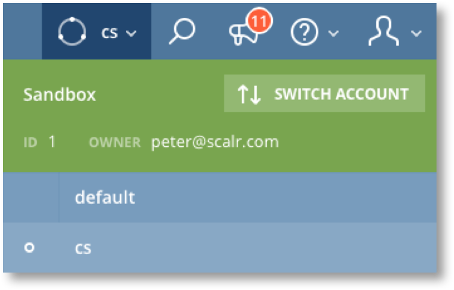

List Views
----------

Lists are used all over the Scalr UI and have a common layout that includes the Search/Action tool bar, column headings and the list itself.
Some lists will have a "New ...." button as shown in this Images example.

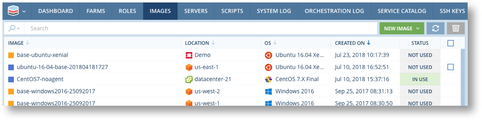

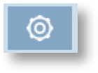

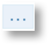

Some lists will include Action and a Settings |ASET| buttons as well. |BR| Action buttons can appear in both the list tool bar and alongside each item in the list. The toolbar action buttons can be used to apply the same action to multiple items in the list. These action buttons will be greyed out until at least one item in the list is checked. Note that the |DROP| button is a drop down list of all the actions than can be taken on the specific farm.

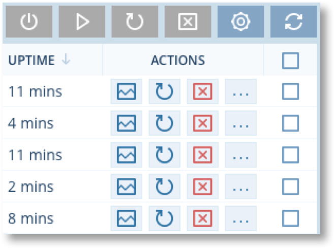

.. |A2| image:: images/list_actions.png
        :scale: 50%

================= ==============
No items selected Items selected
================= ==============
|A1|              |A2|
================= ==============

When a list is selected via the main menu it will show an unfiltered list as can be seen in this example list of Servers.

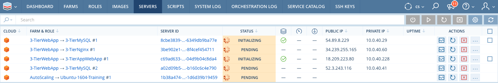

A list can also be navigated to from some other context and will be filtered according to the context. E.g the Servers list can be reached from the Farms list and will then only show the servers for that farm due to the pre-applied search filter.

.. image:: images/list_farms.png
   :scale: 70%

.. image:: images/list_filtered.png
   :scale: 70%
