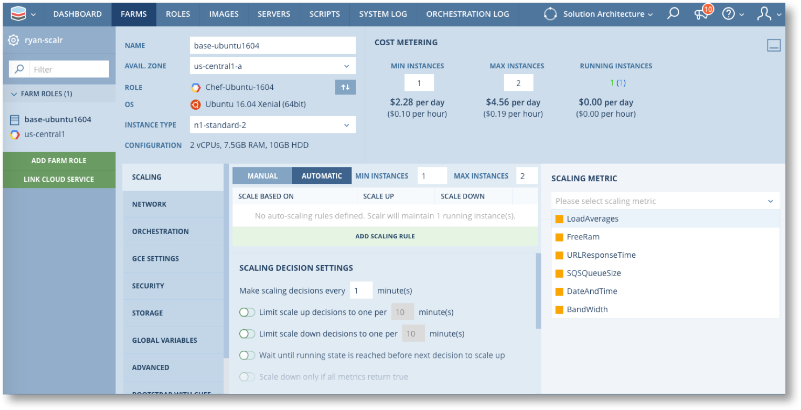
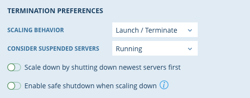

.. include:: ../GLOBAL.rst

.. _auto_scaling:

Auto Scaling
============

Definition and Scope
--------------------

|SCOPE_F_ROLE|

Scalr has autoscaling built directly into the product, which introduces scaling for those clouds that do not have it as well maintains a consistent experience across all clouds. There are two types of autoscaling:

* Simple Autoscaling: Ensure that you always have a minimum number of servers up at all times.

* Dynamic Autoscaling: Using defined metrics, Scalr will scale up or down your Farm Role(s).

Simple Autoscaling
------------------

Simple Autoscaling will perform the following actions:

If your Running Server Count is lower than the minimum you requested, additional Servers will be launched. Such a situation could be caused by:

* Terminating a server
* Suspending a server
* A server crashing
* Increasing the MIN Instances by editing the Farm Role

If your Running Server Count is higher than the Maximum you requested, existing Servers will be terminated. Such a situation could be caused by:

* Manually launching more servers in a Farm Role without updating your scaling settings.
* Decreasing the MAX Instances by editing the Farm Role

To enable simple autoscaling in your Farm Role, find your Farm, click on the Farm Role, go to the Scaling tab and make sure it is set to Automatic:

.. image:: images/simple_scaling.png
   :scale: 50%

In the scenario above, Scalr will always have minimum of one server and a maximum of two for this Farm Role

Dynamic Autoscaling
-------------------

Dynamic Autoscaling does everything Simple Autoscaling does, except it also adds and removes Servers based on utilization or activity (e.g. CPU utilization). Scalr will poll for metrics at least every minute, depending on your configuration, and uses those metrics to make the scaling decisions.

To enable dynamic autoscaling in your Farm Role, find your Farm, click on the Farm Role, go to the Scaling tab and make sure it is set to Automatic. Next, click on the Add Scaling Rule Option which will then present the metrics with which the Server can scale by:

.. csv-table::
   :header-rows: 1
   :file: csv/scaling_metrics.csv
   :widths: 20,80

.. note::
    Dynamic Autoscaling is only enabled for Farm Roles that are using the Scalarizr agent.

Autoscaling Configuration
-------------------------

Along with metrics, Scalr also has many configurations that can be set for scaling decisions and termination preferences:

Scaling Decision Settings:

.. image:: images/scaling_decisions.png
   :scale: 50%

The options in the screenshot are defined as follows (in order):

* The duration between scaling decisions can be changed, the default is 1 minute.
* You can override the timing for a scale up decision.
* You can override the timing for a scale down decision.
* You can pause the scaling after launching a new server, and only resume the cycle when the previously launched server reaches a running state.
* Scaling down will only occur if ALL of the scaling metrics that have been defined return true. For example, you may have a URL and a Load Average scaling rules, both of those metrics must hit the lower threshold before scaling down occurs.

Scaling Termination Settings:

The options in the screenshot are defined as follows (in order):

* Scaling Behaviour:

  * Launch / Terminate: As scaling up occurs, a brand new server will launch. As scaling down occurs, the server will be terminated.
  * Resume / Suspend : As scaling up occurs, a server that was suspended will be turned on. As scaling down occurs, the server will be suspended.

* Consider Suspended Servers:

  * Running: If a server is suspended, that server is considered running in the min/max scaling count.
  * Terminated: If a server is suspended, that server is considered terminated in the min/max scaling count.

* The servers which have been launched the most recently will be scaled down first.
* By enabling safe shutdown, Scalr will run an "auth-shutdown" script on every Server before terminating it. Depending on the Script's return code, Scalr may abort the scale-down procedure. This option is useful to prevent a Server from being terminated while performing a long-running task. Scalr will terminate an instance ONLY IF the script ``/usr/local/scalarizr/hooks/auth-shutdown`` returns 1. If this script is not found or returns any other value, Scalr WILL NOT terminate that server.

Custom Scaling
--------------

|SCOPE_SCALR| |SCOPE_ACC| |SCOPE_ENV|

Scalr also provides a Custom Scaling option to leave it up to a user to decide when a scaling decision should happen. In this scenario, Scalr reads a file, executes a file, or does a URL Request and based on that value it will scalr up or down depending on the calculation function.

To create a Custom Scaling Metric, click on the main Scalr menu on the top left |MENU_ENV|, and click on Custom Scaling Metrics. On that page, click on the New Metric button:

.. image:: images/custom_scaling.png
   :scale: 50%

.. csv-table::
   :header-rows: 1
   :file: csv/custom_scaling.csv
   :widths: 20,80

The URL-Request method will return a single value from the target URL, but File-Read and File-Execute methods must run against all Farm Role instances. Each instance will return their own value and Scalr will compute a single result value from them according to your Calculation Function.

The following Calculation Functions are available for File-Read and File-Get:

.. csv-table::
   :header-rows: 1
   :file: csv/calculation_function.csv
   :widths: 20,80

For example, say you had 3 running instances of a Farm Role using a custom metric with File-Read method.  Scalr polls for the metric and the instances return 2, 3, and 4 respectively.  The table below shows the resulting metric value for each calculation type.

.. csv-table::
   :header-rows: 1
   :file: csv/calculation_function_example.csv
   :widths: 20,20

Once you have created the custom metric it will then appear in the metrics list in the scaling section in each farm role. In the Scaling Metric, select your customer metric and give it rules. The scaling decisions are made based on the custom metric value going above or below a certain value:

.. image:: images/custom_scaling_fr.png
   :scale: 50%
