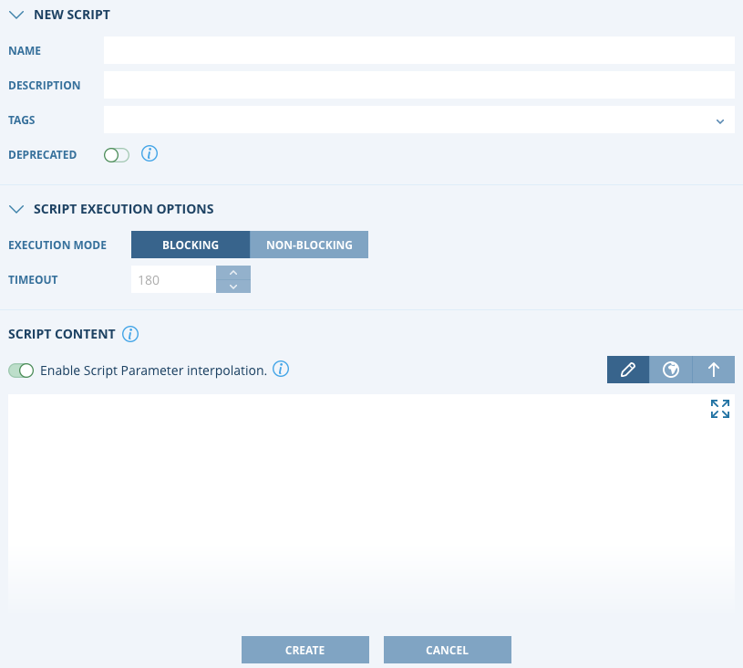
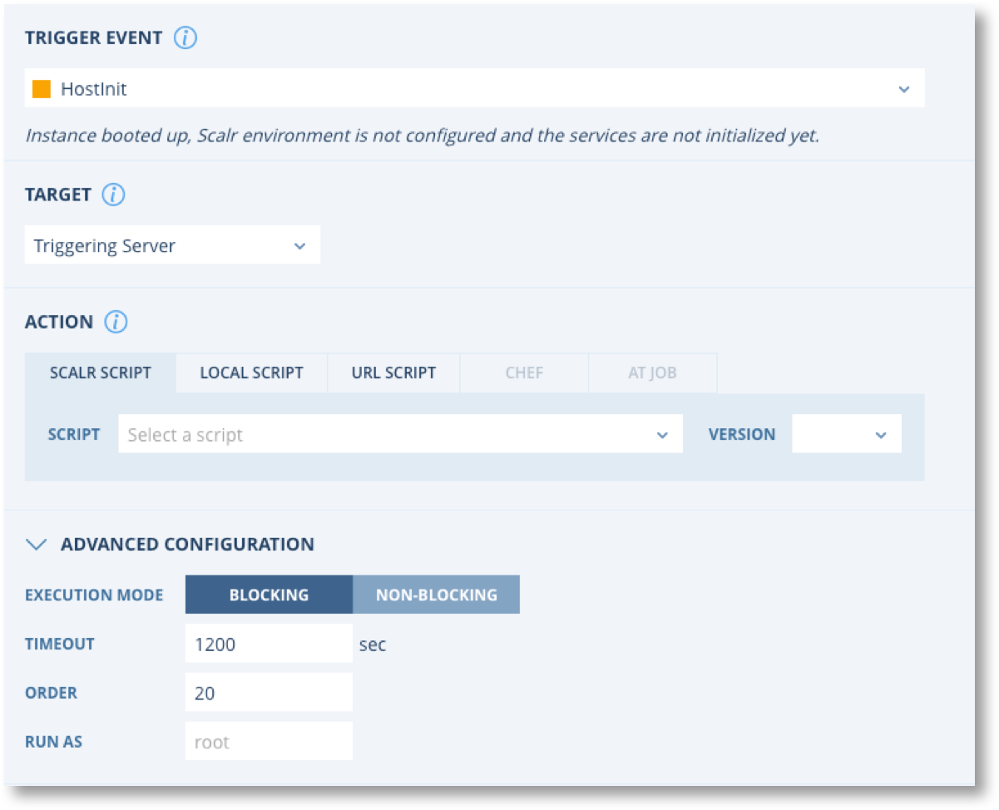

.. include:: ../GLOBAL.rst

.. _scripts:

Scripts
=======

Definition and Scope
--------------------

|SCOPE_SCALR| |SCOPE_ACC| |SCOPE_ENV|

Scripts can be used to automate various configuration items on the operating system that Scalr is provisioning. Scalr supports generic scripting, it is not a proprietary language.

Creating Scripts
----------------

.. |SCALR_ICON| image:: images/scalr_icon_env.png
   :scale: 70%

Scripts can be created, updated, edited, or deleted at the |Scalr|, |Account|, or |Environment| scopes. To create a script you can click on the Scalr icon on the top left of any of the scopes, in this example it is at the |Environment| scope: |SCALR_ICON|
Once you are in the scripts page, click on New Script:

+----------------+---------+-------------------------------------------------------------------------------------------------------------------------+
| Item           | Format  | Description                                                                                                             |
+================+=========+=========================================================================================================================+
| Name           | String  | Name of the script                                                                                                      |
+----------------+---------+-------------------------------------------------------------------------------------------------------------------------+
| Description    | String  | Description of the script                                                                                               |
+----------------+---------+-------------------------------------------------------------------------------------------------------------------------+
| Deprecated     | Binary  | Scripts can be deprecated to prevent further use                                                                        |
+----------------+---------+-------------------------------------------------------------------------------------------------------------------------+
| Shared         | Binary  | Determines if a script can be used at a lower level. This is only seen at the |Account| and |Scalr| scopes              |
+----------------+---------+-------------------------------------------------------------------------------------------------------------------------+
| Execution Mode | Binary  | | Blocking: Scalarizr will wait for your Script to finish executing before firing and processing further events         |
|                |         | | Non-Blocking: Scalarizr will not wait for your Script to finish executing before firing and processing further events |
+----------------+---------+-------------------------------------------------------------------------------------------------------------------------+
| Timeout        | Integer | Length in seconds before the script should timeout                                                                      |
+----------------+---------+-------------------------------------------------------------------------------------------------------------------------+
| Script Content | String  | Script contents                                                                                                         |
+----------------+---------+-------------------------------------------------------------------------------------------------------------------------+

Writing a Script
^^^^^^^^^^^^^^^^

.. |shebang_link| raw:: html

   <a href="https://en.wikipedia.org/wiki/Shebang_(Unix)" target="_blank">Shebang Info</a>

Your Scripts should start with a shebang line: |shebang_link| |NEWWIN|. Scalr will use the interpreter specified in the shebang line and execute your script with it. The script runs on:

* Linux - If the first line starts with #! /*

* Windows - If the first line starts with a #!windows, #!cmd or a #!powershell

* Cross-platform - If the first line is Linux shebang, and the second line is Windows shebang following this format: `#!windows command= extension=`

Shell:

.. code-block:: shell

  #!/bin/bash

Python:

.. code-block:: shell

  #!/usr/bin/env python
  import os

Windows batch file:

.. code-block:: shell

  #!cmd - executes Script as Batch file (.bat)

Powershell:

.. code-block:: shell

  #!powershell - executes Script in powershell

Cross Platform:

.. code-block:: shell

  #!/usr/bin/env python
  #!windows extension=py

Executing Scripts
------------------

There are a couple ways to execute scripts in Scalr:

* As part of a Farm Role: As part of a Farm Role design, a user can add scripts to the orchestration tab and assign a lifecycle event to trigger the script.
* As part of a Role: Users can add a script to a Role and assign a lifecycle event to trigger the script. When this Role gets added to a Farm it becomes a Farm Role and the script will be inherited as part of the orchestration.
* Manually Triggered: Users can select a Farm or Farm Role and manually trigger a script on the running servers within the Farm or Farm Role. A single server within a Farm can also be selected to trigger a script on. This is a good way to test scripts before placing them within Farm Role orchestation.

Farm Role Orchestration
^^^^^^^^^^^^^^^^^^^^^^^^

To assign a script for execution within the context of a Farm Role, go to the orchestration tab within the Farm Role and click new rule:

Script Orchestration Options:

   +--------------------------------------------+---------------------------------------------------------------------------------------------------------------------------------------------------------------+
   | Field                                      | Description                                                                                                                                                   |
   +============================================+===============================================================================================================================================================+
   | Trigger Event                              | The lifecycle event at which the script should be executed.                                                                                                   |
   +--------------------------------------------+---------------------------------------------------------------------------------------------------------------------------------------------------------------+
   | Target - Triggering Server                 | The script will get executed on the server that is building.                                                                                                  |
   +--------------------------------------------+---------------------------------------------------------------------------------------------------------------------------------------------------------------+
   | Target - All Servers in the Farm           | All servers in the farm, whether already running or being provisioned, will have the script executed on them.                                                 |
   +--------------------------------------------+---------------------------------------------------------------------------------------------------------------------------------------------------------------+
   | Target - All Farm Roles with Selected Tags | All servers within a farm role(s) that have a specific tag assigned to it, whether already running or being provisioned, will have the script executed on them|
   +--------------------------------------------+---------------------------------------------------------------------------------------------------------------------------------------------------------------+
   | Target - All Farm Roles with Selected OS   | All servers within a farm role(s) that have a specific OS, whether already running or being provisioned, will have the script executed on them.               |
   +--------------------------------------------+---------------------------------------------------------------------------------------------------------------------------------------------------------------+
   | Target - Selected Farm Roles               | All servers within a specific farm role, whether already running or being provisioned, will have the script executed on them.                                 |
   +--------------------------------------------+---------------------------------------------------------------------------------------------------------------------------------------------------------------+
   | Action - Scalr Script                      | A script created within Scalr will be executed on the server.                                                                                                 |
   +--------------------------------------------+---------------------------------------------------------------------------------------------------------------------------------------------------------------+
   | Action - Local Script                      | A script already on the OS will be executed, a path to the script must be provided.                                                                           |
   +--------------------------------------------+---------------------------------------------------------------------------------------------------------------------------------------------------------------+
   | Action - URL Script                        | A script will be pulled from a URL and executed on the server. The URL must be the link to the raw code.                                                      |
   +--------------------------------------------+---------------------------------------------------------------------------------------------------------------------------------------------------------------+
   | Action - AT Job                            | If Ansible Tower is configured a Job Template can be executed on the server.                                                                                  |
   +--------------------------------------------+---------------------------------------------------------------------------------------------------------------------------------------------------------------+
   | Action - Chef                              | If Chef Server is configured a Cookbook can be executed on the server.                                                                                        |
   +--------------------------------------------+---------------------------------------------------------------------------------------------------------------------------------------------------------------+
   | Execution Mode                             | The mode is inherited from the script but can be overwritten. See above for more detail.                                                                      |
   +--------------------------------------------+---------------------------------------------------------------------------------------------------------------------------------------------------------------+
   | Timeout                                    | The timeout is inherited from the script but can be overwritten. See above for more detail.                                                                   |
   +--------------------------------------------+---------------------------------------------------------------------------------------------------------------------------------------------------------------+
   | Order                                      | The order in which the script should run compared to other scripts.                                                                                           |
   +--------------------------------------------+---------------------------------------------------------------------------------------------------------------------------------------------------------------+
   | Run As                                     | What OS user the script should run as.                                                                                                                        |
   +--------------------------------------------+---------------------------------------------------------------------------------------------------------------------------------------------------------------+

Manually On Farms, Farm Roles, or Servers
^^^^^^^^^^^^^^^^^^^^^^^^^^^^^^^^^^^^^^^^^^

As mentioned above, scripts created within Scalr can also be manually executed on running servers. There are two ways to do this:

* Click on scripts on the main toolbar, find your script, and click execute |EXECUTE_SCRIPT|. Choose whether the script should be executed on the entire Farm, a specific Farm Role, or a specific Server.
* Click on the Farm, Farm Role, or Server dropdown and click Execute Script.
