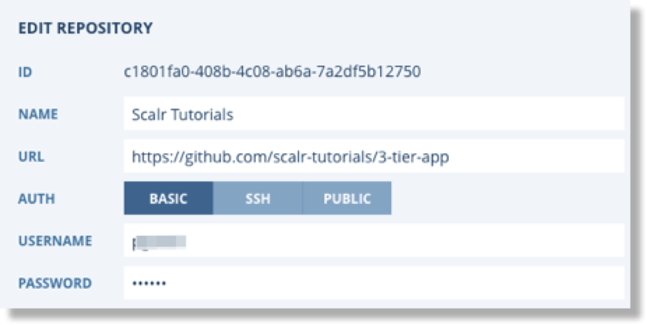
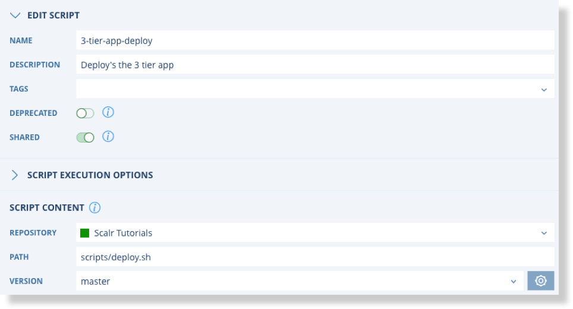

.. include:: ../GLOBAL.rst

.. _scripts:

Scripts
=======

Definition and Scope
--------------------

|SCOPE_SCALR| |SCOPE_ACC| |SCOPE_ENV|

Scripts can be used to automate various configuration items on the operating system that Scalr is provisioning. Scalr supports generic scripting, it is not a proprietary language.

Scripts can be created and stored within Scalr or they can be pulled from a Git Repo at the time of execution.

.. note:: The Git Repository feature supports any repository that uses the Git Protocol, such as git, github, bitbucket etc

.. |SCALR_ICON| image:: images/scalr_icon_env.png
   :scale: 70%

Scripts can be created, updated, edited, or deleted at the |SCALR|, |ACCOUNT|, or |ENVIRONMENT| scopes. To create a script you can click on the Scalr icon on the top left of any of the scopes, in this example it is at the |ENVIRONMENT| scope: |MENU_ENV|

Creating Scripts in Scalr
-------------------------

Once you are in the scripts screen, click on "New Scalr Script":

.. image:: images/new_script.png
   :scale: 60%

+----------------+---------+-----------------------------------------------------------------------------------------------------------------------+
| Item           | Format  | Description                                                                                                           |
+================+=========+=======================================================================================================================+
| Name           | String  | Name of the script                                                                                                    |
+----------------+---------+-----------------------------------------------------------------------------------------------------------------------+
| Description    | String  | Description of the script                                                                                             |
+----------------+---------+-----------------------------------------------------------------------------------------------------------------------+
| Deprecated     | Binary  | Scripts can be deprecated to prevent further use                                                                      |
+----------------+---------+-----------------------------------------------------------------------------------------------------------------------+
| Shared         | Binary  | Determines if a script can be used at a lower level. This is only seen at the |Account| and |Scalr| scopes.           |
+----------------+---------+-----------------------------------------------------------------------------------------------------------------------+
| Execution Mode | Binary  | Blocking: Scalarizr will wait for your Script to finish executing before firing and processing further events         |
|                |         | Non-Blocking: Scalarizr will not wait for your Script to finish executing before firing and processing further events |
+----------------+---------+-----------------------------------------------------------------------------------------------------------------------+
| Timeout        | Integer | Length in seconds before the script should timeout                                                                    |
+----------------+---------+-----------------------------------------------------------------------------------------------------------------------+
| Script Content | String  | Script contents                                                                                                       |
+----------------+---------+-----------------------------------------------------------------------------------------------------------------------+

Linking a Git Script
--------------------

Git repositories can be defined before linking a script by navigating to Git Repositories off the main menu |MENU_ENV|. Repositories can also be defined during the script link dialogue. Basic and SSH authentication are supported along with Public repositories.

To link a git script click on "New Git Script" on the main scripts screen:

The majority of the parameters are the same as for Scalr Scripts. The additional parameters are as follows.

+----------------+---------+-----------------------------------------------------------------------------------------------------------------------+
| Item           | Format  | Description                                                                                                           |
+================+=========+=======================================================================================================================+
| Repository     | String  | Name of the previously defined Git Repo. You can click on the "+" bar to define a new Git repo.                       |
+----------------+---------+-----------------------------------------------------------------------------------------------------------------------+
| Path           | String  | The Path to the script in the Repo                                                                                    |
+----------------+---------+-----------------------------------------------------------------------------------------------------------------------+
| Version        | String  | The version or Branch to use. "Master" is shown by default. Click the settings button to register additional branches.|
+----------------+---------+-----------------------------------------------------------------------------------------------------------------------+

Git based scripts can be used in Orchestration Rules and for immediate execution in the same way as Scalr Scripts.

Writing a Script
^^^^^^^^^^^^^^^^

.. |shebang_link| raw:: html

   <a href="https://en.wikipedia.org/wiki/Shebang_(Unix)" target="_blank">Shebang Info</a>

Your Scripts should start with a shebang line: |shebang_link| |NEWWIN|. Scalr will use the interpreter specified in the shebang line and execute your script with it. The script runs on:

* Linux - If the first line starts with #! /*

* Windows - If the first line starts with a #!windows, #!cmd or a #!powershell

* Cross-platform - If the first line is Linux shebang, and the second line is Windows shebang following this format: `#!windows command= extension=`

Shell:

.. code-block:: shell

  #!/bin/bash

Python:

.. code-block:: shell

  #!/usr/bin/env python
  import os

Windows batch file:

.. code-block:: shell

  #!cmd - executes Script as Batch file (.bat)

Powershell:

.. code-block:: shell

  #!powershell - executes Script in powershell

Cross Platform:

.. code-block:: shell

  #!/usr/bin/env python
  #!windows extension=py

.. _executing:

Executing Scripts
------------------

There are a couple ways to execute scripts in Scalr:

* In Orchestration Rules: At all three main scopes and in Roles and Farm Roles a user can create orchestration rules and assign a lifecycle event to trigger the script.
* Manually Triggered: Users can select a Farm or Farm Role and manually trigger a script on the running servers within the Farm or Farm Role. A single server within a Farm can also be selected to trigger a script on. This is a good way to test scripts before placing them within Farm Role orchestration.

Using Scripts In Orchestration
^^^^^^^^^^^^^^^^^^^^^^^^^^^^^^

For details on using scripts in Orchestration Rules please follow the link to the relevant section.

* :ref:`sa_orchestration`
* :ref:`role_orchestration`
* :ref:`farm_role_orchestration`

Manually On Farms, Farm Roles, or Servers
^^^^^^^^^^^^^^^^^^^^^^^^^^^^^^^^^^^^^^^^^^

As mentioned above, scripts created within Scalr can also be manually executed on running servers. There are two ways to do this:

.. |EXECUTE_SCRIPT| image:: images/execute_script.png
   :scale: 40%

* Click on scripts on the main toolbar, find your script, and click execute |EXECUTE_SCRIPT|. Choose whether the script should be executed on the entire Farm, a specific Farm Role, or a specific Server.
* Click on the Farm, Farm Role, or Server dropdown and click Execute Script.
