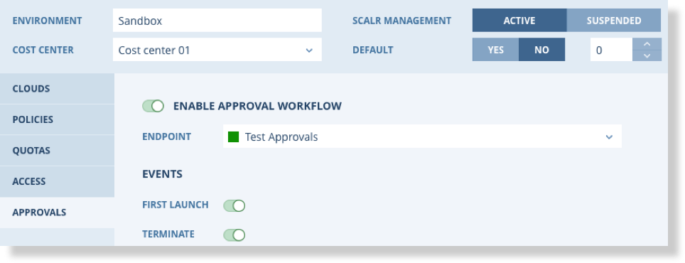
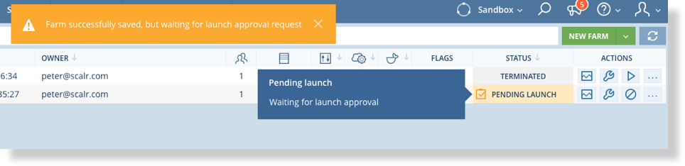
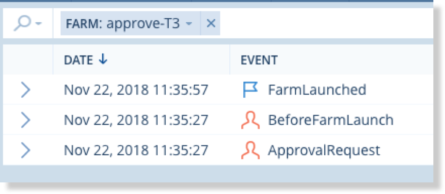
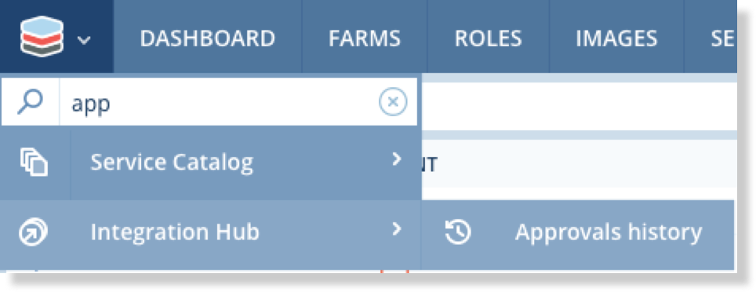
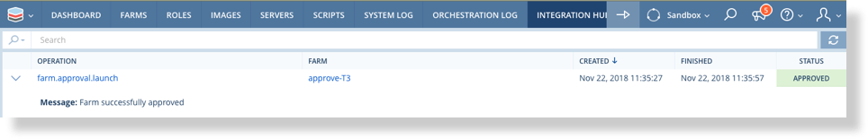

.. include:: ../GLOBAL.rst

.. _approvals:

Approvals
=========

|SCOPE_ACC|

|ENVIRONMENTS| can optionally be configured to require approval for the first launch and all terminations of Farms. This is done via an integration :ref:`Endpoint <endpoints>` that will send approval requests to an external approvals system, such as ServiceNow.

Before configuring approvals on a |ENVIRONMENT| a Webhook handler and Endpoint must be set up. Please see :ref:`webhooks` for more details.

Once the Endpoint is configured select the "Approvals" tab on the |ENVIRONMENT| and configure the Approval as shown.

* Endpoint - The previously configured Endpoint for the Approval Webhook handler
* First Launch - Toggle this on to require approval for the first launch of a Farm. Subsequent launches do not require approval.
* Terminate - Toggle this on to require approval for all Farm Terminations.

Farm Status and Events
----------------------

In conjunction with Approvals there are new Farm statuses and Farm level events.

For example when a Farm is launched and requires approval it will enter "Pending Launch" state as shown below.

There is a similar "Pending Terminate" status.

These new statuses have corresponding events which can be viewed via the "Event Log" accessed from the Farm menu |MENU| on the Farm list.

Approvals History
-----------------

The history of approval requests and the responses can be viewed from the Approvals History menu item via the main menu |MENU_ENV|.

