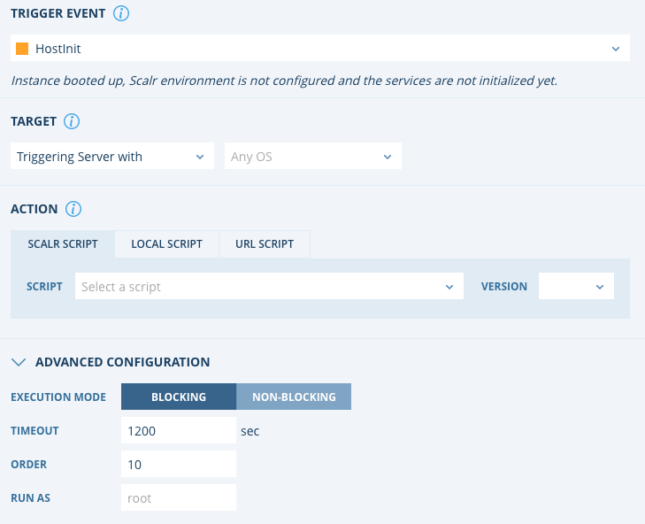

.. include:: ../GLOBAL.rst

.. _sa_orchestration:

|SCALR|/|ACCOUNT|/|ENVIRONMENT| Level Orchestration
====================================================

Definition and Scope
--------------------

|SCOPE_SCALR| |SCOPE_ACC| |SCOPE_ENV|

Just like a script can be assigned to run within a Farm Role, it can also be assigned to run across all servers within the |SCALR|, |ACCOUNT|, or |ENVIRONMENT| scopes. This type of Orchestration is typically used to enforce policies, for example:

* Security toolsets that must be applied to all servers.
* Lifecycle events that must be applied to all servers, i.e. join a domain.

If an Orchestration rule is created at one of these scopes, it cannot be removed at the lower scope and ALL servers at the lower scope will have the rule applied to it.

Creating Orchestration Rules
----------------------------

To create an orchestration rule at the |SCALR|, |ACCOUNT|, or |ENVIRONMENT| scopes, click on the Scalr icon on the top left |SCALR_ICON| and then click on Orchestration. After you click on New Rule the following page will show up:

+--------------------------------------------+---------------------------------------------------------------------------------------------------------------------------------------------------------------+
| Field                                      | Description                                                                                                                                                   |
+============================================+===============================================================================================================================================================+
| Trigger Event                              | The lifecycle event at which the script should be executed.                                                                                                   |
+--------------------------------------------+---------------------------------------------------------------------------------------------------------------------------------------------------------------+
| Target - Triggering Server                 | The script will run the server being built. Optionally: Will this rule apply to ALL operating systems or a specific operating system?                         |
+--------------------------------------------+---------------------------------------------------------------------------------------------------------------------------------------------------------------+
| Target - All Roles with Selected Tags      | All servers built from a role that has a specific tag assigned to it will have the script executed on it.                                                     |
+--------------------------------------------+---------------------------------------------------------------------------------------------------------------------------------------------------------------+
| Action - Scalr Script                      | A script created within Scalr will be executed on the server.                                                                                                 |
+--------------------------------------------+---------------------------------------------------------------------------------------------------------------------------------------------------------------+
| Action - Local Script                      | A script already on the OS will be executed, a path to the script must be provided.                                                                           |
+--------------------------------------------+---------------------------------------------------------------------------------------------------------------------------------------------------------------+
| Action - URL Script                        | A script will be pulled from a URL and executed on the server. The URL must be the link to the raw code.                                                      |
+--------------------------------------------+---------------------------------------------------------------------------------------------------------------------------------------------------------------+
| Execution Mode                             | The mode is inherited from the script but can be overwritten. See :ref:`scripts` for more detail.                                                             |
+--------------------------------------------+---------------------------------------------------------------------------------------------------------------------------------------------------------------+
| Timeout                                    | The timeout is inherited from the script but can be overwritten. See above for more detail.                                                                   |
+--------------------------------------------+---------------------------------------------------------------------------------------------------------------------------------------------------------------+
| Order                                      | The order in which the script should run compared to other scripts.                                                                                           |
+--------------------------------------------+---------------------------------------------------------------------------------------------------------------------------------------------------------------+
| Run As                                     | What OS user the script should run as.                                                                                                                        |
+--------------------------------------------+---------------------------------------------------------------------------------------------------------------------------------------------------------------+

.. note::

  Linux Scripts will not execute on Windows Servers, and vice-versa, unless the script is a cross platform script.
