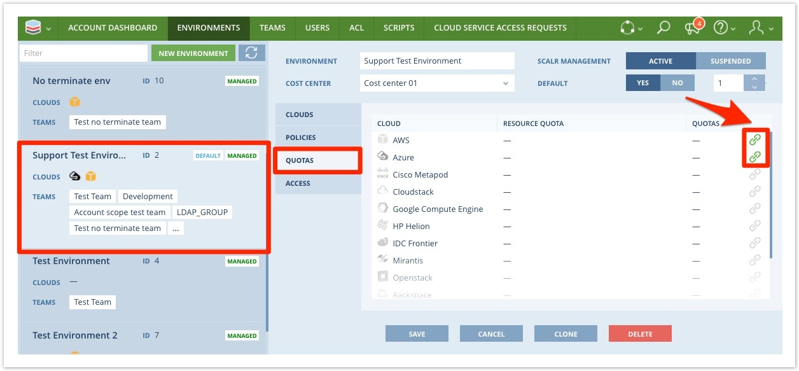

.. include:: ../GLOBAL.rst

.. _quotas:

Resource Quotas
===============

Definition and Scope
--------------------

|SCOPE_ACC|

In order to ensure control over how much access to resources is granted to users, Scalr will enforce limitations on the volume of consumption afforded to users. Resource Quotas allow for a Scalr administrator to set hard limits on the consumption of cloud resources per environment.

Creating Quotas
---------------

To create a Resource Quota at the |ACCOUNT| scope, click on the Scalr icon on the top left |MENU_ACC| and then click on Resource Quotas. After you click on New Resource Quota the following page will show up:

.. image:: images/new_resource_quota.png
   :scale: 70%

.. _apply_quotas:

Applying Quotas
---------------

After creating a Resource Quota, it must be linked to an Environment for the quota to take effect.  Navigate to the Environments tab within the Account Scope and selecting your desired Environment:

Click on the link icon on the right-hand side, link the quota to the environment, and save.
