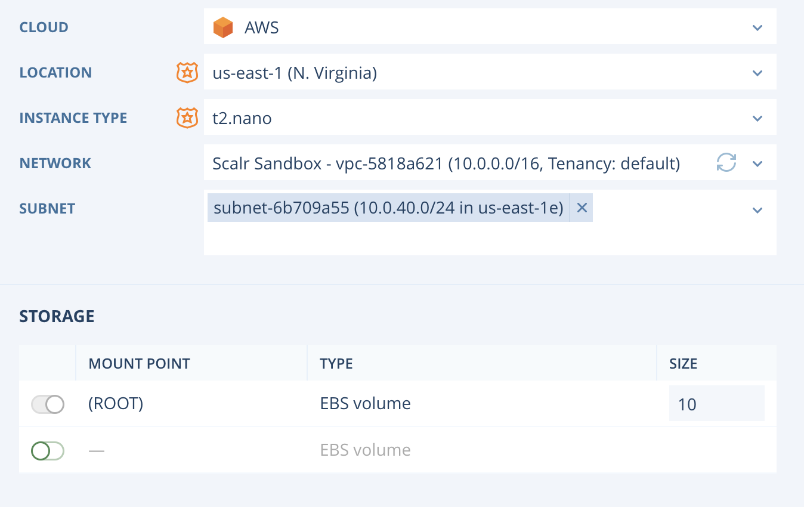

.. include:: ../GLOBAL.rst

.. _adv_farm_templates:

Advanced Farm Templates
=======================

|SCOPE_SCALR| |SCOPE_ACC| |SCOPE_ENV|

The following cloud specific examples have all possible parameters and values for their respective clouds. To learn the basics of Farm Templates and how they are used, please see :ref:`basic_templates`.

AWS Example
------------

.. code-block:: json

   {
      "_meta": {
      "schema_version": "v1beta0-7.11.2"
      },
      "farm": {
      "name": "Docs AWS",
      "description": "",
      "project": {
         "id": "1682b63d-6d28-4b5f-8438-3cf058f89a6c"
      },
      "timezone": "America\/New_York",
      "launchOrder": "simultaneous",
      "variables": []
      },
      "roles": [
      {
         "alias": "base-ubuntu1604",
         "role": {
             "name": "base-ubuntu1604"
         },
         "cloudPlatform": "ec2",
         "cloudLocation": "us-east-1",
         "instanceType": {
             "id": "t2.micro"
         },
         "launchIndex": 0,
         "advancedConfiguration": {
             "disableAgentIptablesManagement": false,
             "disableAgentNtpManagement": false,
             "disableAgentHostnameManagement": false,
             "rebootAfterHostInit": false,
             "instanceName": "{SCALR_FARM_OWNER_EMAIL}-{Purpose}"
         },
         "scaling": {
             "considerSuspendedServers": "running",
             "enabled": true,
             "maxInstances": 2,
             "minInstances": 1,
             "rules": [],
             "scalingBehavior": "launch-terminate"
         },
         "networking": {
             "networks": [
                 {
                     "id": "vpc-5818a621"
                 }
             ],
             "subnets": [
                 {
                     "id": "subnet-6b709a55"
                 },
                 {
                     "id": "subnet-3333856f"
                 }
             ]
         },
         "cloudFeatures": {
             "type": "AwsCloudFeatures",
             "ebsOptimized": false,
             "iamInstanceProfile": "arn:aws:iam::515485494432:instance-profile\/EC2-Service-Role",
             "backupInstanceTypes": [
                 {
                     "id": "t2.large"
                 }
             ]
         },
         "security": {
             "securityGroups": [
                 {
                     "id": "sg-ca60c9bb"
                 },
                 {
                     "id": "sg-ba2bb3f3"
                 }
             ]
         },
         "variables": [
             {
                 "name": "Purpose",
                 "value": "docs"
             }
         ],
         "orchestration": {
             "rules": []
         },
         "storage": [
             {
                 "type": "PersistentStorageConfiguration",
                 "reUse": true,
                 "fromTemplateIfMissing": false,
                 "mounting": {
                     "enabled": true,
                     "fileSystem": "ext3",
                     "mountPoint": "\/a"
                 },
                 "template": {
                     "size": 1,
                     "type": "standard",
                     "cloudFeatures": {
                         "type": "AwsStorageTemplateCloudFeatures",
                         "isEncrypted": true,
                         "kmsKey": "5fd6e560-29e6-4a1c-9abe-a2b54ce2e8d1"
                     }
                 }
             },
             {
                 "type": "PersistentStorageConfiguration",
                 "reUse": true,
                 "fromTemplateIfMissing": false,
                 "mounting": {
                     "enabled": true,
                     "fileSystem": "xfs",
                     "mountPoint": "\/c"
                 },
                 "template": {
                     "size": 1,
                     "type": "standard",
                     "cloudFeatures": {
                         "type": "AwsStorageTemplateCloudFeatures",
                         "isEncrypted": false
                     }
                 }
             },
             {
                 "type": "PersistentStorageConfiguration",
                 "reUse": true,
                 "fromTemplateIfMissing": false,
                 "template": {
                     "size": 500,
                     "type": "st1",
                     "cloudFeatures": {
                         "type": "AwsStorageTemplateCloudFeatures",
                         "isEncrypted": false
                     }
                 }
             },
             {
                 "type": "PersistentStorageConfiguration",
                 "reUse": true,
                 "fromTemplateIfMissing": false,
                 "template": {
                     "size": 500,
                     "type": "sc1",
                     "cloudFeatures": {
                         "type": "AwsStorageTemplateCloudFeatures",
                         "isEncrypted": false
                     }
                 }
             },
             {
                 "type": "PersistentStorageConfiguration",
                 "reUse": true,
                 "fromTemplateIfMissing": false,
                 "mounting": {
                     "enabled": true,
                     "fileSystem": "ext4",
                     "mountPoint": "\/b"
                 },
                 "template": {
                     "size": 1,
                     "type": "gp2",
                     "cloudFeatures": {
                         "type": "AwsStorageTemplateCloudFeatures",
                         "isEncrypted": false
                     }
                 }
             },
             {
                 "type": "RootStorageConfiguration",
                 "template": {
                     "size": 8,
                     "type": "gp2",
                     "cloudFeatures": {
                         "type": "AwsStorageTemplateCloudFeatures",
                         "isEncrypted": false
                     }
                 }
             }
         ]
      }
    ]
  }

Azure Example
--------------

.. code-block:: json

     {
         "_meta": {
             "schema_version": "v1beta0-7.11.2"
         },
         "farm": {
             "name": "azure farm template for docs",
             "description": "",
             "project": {
                 "id": "30c59dba-fc9b-4d0f-83ec-4b5043b12f72"
             },
             "timezone": "America\/New_York",
             "launchOrder": "simultaneous",
             "variables": []
         },
         "roles": [
             {
                 "alias": "base-ubuntu1604",
                 "role": {
                     "name": "base-ubuntu1604"
                 },
                 "cloudPlatform": "azure",
                 "cloudLocation": "eastus",
                 "availabilityZones": [],
                 "instanceType": {
                     "id": "Standard_B1ms"
                 },
                 "launchIndex": 0,
                 "advancedConfiguration": {
                     "disableAgentIptablesManagement": false,
                     "disableAgentNtpManagement": false,
                     "disableAgentHostnameManagement": false,
                     "rebootAfterHostInit": false
                 },
                 "networking": {
                     "networks": [
                         {
                             "id": "\/subscriptions\/e6b1e566-9703-4f7d-9f79-743555284ea6\/resourceGroups\/Scalr\/providers\/Microsoft.Network\/virtualNetworks\/Scalr-vnet",
                             "associatePublicIpAddress": true
                         }
                     ],
                     "subnets": [
                         {
                             "id": "\/subscriptions\/e6b1e566-9703-4f7d-9f79-743555284ea6\/resourceGroups\/Scalr\/providers\/Microsoft.Network\/virtualNetworks\/Scalr-vnet\/subnets\/default"
                         }
                     ]
                 },
                 "cloudFeatures": {
                     "type": "AzureCloudFeatures",
                     "resourceGroup": "\/subscriptions\/e6b1e566-9703-4f7d-9f79-743555284ea6\/resourceGroups\/Scalr"
                 },
                 "security": {
                     "securityGroups": [
                         {
                             "id": "Scalr-base"
                         }
                     ]
                 },
                 "variables": [],
                 "orchestration": {
                     "rules": []
                 },
                 "storage": [
                     {
                         "type": "PersistentStorageConfiguration",
                         "reUse": true,
                         "fromTemplateIfMissing": false,
                         "mounting": {
                             "enabled": true,
                             "fileSystem": "ext3",
                             "mountPoint": "\/a"
                         },
                         "template": {
                             "size": 1,
                             "type": "Standard_LRS",
                             "cloudFeatures": {
                                 "type": "AzureStorageTemplateCloudFeatures",
                                 "resourceGroup": "\/subscriptions\/e6b1e566-9703-4f7d-9f79-743555284ea6\/resourceGroups\/Scalr"
                             }
                         }
                     }
                 ]
             }
         ]
     }

VMware Example
---------------

.. code-block:: json

      {
          "_meta": {
              "schema_version": "v1beta0-7.11.2"
          },
          "farm": {
              "name": "Docs vmware",
              "description": "",
              "project": {
                  "id": "1682b63d-6d28-4b5f-8438-3cf058f89a6c"
              },
              "timezone": "America\/New_York",
              "launchOrder": "simultaneous",
              "variables": []
          },
          "roles": [
              {
                  "alias": "base-ubuntu1604",
                  "role": {
                      "name": "base-ubuntu1604"
                  },
                  "cloudPlatform": "vmware",
                  "cloudLocation": "datacenter-21",
                  "instanceType": {
                      "id": "282c8b16746f"
                  },
                  "launchIndex": 0,
                  "advancedConfiguration": {
                      "disableAgentIptablesManagement": false,
                      "disableAgentNtpManagement": false,
                      "disableAgentHostnameManagement": false,
                      "rebootAfterHostInit": false
                  },
                  "scaling": {
                      "considerSuspendedServers": "running",
                      "enabled": true,
                      "maxInstances": 2,
                      "minInstances": 1,
                      "rules": [],
                      "scalingBehavior": "launch-terminate"
                  },
                  "networking": {
                      "networks": [
                          {
                              "id": "network-30"
                          }
                      ]
                  },
                  "cloudFeatures": {
                      "type": "VmwareCloudFeatures",
                      "folder": "group-v22",
                      "placementStrategy": "manual",
                      "computeResource": "domain-s26",
                      "hosts": [
                          "host-28"
                      ],
                      "customizationSpec": "Test_Customer_Spec",
                      "dataStore": "datastore-29",
                      "resourcePool": "resgroup-27"
                  },
                  "variables": [
                      {
                          "name": "Purpose",
                          "value": "docs"
                      }
                  ],
                  "orchestration": {
                      "rules": []
                  },
                  "storage": [
                      {
                          "type": "PersistentStorageConfiguration",
                          "reUse": false,
                          "fromTemplateIfMissing": false,
                          "mounting": {
                              "enabled": true,
                              "fileSystem": "ext3",
                              "mountPoint": "\/a"
                          },
                          "template": {
                              "size": 1,
                              "type": "provisioning-thick-lazy",
                              "cloudFeatures": {
                                  "type": "VmwareStorageTemplateCloudFeatures",
                                  "isSharedDisk": false
                              }
                          }
                      },
                      {
                          "type": "RootStorageConfiguration",
                          "template": {
                              "size": 16,
                              "type": "provisioning-thin",
                              "cloudFeatures": {
                                  "type": "VmwareStorageTemplateCloudFeatures",
                                  "diskObjectId": "6-2000",
                                  "isSharedDisk": false
                              }
                          }
                      },
                      {
                          "type": "PersistentStorageConfiguration",
                          "reUse": false,
                          "fromTemplateIfMissing": false,
                          "mounting": {
                              "enabled": true,
                              "fileSystem": "ext4",
                              "mountPoint": "\/b"
                          },
                          "template": {
                              "size": 1,
                              "type": "provisioning-thick-eager",
                              "cloudFeatures": {
                                  "type": "VmwareStorageTemplateCloudFeatures",
                                  "isSharedDisk": false
                              }
                          }
                      },
                      {
                          "type": "PersistentStorageConfiguration",
                          "reUse": false,
                          "fromTemplateIfMissing": false,
                          "mounting": {
                              "enabled": true,
                              "fileSystem": "xfs",
                              "mountPoint": "\/c"
                          },
                          "template": {
                              "size": 1,
                              "type": "provisioning-thin",
                              "cloudFeatures": {
                                  "type": "VmwareStorageTemplateCloudFeatures",
                                  "isSharedDisk": false
                              }
                          }
                      }
                  ]
              }
          ]
      }

GCE Example
------------

.. code-block:: json

  {
      "_meta": {
      "schema_version": "v1beta0-7.11.2"
      },
      "farm": {
      "name": "GCE Docs",
      "description": "",
      "project": {
          "id": "1682b63d-6d28-4b5f-8438-3cf058f89a6c"
      },
      "timezone": "America\/New_York",
      "launchOrder": "simultaneous",
      "variables": []
      },
      "roles": [
      {
          "alias": "base-ubuntu1604",
          "role": {
              "name": "base-ubuntu1604"
          },
          "cloudPlatform": "gce",
          "cloudLocation": "us-central1",
          "availabilityZones": [
              "us-central1-a"
          ],
          "instanceType": {
              "id": "n1-standard-1"
          },
          "launchIndex": 0,
          "advancedConfiguration": {
              "disableAgentIptablesManagement": false,
              "disableAgentNtpManagement": false,
              "disableAgentHostnameManagement": false,
              "rebootAfterHostInit": false
          },
          "scaling": {
              "considerSuspendedServers": "running",
              "enabled": true,
              "maxInstances": 2,
              "minInstances": 1,
              "rules": [],
              "scalingBehavior": "launch-terminate"
          },
          "networking": {
              "networks": [
                  {
                      "id": "scalr-demo\/global\/networks\/all-open",
                      "associatePublicIpAddress": true
                  }
              ],
              "subnets": [
                  {
                      "id": "all-open-9095425ae886b02e"
                  }
              ]
          },
          "cloudFeatures": {
              "type": "GceCloudFeatures",
              "networkTags": [
                  "scalr"
              ],
              "serviceAccount": {
                  "email": "default"
              }
          },
          "variables": [
              {
                  "name": "Purpose",
                  "value": "test"
              }
          ],
          "orchestration": {
              "rules": []
          },
          "storage": [
              {
                  "type": "EphemeralStorageConfiguration",
                  "mounting": {
                      "enabled": true,
                      "fileSystem": "xfs",
                      "mountPoint": "\/c"
                  },
                  "template": {
                      "size": 375,
                      "name": "google-local-ssd-0"
                  }
              },
              {
                  "type": "PersistentStorageConfiguration",
                  "reUse": true,
                  "fromTemplateIfMissing": false,
                  "mounting": {
                      "enabled": true,
                      "fileSystem": "ext3",
                      "mountPoint": "\/a"
                  },
                  "template": {
                      "size": 1,
                      "type": "pd-standard"
                  }
              },
              {
                  "type": "RootStorageConfiguration",
                  "template": {
                      "size": 10,
                      "type": "pd-standard"
                  }
              },
              {
                  "type": "PersistentStorageConfiguration",
                  "reUse": true,
                  "fromTemplateIfMissing": false,
                  "mounting": {
                      "enabled": true,
                      "fileSystem": "ext4",
                      "mountPoint": "\/b"
                  },
                  "template": {
                      "size": 1,
                      "type": "pd-ssd"
                  }
              }
          ]
      }
    ]
  }

Openstack Example
------------------

.. code-block:: json

     {
      "_meta": {
          "schema_version": "v1beta0-7.11.2"
      },
      "farm": {
          "name": "Docs openstack",
          "description": "",
          "project": {
              "id": "1682b63d-6d28-4b5f-8438-3cf058f89a6c"
          },
          "timezone": "America\/New_York",
          "launchOrder": "simultaneous",
          "variables": []
      },
      "roles": [
          {
              "alias": "base-ubuntu1604",
              "role": {
                  "name": "base-ubuntu1604"
              },
              "cloudPlatform": "openstack",
              "cloudLocation": "RegionOne",
              "availabilityZones": [],
              "instanceType": {
                  "id": "1"
              },
              "launchIndex": 0,
              "advancedConfiguration": {
                  "disableAgentIptablesManagement": false,
                  "disableAgentNtpManagement": false,
                  "disableAgentHostnameManagement": false,
                  "rebootAfterHostInit": false
              },
              "scaling": {
                  "considerSuspendedServers": "running",
                  "enabled": true,
                  "maxInstances": 2,
                  "minInstances": 1,
                  "rules": [],
                  "scalingBehavior": "launch-terminate"
              },
              "networking": {
                  "networks": [
                      {
                          "id": "9d001c2f-3960-46cb-aef4-8bbc96500958",
                          "cloudFeatures": {
                              "type": "OpenstackNetworkCloudFeatures",
                              "floatingIpPool": {
                                  "id": "e2e49b41-e486-409e-b00e-97ec18dc7471"
                              }
                          }
                      }
                  ]
              },
              "cloudFeatures": {
                  "type": "OpenstackCloudFeatures",
                  "disableKeyPairManagement": false
              },
              "security": {
                  "securityGroups": [
                      {
                          "id": "071e9add-509b-47c7-ba8a-973b645ce8bb"
                      },
                      {
                          "id": "3629e09d-ed2d-4347-8ec2-7001fd1ef4b8"
                      }
                  ]
              },
              "variables": [
                  {
                      "name": "Purpose",
                      "value": "test"
                  }
              ],
              "orchestration": {
                  "rules": []
              },
              "storage": [
                  {
                      "type": "PersistentStorageConfiguration",
                      "reUse": true,
                      "fromTemplateIfMissing": false,
                      "mounting": {
                          "enabled": true,
                          "fileSystem": "ext3",
                          "mountPoint": "\/a"
                      },
                      "template": {
                          "size": 1,
                          "type": "708cf4f3-7204-4fd1-8f13-bd4af6928c4d"
                      }
                  }
              ]
          }
      ]
     }

Service Catalog Advanced Configuration
--------------------------------------

In addition to the standard Farm templates seen above, options can be added to make the template more dynamic when they are used in the Service Catalog. All of this should be entered within the "meta" context.

* pattern - Set a validation pattern for a setting value to be checked against.  This follows the same printf format as Global Variable Validation Patterns.
* maxLength -  Sets a maximum character length for a string value.
* minLength  -  Sets a minimum character length for a string value.
* final - Locks a value to the Farm Template configured value, even if the user would otherwise have other options to select from.
* visible – Sets a field to always be visible, even if a value is already supplied by policy or the template and would otherwise be hidden.
* allowedValues - Sets the allowed user-provided values for a setting, even if the user would otherwise have other options available to choose from.
* conditions - Check for a condition and apply the nested _meta.configuration when the condition is true.  Conditions are only available for variables and Farm Role setting.  Condition statements must be based on Role properties such as platform or location.  Conditions based on Global Variable values are not yet supported.

Here is an example of a Farm Template with advanced configuration added. In the meta section, a naming standard was added for the farm name which must start with "MyApp-" , be a minimum of 6 characters, and a maximum of 9 characters:

.. code-block:: json

        {
            "_meta": {
                "schema_version": "v1beta0-7.9.4",
                "configuration": {
                    "farm": {
                        "name": {
                            "pattern": "^MyApp-[0-9]+$",
                            "maxLength": 9,
                            "minLength": 6
                        }
                    }
                }
            },
            "farm": {
                "name": "",
                "description": "",
                "project": {
                    "id": ""
                },
                "timezone": "America\/New_York",
                "launchOrder": "simultaneous",
                "variables": []
            },
            "roles": [
                {
                    "alias": "SC-mysql-ubuntu1604",
                    "role": {
                        "name": "SC-mysql-ubuntu1604"
                    },
                    "launchIndex": 0,
                    "advancedConfiguration": {
                        "disableAgentIptablesManagement": false,
                        "disableAgentNtpManagement": false,
                        "rebootAfterHostInit": false,
                        "instanceName": "{SCALR_FARM_OWNER_EMAIL}-{Purpose}"
                    },
                    "scaling": {
                        "considerSuspendedServers": "running",
                        "enabled": true,
                        "maxInstances": 2,
                        "minInstances": 1,
                        "rules": [],
                        "scalingBehavior": "launch-terminate"
                    },
                    "variables": [],
                    "orchestration": {
                        "rules": []
                    },
                    "storage": []
                }
            ]
        }

Cloud Agnostic Template
^^^^^^^^^^^^^^^^^^^^^^^^

To make a template completely cloud agnostic, remove all references to the cloud within it. By removing the references, the user will be prompted for the Cloud information at the time of ordering the catalog item:

.. code-block:: json

      {
          "_meta": {
              "schema_version": "v1beta0-7.9.4"
          },
          "farm": {
              "name": "",
              "description": "",
              "project": {
                  "id": ""
              },
              "timezone": "America\/New_York",
              "launchOrder": "simultaneous",
              "variables": []
          },
          "roles": [
              {
                  "alias": "SC-mysql-ubuntu1604",
                  "role": {
                      "name": "SC-mysql-ubuntu1604"
                  },
                  "launchIndex": 0,
                  "advancedConfiguration": {
                      "disableAgentIptablesManagement": false,
                      "disableAgentNtpManagement": false,
                      "rebootAfterHostInit": false,
                      "instanceName": "{SCALR_FARM_OWNER_EMAIL}-{Purpose}"
                  },
                  "scaling": {
                      "considerSuspendedServers": "running",
                      "enabled": true,
                      "maxInstances": 2,
                      "minInstances": 1,
                      "rules": [],
                      "scalingBehavior": "launch-terminate"
                  },
                  "variables": [],
                  "orchestration": {
                      "rules": []
                  },
                  "storage": []
              }
          ]
      }

Conditions and Allowed Values
^^^^^^^^^^^^^^^^^^^^^^^^^^^^^^

In the following example, the instance type will be determined based on the cloud they select:

.. code-block:: json

  {
     "_meta":{
          "schema_version":"v1beta0-7.7.9",
          "configuration":{
             "roles":{
                "instanceType":[
                   {
                      "conditions":{
                         "cloudPlatform": "ec2"
                      },
                      "allowedValues":[
                         "m3.medium"
                      ]
                   },
                   {
                      "conditions":{
                         "cloudPlatform": "azure"
                      },
                      "allowedValues":[
                         "Basic_A2"
                      ]
                   },
                   {
                      "conditions":{
                         "cloudPlatform":"vmware"
                      },
                      "allowedValues":[
                         "Medium"
                      ]
                   }
                ]
             }
          }
     }

Storage Configuration
^^^^^^^^^^^^^^^^^^^^^^

In the following example, the instance type will be determined based on the cloud they select:

* The root device cannot be removed, but can be configured to be between 10-100GB.
* The second device is completely optional, but if you do choose to have it then it must be between 10-100GB. The mount point can also be chosen by the end user.
* The index value will correlate with the the order in which the storage shows up in the farm template.

.. code-block:: json

     {
        "_meta":{
             "schema_version":"v1beta0-7.7.9",
             "configuration": {
                   "roles": {
                       "storage": [
                           {
                               "conditions": {
                                   "index": 0
                               },
                               "final": true,
                               "visible": true,
                               "defaultValue": true,
                               "configuration": {
                                   "template.size": {
                                       "defaultValue": true,
                                       "final": false,
                                       "maxValue": 100,
                                       "minValue": 10
                                   }
                               }
                           },
                           {
                               "conditions": {
                                   "index": 1
                               },
                               "final": false,
                               "visible": true,
                               "defaultValue": false,
                               "configuration": {
                                   "template.size": {
                                       "final": false,
                                       "maxValue": 100,
                                       "minValue": 10
                                   },
                                   "mounting.mountPoint": {
                                       "final": false
                                  }
                               }
                           }
                       ]
                   }
               }
           }
       }

Min and Max Server Counts
^^^^^^^^^^^^^^^^^^^^^^^^^^

In the following example, all roles within the farm must have a minimum of 2 and maximum of 3 servers:

.. code-block:: json

  {
    "_meta": {
        "schema_version": "v1beta0-7.10.0",
        "configuration": {
            "roles": {
                "scaling.minInstances": [
                    {
                        "visible": true,
                        "maxValue": 3,
                        "minValue": 2
                    }
                ]
            }
        }
    }
